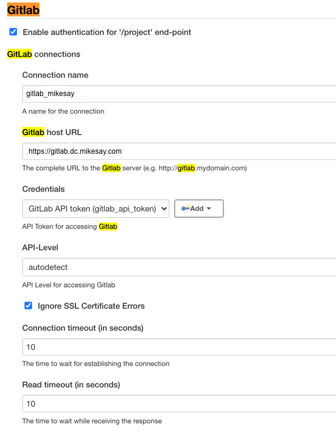

## Install JDK
+ Extract Oracle JDK1.8 to “/data/tool/jdk”
+ Edit “/etc/profile” to set JAVA_HOME and add Java to PATH
    ```bash
    export JAVA_HOME=/data/tools/jdk
    export PATH=$PATH:$JAVA_HOME/bin
    ```
+ Run command “ln –s /data/tools/jdk/bin/java /usr/bin/java” to add symbol link of java executable in /usr/bin which is needed by Jenkins start script

## Install Jenkins
Follow https://www.jenkins.io/doc/book/installing/linux/#debianubuntu to install latest stable version of Jenkins

## Configure Jenkins
+ Convert the self-signed ssl certificates to jks format which is used by Jenkins, as well as the one to be imported into JDK
    ```bash
    openssl pkcs12 -export -keypbe PBE-SHA1-3DES -certpbe PBE-SHA1-3DES -export -in dc.mikesay.com.crt -inkey dc.mikesay.com.key -name mikesay -out dc.mikesay.com.p12

    keytool -importkeystore -srckeystore dc.mikesay.com.p12 -srcstoretype pkcs12 -destkeystore dc.mikesay.com.jks

    keytool -export -keystore dc.mikesay.com.jks -alias mikesay -file dc.mikesay.com.full.crt

    keytool -importcert -file dc.mikesay.com.full.crt -alias linkinnos -keystore $JAVA_HOME/jre/lib/security/cacerts (Note, the keystore password is changeit, and also selete trust)
    ```
+ Edit “/etc/default/jenkins”, set JAVA_ARGS and JENKINS_ARGS
    ```properties
    JAVA_ARGS="-Djava.awt.headless=true \
    -Xms1024m -Xmx4096m -XX:PermSize=512m -XX:MaxPermSize=10240m \
    -Dfile.encoding=UTF-8 -Dsun.jnu.encoding=utf-8 \
    -Djavax.net.ssl.trustStore=$JAVA_HOME/jre/lib/security/cacerts \
    -Djavax.net.ssl.trustStorePassword=changeit"
    ```
    ```properties
    JENKINS_ARGS="--webroot=/var/cache/$NAME/war \
    --httpPort=-1 \
    --httpsPort=8443 \
    --httpsKeyStore=$JENKINS_HOME/.keystore/dc.mikesay.com.jks \
    --httpsKeyStorePassword=xxxx"
    ```
+ Run command “iptables -t nat -A PREROUTING -p tcp --dport 443 -j REDIRECT --to-port 8443” to redirect port 443 to 8443, so that you don’t need to input port 8443 each time you open Jenkins url

+ Run command “apt-get install netfilter-persistent” to persist the iptables’ configuration

+ Change to use the mirror inside China for plugin installation

    Follow  https://community.jenkins-zh.cn/t/jenkins/400/2 to do the change. In general, it is following command:  
    ```bash
    bash -c "$(curl -fsSL https://gitee.com/hummerstudio/jenkins-update-center-changer/raw/master/jenkins-update-center-changer.sh)"
    ```

    To rollback, run command:
    ```bash
    bash -c "$(curl -fsSL https://gitee.com/hummerstudio/jenkins-update-center-changer/raw/master/jenkins-update-center-changer.sh rollback)"
    ```
+ Configure SMTP server from Jenkins -> Manage Jenkins -> Configure System  

    

+ Configure connection to GitLab  

    