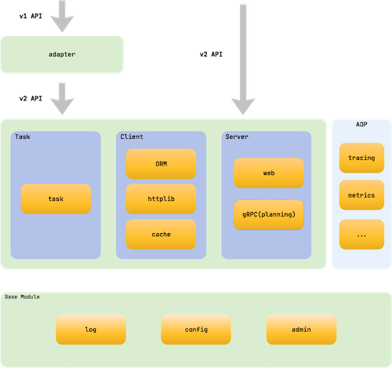

# Go Web
## Beego
**What is Beego?**  
Beego is a RESTful HTTP framework for the rapid development of Go applications including APIs, web apps and backend services with integrated Go specific features such as interfaces and struct embedding.

**The architecture of Beego**  
Beego is built upon 8 loosely linked modules that can be used independently or as part of Beego’s HTTP logic. This high level of modularity gives Beego an unprecedented level of flexibility to meet developer needs.  


**The execution logic of Beego**  
Beego uses a standard Model-View-Controller (MVC) architecture for logic execution.  


**The project structure of Beego**  
Here is the typical folder structure of a Beego project:  
```bash
├── conf
│   └── app.conf
├── controllers
│   ├── admin
│   └── default.go
├── main.go
├── models
│   └── models.go
├── static
│   ├── css
│   ├── ico
│   ├── img
│   └── js
└── views
    ├── admin
    └── index.tpl
```

+ Official Website  
    https://github.com/astaxie/beego

+ Official Doc  
    https://beego.me/docs/intro/

+ Github  
    https://github.com/astaxie/beego

## go-restful
**What is go-restful?**  
package for building REST-style Web Services using Google Go. It is used by Kubernetes api-server.  

+ Github  
    https://github.com/emicklei/go-restful  

## Gin
**What is Gin?**  
Gin is a web framework written in Go (Golang). It features a martini-like API with much better performance, up to 40 times faster thanks to httprouter. If you need performance and good productivity, you will love Gin.  

+ Official Website  
    https://gin-gonic.com/  

+ Official Doc  
    https://gin-gonic.com/docs/  

+ Github  
    https://github.com/gin-gonic/gin  

## Echo
**What is echo?**  
High performance, minimalist Go web framework  

+ Official Website  
    https://echo.labstack.com/  

+ Official Doc  
    https://echo.labstack.com/guide  

+ Github  
    https://github.com/labstack/echo  

## Kit
**What is Kit?**  
Go kit is a programming toolkit for building microservices (or elegant monoliths) in Go. We solve common problems in distributed systems and application architecture so you can focus on delivering business value.  

+ Official Website  
    https://gokit.io/  

+ Github
    https://github.com/go-kit/kit  

## FastHttp
**What is FastHttp**  
The fasthttp framework provides a fast HTTP server and client API which was made as an alternative to net/http due to its limits on optimization opportunities.  

+ Github
    https://github.com/valyala/fasthttp

## Reference
+ Top 5 Golang Frameworks in 2020  
    https://www.geeksforgeeks.org/top-5-golang-frameworks-in-2020/

## Go admin web
### go-admin
**What is go-admin?**  
GoAdmin is a framework, providing a complete set of visual UI calls to golang programs, and a built-in sql relational database management backend plugin.  

+ Official Website  
http://www.go-admin.cn/en/  

+ Official Doc  
https://book.go-admin.cn/en  