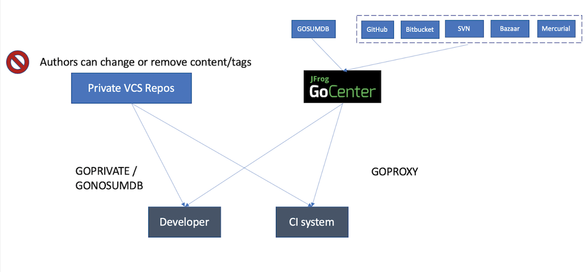
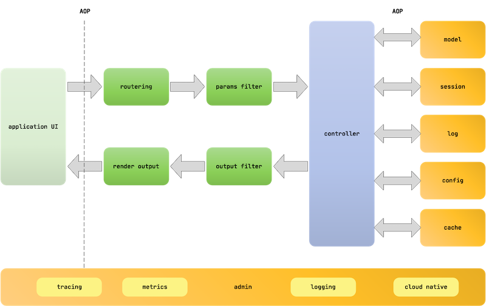

## Go knowledge base

### Install Go 

+ Install Go
https://golang.org/doc/install

+ Install vscode go extension and related go command tools
https://marketplace.visualstudio.com/items?itemName=golang.go  

    + Features of vscode extension  
        https://github.com/golang/vscode-go/blob/master/docs/features.md

    + The extension uses a few command-line tools developed by the Go community. In particular, go, gopls, and dlv must be installed for this extension to work correctly.  
        https://github.com/golang/vscode-go/blob/master/docs/tools.md

        Tools will be installed by default when you install the extension. You can also manually install or update all of these tools by running the Go: Install/Update Tools command. If any tools are missing, you will see an Analysis Tools Missing warning in the bottom-right corner of the editor, which will prompt you to install these tools.VS Code Go will install the tools to your $GOPATH/bin by default.  
        ```bash
        Tools environment: GOPATH=/Users/mike/go
        Installing 9 tools at /Users/mike/go/bin in module mode.
        gopkgs
        go-outline
        gotests
        gomodifytags
        impl
        goplay
        dlv
        golint
        gopls

        Installing github.com/uudashr/gopkgs/v2/cmd/gopkgs (/Users/mike/go/bin/gopkgs) SUCCEEDED
        Installing github.com/ramya-rao-a/go-outline (/Users/mike/go/bin/go-outline) SUCCEEDED
        Installing github.com/cweill/gotests/... (/Users/mike/go/bin/gotests) SUCCEEDED
        Installing github.com/fatih/gomodifytags (/Users/mike/go/bin/gomodifytags) SUCCEEDED
        Installing github.com/josharian/impl (/Users/mike/go/bin/impl) SUCCEEDED
        Installing github.com/haya14busa/goplay/cmd/goplay (/Users/mike/go/bin/goplay) SUCCEEDED
        Installing github.com/go-delve/delve/cmd/dlv (/Users/mike/go/bin/dlv) SUCCEEDED
        Installing golang.org/x/lint/golint (/Users/mike/go/bin/golint) SUCCEEDED
        Installing golang.org/x/tools/gopls (/Users/mike/go/bin/gopls) SUCCEEDED

        All tools successfully installed. You are ready to Go :).
        ```

    + Settings of go extensions for different command-line tools  
        https://github.com/golang/vscode-go/blob/master/docs/settings.md


### Setup Go development environment in vscode

+ Enable debug for vscode go extension (Delve)  
    https://github.com/golang/vscode-go/blob/master/docs/debugging.md

+ Enable resolving private go modues(GOPRIVATE)  
https://jfrog.com/blog/why-goproxy-matters-and-which-to-pick/

    + Use "GOPRVIATE" and JFrog GoCenter to resolve private modules from private git repository as well as public modules from GoCenter
        
        ```bash
        $ export GOPROXY=https://gocenter.io,direct
        $ export GOPRIVATE=*.internal.mycompany.com
        ```
        > (1) https://gocenter.io,direct means to resolve all modules which don't belong to GOPRIVATE by GoCenter, then direct.  
        > (2) By default. GOPROXY is https://proxy.golang.org,direct which is a module mirror provided by Go team for accelerating Go module downloads.  
        > (3) GOPRIVATE serves as the default value for the lower-level GONOPROXY and GONOSUMDB variables, which provide finer-grained control over which modules are fetched via proxy and verified using the checksum database.

    + Use "GOPROXY" and Artifactory to delegate both public and private repositories
        
        ```bash
        $ export GOPROXY="https://:@my.artifactory.server/artifactory/api/go/go
        $ export GONOSUMDB="github.com/mycompany/*,github.com/mypersonal/*"
        ```

### Go web development

#### Beego
**What is Beego?**  
Beego is a RESTful HTTP framework for the rapid development of Go applications including APIs, web apps and backend services with integrated Go specific features such as interfaces and struct embedding.

**The architecture of Beego**  
Beego is built upon 8 loosely linked modules that can be used independently or as part of Beego’s HTTP logic. This high level of modularity gives Beego an unprecedented level of flexibility to meet developer needs.  


**The execution logic of Beego**  
Beego uses a standard Model-View-Controller (MVC) architecture for logic execution.  


**The project structure of Beego**  
Here is the typical folder structure of a Beego project:  
```bash
├── conf
│   └── app.conf
├── controllers
│   ├── admin
│   └── default.go
├── main.go
├── models
│   └── models.go
├── static
│   ├── css
│   ├── ico
│   ├── img
│   └── js
└── views
    ├── admin
    └── index.tpl
```

+ Official Website  
    https://github.com/astaxie/beego

+ Official Doc  
    https://beego.me/docs/intro/

+ Github  
    https://github.com/astaxie/beego

#### go-restful
**What is go-restful?**  
package for building REST-style Web Services using Google Go. It is used by Kubernetes api-server.

+ Github
    https://github.com/emicklei/go-restful

#### Gin
**What is Gin?**
Gin is a web framework written in Go (Golang). It features a martini-like API with much better performance, up to 40 times faster thanks to httprouter. If you need performance and good productivity, you will love Gin.  

+ Official Website  
    https://gin-gonic.com/

+ Official Doc
    https://gin-gonic.com/docs/

+ Github
    https://github.com/gin-gonic/gin

#### Echo
**What is echo?**  
High performance, minimalist Go web framework  

+ Official Website
    https://echo.labstack.com/

+ Official Doc
    https://echo.labstack.com/guide

+ Github
    https://github.com/labstack/echo

#### Kit
**What is Kit?**  
Go kit is a programming toolkit for building microservices (or elegant monoliths) in Go. We solve common problems in distributed systems and application architecture so you can focus on delivering business value.  

+ Official Website
    https://gokit.io/

+ Github
    https://github.com/go-kit/kit

#### FastHttp
**What is FastHttp**  
The fasthttp framework provides a fast HTTP server and client API which was made as an alternative to net/http due to its limits on optimization opportunities.

+ Github
    https://github.com/valyala/fasthttp

#### Reference
+ Top 5 Golang Frameworks in 2020  
    https://www.geeksforgeeks.org/top-5-golang-frameworks-in-2020/

### Go admin web

#### go-admin
**What is go-admin?**  
GoAdmin is a framework, providing a complete set of visual UI calls to golang programs, and a built-in sql relational database management backend plugin. 

+ Official Website  
http://www.go-admin.cn/en/

+ Official Doc  
https://book.go-admin.cn/en

### Go Syntax

#### Go Concurrency Patterns: Pipelines and cancellation
https://blog.golang.org/pipelines  

#### Go Concurrency Patterns: Context
https://blog.golang.org/context

## Go learning materials

### Learn Go And Plant Trees
https://tutorialedge.net/