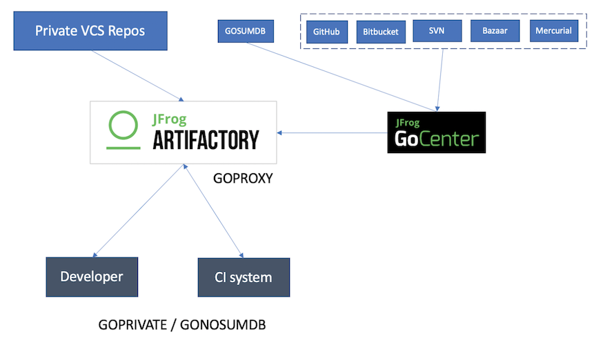

# Go Basic
## Install Go
+ Install Go  
    https://golang.org/doc/install

+ Install vscode go extension and related go command tools  
    https://marketplace.visualstudio.com/items?itemName=golang.go  

    + Features of vscode extension  
        https://github.com/golang/vscode-go/blob/master/docs/features.md

    + The extension uses a few command-line tools developed by the Go community. In particular, go, gopls, and dlv must be installed for this extension to work correctly.  
        https://github.com/golang/vscode-go/blob/master/docs/tools.md

        Tools will be installed by default when you install the extension. You can also manually install or update all of these tools by running the Go: Install/Update Tools command. If any tools are missing, you will see an Analysis Tools Missing warning in the bottom-right corner of the editor, which will prompt you to install these tools.VS Code Go will install the tools to your $GOPATH/bin by default.  
        ```bash
        Tools environment: GOPATH=/Users/mike/go
        Installing 9 tools at /Users/mike/go/bin in module mode.
        gopkgs
        go-outline
        gotests
        gomodifytags
        impl
        goplay
        dlv
        golint
        gopls

        Installing github.com/uudashr/gopkgs/v2/cmd/gopkgs (/Users/mike/go/bin/gopkgs) SUCCEEDED
        Installing github.com/ramya-rao-a/go-outline (/Users/mike/go/bin/go-outline) SUCCEEDED
        Installing github.com/cweill/gotests/... (/Users/mike/go/bin/gotests) SUCCEEDED
        Installing github.com/fatih/gomodifytags (/Users/mike/go/bin/gomodifytags) SUCCEEDED
        Installing github.com/josharian/impl (/Users/mike/go/bin/impl) SUCCEEDED
        Installing github.com/haya14busa/goplay/cmd/goplay (/Users/mike/go/bin/goplay) SUCCEEDED
        Installing github.com/go-delve/delve/cmd/dlv (/Users/mike/go/bin/dlv) SUCCEEDED
        Installing golang.org/x/lint/golint (/Users/mike/go/bin/golint) SUCCEEDED
        Installing golang.org/x/tools/gopls (/Users/mike/go/bin/gopls) SUCCEEDED

        All tools successfully installed. You are ready to Go :).
        ```

    + Settings of go extensions for different command-line tools  
        https://github.com/golang/vscode-go/blob/master/docs/settings.md
## Setup Go development environment in vscode
### Enable debug for vscode go extension (Delve)
    https://github.com/golang/vscode-go/blob/master/docs/debugging.md

    ```bash
    $ export GOPROXY=https://goproxy.cn,direct
    $ export GOPRIVATE=*.internal.mycompany.com
    ```  
### Enable resolving private go modues(GOPRIVATE)
+ Use "GOPRVIATE" to resolve private modules from private git repository and use "GOPROXY" to resolve public modules from JFrog GoCenter  

    
    ```bash
    $ export GOPROXY=https://gocenter.io,direct
    $ export GOPRIVATE=*.internal.mycompany.com
    ```
    > 1. https://gocenter.io,direct means to resolve all modules which don't belong to GOPRIVATE by GoCenter, then direct.  
    > 2. By default. GOPROXY is https://proxy.golang.org,direct which is a module mirror provided by Go team for accelerating Go module downloads.  
    > 3. GOPRIVATE serves as the default value for the lower-level GONOPROXY and GONOSUMDB variables, which provide finer-grained control over which modules are fetched via proxy and verified using the checksum database.

+ Use "GOPROXY" and Artifactory to delegate both public and private repositories  

    

    ```bash
    $ export GOPROXY="https://:@my.artifactory.server/artifactory/api/go/go
    $ export GONOSUMDB="github.com/mycompany/*,github.com/mypersonal/*"
    ```  

> https://jfrog.com/blog/why-goproxy-matters-and-which-to-pick/

## Go learning materials
### Learn Go And Plant Trees
https://tutorialedge.net/

### Golang Tuorial
https://www.golangprograms.com/golang-package-examples.html

### Golang入门教程
http://c.biancheng.net/golang/  

### Go Concurrency Patterns: Pipelines and cancellation
https://blog.golang.org/pipelines  

### Go Concurrency Patterns: Context
https://blog.golang.org/context