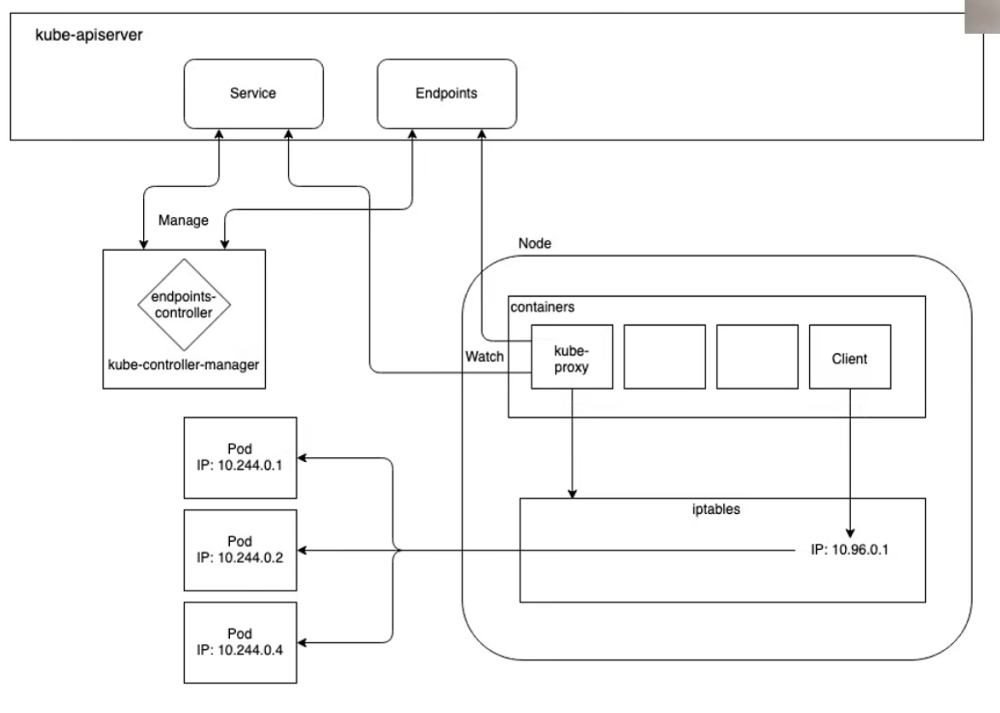
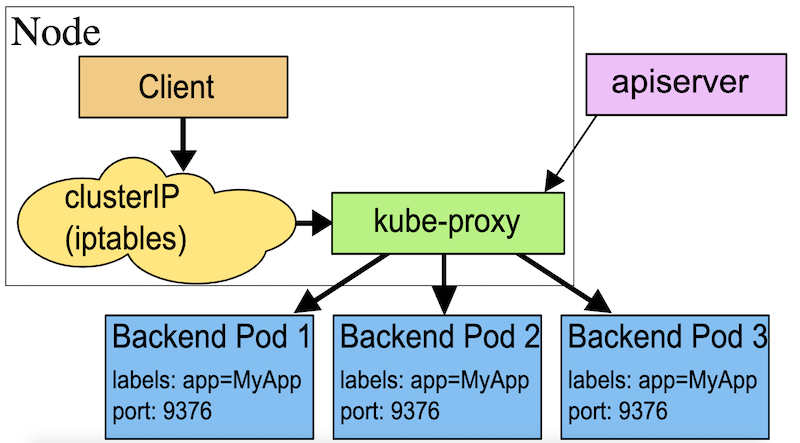
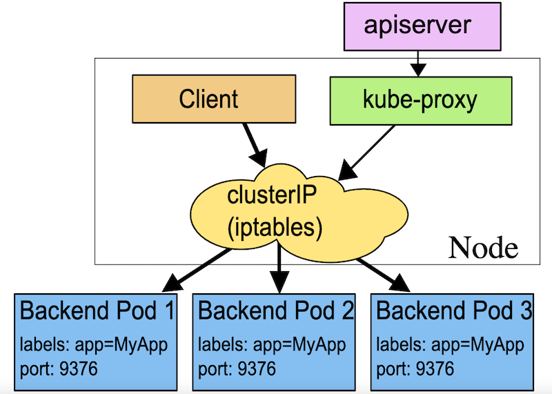
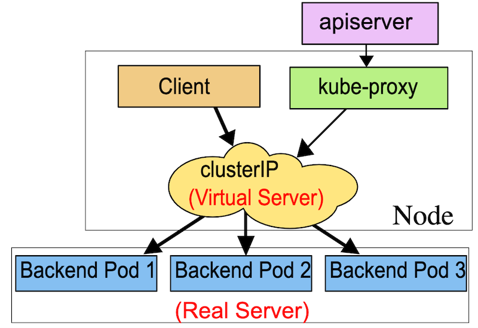
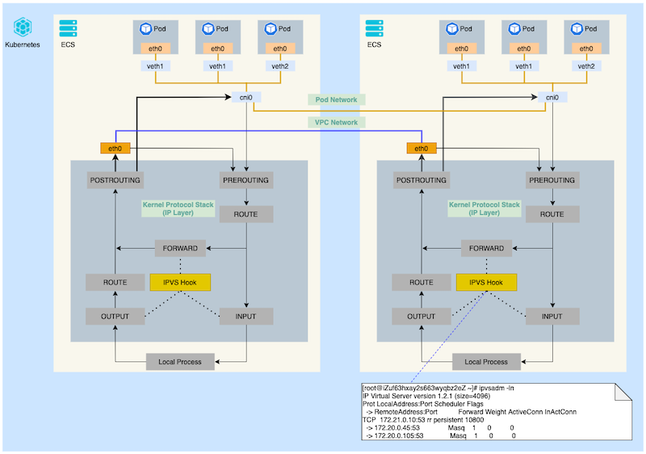

## kube-proxy
kube-proxy is a network proxy that runs on each node in your cluster, implementing part of the Kubernetes Service concept. kube-proxy is responsible for implementing a form of virtual IP for Services of type other than ExternalName.  
  

https://arthurchiao.art/blog/cracking-k8s-node-proxy/#1-background-knowledge  
https://www.digitalocean.com/community/tutorials/a-deep-dive-into-iptables-and-netfilter-architecture  
https://kubernetes.io/docs/reference/networking/virtual-ips/  

### Why not use round-robin DNS?
A question that pops up every now and then is why Kubernetes relies on proxying to forward inbound traffic to backends. What about other approaches? For example, would it be possible to configure DNS records that have multiple A values (or AAAA for IPv6), and rely on round-robin name resolution?

There are a few reasons for using proxying for Services:

+ There is a long history of DNS implementations not respecting record TTLs, and caching the results of name lookups after they should have expired.
+ Some apps do DNS lookups only once and cache the results indefinitely.
+ Even if apps and libraries did proper re-resolution, the low or zero TTLs on the DNS records could impose a high load on DNS that then becomes difficult to manage.

### User space proxy mode
In this mode, kube-proxy watches the Kubernetes control plane for the addition and removal of Service and Endpoint objects. For each Service it opens a port (randomly chosen) on the local node. Any connections to this "proxy port" are proxied to one of the Service's backend Pods (as reported via Endpoints). kube-proxy takes the SessionAffinity setting of the Service into account when deciding which backend Pod to use.

Lastly, the user-space proxy installs iptables rules which capture traffic to the Service's clusterIP (which is virtual) and port. The rules redirect that traffic to the proxy port which proxies the backend Pod.

By default, kube-proxy in userspace mode chooses a backend via a round-robin algorithm.  
  

### iptables proxy mode
In this mode, kube-proxy watches the Kubernetes control plane for the addition and removal of Service and Endpoint objects. For each Service, it installs iptables rules, which capture traffic to the Service's clusterIP and port, and redirect that traffic to one of the Service's backend sets. For each Endpoint object, it installs iptables rules which select a backend Pod.

By default, kube-proxy in iptables mode chooses a backend at random.

Using iptables to handle traffic has a lower system overhead, because traffic is handled by Linux netfilter without the need to switch between userspace and the kernel space. This approach is also likely to be more reliable.

If kube-proxy is running in iptables mode and the first Pod that's selected does not respond, the connection fails. This is different from userspace mode: in that scenario, kube-proxy would detect that the connection to the first Pod had failed and would automatically retry with a different backend Pod.

You can use Pod readiness probes to verify that backend Pods are working OK, so that kube-proxy in iptables mode only sees backends that test out as healthy. Doing this means you avoid having traffic sent via kube-proxy to a Pod that's known to have failed.  
  

### IPVS proxy mode
In ipvs mode, kube-proxy watches Kubernetes Services and Endpoints, calls netlink interface to create IPVS rules accordingly and synchronizes IPVS rules with Kubernetes Services and Endpoints periodically. This control loop ensures that IPVS status matches the desired state. When accessing a Service, IPVS directs traffic to one of the backend Pods.

The IPVS proxy mode is based on netfilter hook function that is similar to iptables mode, but uses a hash table as the underlying data structure and works in the kernel space. That means kube-proxy in IPVS mode redirects traffic with lower latency than kube-proxy in iptables mode, with much better performance when synchronising proxy rules. Compared to the other proxy modes, IPVS mode also supports a higher throughput of network traffic.

IPVS provides more options for balancing traffic to backend Pods; these are:

+ rr: round-robin
+ lc: least connection (smallest number of open connections)
+ dh: destination hashing
+ sh: source hashing
+ sed: shortest expected delay
+ nq: never queue

  

> Note:  
To run kube-proxy in IPVS mode, you must make IPVS available on the node before starting kube-proxy.  
When kube-proxy starts in IPVS proxy mode, it verifies whether IPVS kernel modules are available. If the IPVS kernel modules are not detected, then kube-proxy falls back to running in iptables proxy mode.  

#### IPVS proxy mode mechanism
  

### Kubernetes service
+ externalTrafficPolicy  
    While “Cluster” allows for efficient load balancing by forwarding requests to other nodes, “Local” can result in imbalanced traffic spreading. When “Local” is set, the load balancer distributes traffic equally between nodes, regardless of the number of pods, which can lead to inefficient resource consumption.  

    If a Service’s .spec.externalTrafficPolicy is set to Cluster, the client's IP address is not propagated to the end Pods (default). By setting .spec.externalTrafficPolicy to Local, the client IP addresses is propagated to the end Pods, but this could result in uneven distribution of traffic.  

+ internalTrafficPolicy  
    Cluster (default): route to all cluster-wide endpoints (or use topology aware subsetting if enabled).  
    Local: only route to node-local endpoints, drop otherwise.  

> Note:  
https://www.youtube.com/watch?v=y2bhV81MfKQ&t=1823s  