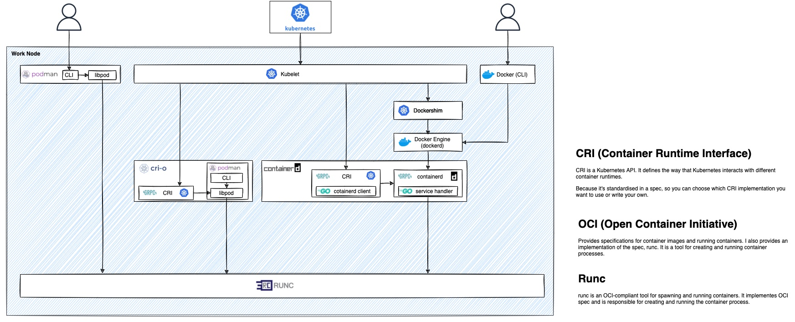

## Useful commands

+ Get pods in specific work node
```bash
kubectl get pod -o=custom-columns=NODE:.spec.nodeName,NAME:.metadata.name,KIND:.kind,NAMESPACE:.metadata.namespace  --all-namespaces
```

## Entering into node of Kubernetes of Docker for Mac 

### Option1
+ Entering
    ```bash
    screen ~/Library/Containers/com.docker.docker/Data/vms/0/tty
    ```

+ Quit
    Ctrl+a, followed by pressing k and y.

### Option2
+ Entering  
    ```bash
    docker run -it --privileged --pid=host debian nsenter -t 1 -m -u -n -i sh
    ```
    > http://www.openkb.info/2021/03/docker-for-mac-could-not-find.html

+ Quit  
    ```bash
    exit
    ```

## Start various kind of pods in Kubernetes for test purpose
### Start a pod using kubectl command

+ RockyLinux  
  ```bash
  kubectl run rockylinux -it  \
  --image=rockylinux:9.3.20231119 \
  --image-pull-policy="IfNotPresent" \
  --overrides='{ "apiVersion": "v1", "spec": { "imagePullSecrets": [{"name": "xxxx"}] } }' -- sh
  ```  

  ```bash
  kubectl run rockylinux -it --image=rockylinux:9.3.20231119 -- sh
  ```  

+ Ubuntu  
  ```bash
  kubectl run ubuntu1804 -it \
  --image=ubuntu:18.04 \
  --image-pull-policy="IfNotPresent" \
  --overrides='{ "apiVersion": "v1", "spec": { "imagePullSecrets": [{"name": "xxxx"}] } }' -- sh
  ```  

  ```bash
  kubectl run ubuntu1804 -it --image=ubuntu:18.04 -- sh
  ```  

  > Need to install necessary utilities:  
    apt-get update  
    apt-get install vim  
    apt-get install curl  
    apt install dnsutils  
    apt-get install iputils-ping  
    cd /usr/local/bin  
    curl -LO https://dl.k8s.io/release/v1.21.0/bin/linux/amd64/kubectl  
    chmod a+x kubectl  


+ Start busybox-curl  
  ```bash
  kubectl run bcurl -it --image=yauritux/busybox-curl:latest  -- sh
  ```
  > It is run as root user

+ Start from a curl image
  ```bash
  kubectl run curl -it --image=curlimages/curl:latest  -- sh
  ```

+ Start busybox
  ```bash
  kubectl run busybox -it --privileged=true --image=busybox  -- sh
  ```

+ Start psql client
  ```bash
  kubectl run psql -it --image=jbergknoff/postgresql-client  --command -- /bin/sh
  ```

### Start a pod using manifests for advanced control  

+ Use nodeSelector to select exact node  

  ```bash
  kubectl apply -f - <<EOF
  apiVersion: apps/v1
  kind: Deployment
  metadata:
    labels:
      app: curl
    name: curl
  spec:
    replicas: 1
    selector:
      matchLabels:
        app: curl
    template:
      metadata:
        labels:
          app: curl
      spec:
        dnsPolicy: ClusterFirst
        nodeSelector:
          kubernetes.io/os: linux
          kubernetes.io/hostname: cn-shanghai.172.19.xxx.xxx
        terminationGracePeriodSeconds: 300
        containers:
          - name: curl
            image: curlimages/curl:latest
            imagePullPolicy: IfNotPresent
            args:
              - sh
              - -c
              - "sleep 36000"
            resources:
              limits:
                cpu: 300m
                memory: 1000Mi
              requests:
                cpu: 100m
                memory: 300Mi
  EOF
  ```

+ Use nodeAffinity to select nodes  

  ```bash
  kubectl apply -f - <<EOF
  apiVersion: apps/v1
  kind: Deployment
  metadata:
    labels:
      app: curl
    name: curl
  spec:
    replicas: 1
    selector:
      matchLabels:
        app: curl
    template:
      metadata:
        labels:
          app: curl
      spec:
        affinity:
          nodeAffinity:
            requiredDuringSchedulingIgnoredDuringExecution:
              nodeSelectorTerms:
              - matchExpressions:
                - key: type
                  operator: NotIn
                  values:
                  - virtual-kubelet
                - key: k8s.aliyun.com
                  operator: NotIn
                  values:
                  - "true"
                - key: usage
                  operator: In
                  values:
                  - nginx-ingress-reverse
        dnsPolicy: ClusterFirst
        nodeSelector:
          kubernetes.io/os: linux
        terminationGracePeriodSeconds: 300
        containers:
          - name: curl
            image: curlimages/curl:latest
            imagePullPolicy: IfNotPresent
            args:
              - sh
              - -c
              - "sleep 36000"
            resources:
              limits:
                cpu: 300m
                memory: 1000Mi
              requests:
                cpu: 100m
                memory: 300Mi
  EOF
  ```

  > Docker image (based in alpine) for test dns configurations, include: dig, nslookup and nsupdate tools.  
  ```bash
  kubectl apply -f - <<EOF
  apiVersion: apps/v1
  kind: Deployment
  metadata:
    labels:
      app: dig
    name: dig
  spec:
    replicas: 1
    selector:
      matchLabels:
        app: dig
    template:
      metadata:
        labels:
          app: dig
      spec:
        affinity:
          nodeAffinity:
            requiredDuringSchedulingIgnoredDuringExecution:
              nodeSelectorTerms:
              - matchExpressions:
                - key: type
                  operator: NotIn
                  values:
                  - virtual-kubelet
                - key: k8s.aliyun.com
                  operator: NotIn
                  values:
                  - "true"
                - key: kubernetes.io/hostname
                  operator: In
                  values:
                  - cn-shanghai.10.229.249.51
        dnsPolicy: ClusterFirst
        nodeSelector:
          kubernetes.io/os: linux
        terminationGracePeriodSeconds: 300
        containers:
          - name: dig-51
            image: azukiapp/dig
            imagePullPolicy: IfNotPresent
            args:
              - bash
              - -c
              - "sleep 36000"
            resources:
              limits:
                cpu: 300m
                memory: 1000Mi
              requests:
                cpu: 100m
                memory: 300Mi
  EOF
  ```
  > nodeSelector and nodeAffinity can be used at the same time.  

+ Tolerate pod to a node with taints  
  > The node has a taint "usage: nginx-ingress-reverse".  

  ```bash
  kubectl apply -f - <<EOF
  apiVersion: apps/v1
  kind: Deployment
  metadata:
    labels:
      app: curl
    name: curl
  spec:
    replicas: 1
    selector:
      matchLabels:
        app: curl
    template:
      metadata:
        labels:
          app: curl
      spec:
        tolerations:
        - key: "usage"
          operator: "Equal"
          value: "nginx-ingress-reverse"
          effect: "NoSchedule"
        dnsPolicy: ClusterFirst
        nodeSelector:
          kubernetes.io/os: linux
        terminationGracePeriodSeconds: 300
        containers:
          - name: curl
            image: curlimages/curl:latest
            imagePullPolicy: IfNotPresent
            args:
              - sh
              - -c
              - "sleep 36000"
            resources:
              limits:
                cpu: 300m
                memory: 1000Mi
              requests:
                cpu: 100m
                memory: 300Mi
  EOF
  ```
  > nodeSelector and tolerations can be used at the same time.  

### Start a pod for special testing purpose  
+ netutils including mtr command to do network probing  

  ```bash
  kubectl apply -f - <<EOF
  apiVersion: apps/v1
  kind: Deployment
  metadata:
    labels:
      app: netutils
    name: netutils
  spec:
    replicas: 1
    selector:
      matchLabels:
        app: netutils
    template:
      metadata:
        labels:
          app: netutils
      spec:
        dnsPolicy: ClusterFirst
        nodeSelector:
          kubernetes.io/os: linux
          kubernetes.io/hostname: cn-shanghai.xxxxx
        terminationGracePeriodSeconds: 300
        containers:
          - name: netutils
            image: mikejianzhang/netutils:0.0.2
            imagePullPolicy: IfNotPresent
            args:
              - sh
              - -c
              - "sleep 36000"
            resources:
              limits:
                cpu: 300m
                memory: 1000Mi
              requests:
                cpu: 100m
                memory: 300Mi
  EOF
  ```  

+ Start a testing NFS server  
  ```bash
  kubectl apply -f - <<EOF
  apiVersion: apps/v1
  kind: Deployment
  metadata:
    namespace: nfs
    name: nfs-server
    labels:
      app: nfs-server
  spec:
    replicas: 1
    selector:
      matchLabels:
        app: nfs-server
    template:
      metadata:
        labels:
          app: nfs-server
          name: nfs-server
      spec:
        containers:
          - name: nfs-server
            image: itsthenetwork/nfs-server-alpine:12
            securityContext:
              privileged: true
            ports:
              - name: nfs
                containerPort: 2049
              - name: mountd
                containerPort: 20048
              - name: rpcbind
                containerPort: 111
            env:
              - name: SHARED_DIRECTORY
                value: /nfsshare
            volumeMounts:
            - mountPath: /nfsshare
              name: nfsshare
            imagePullPolicy: IfNotPresent
            resources:
              limits:
                cpu: 200m
                memory: 512Mi
              requests:
                cpu: 100m
                memory: 256Mi
        restartPolicy: Always
        volumes:
        - name: nfsshare
          emptyDir: {}
          # For hostPath, the client can mount but has no permission to write.
          #hostPath:
            # directory location on host
          #  path: /Users/mizha53/Documents/MikeStorage/MikeNFS
            # this field is optional
          #  type: Directory
  ---
  apiVersion: v1
  kind: Service
  metadata:
    name: nfs-server
    namespace: nfs
  spec:
    selector:
      app: nfs-server
    ports:
      - name: nfs
        port: 2049
      - name: mountd
        port: 20048
      - name: rpcbind
        port: 111
  EOF
  ```

+ Start a NFS client to connect the tesing NFS server  
  ```bash
  kubectl apply -f - <<EOF
  apiVersion: v1
  kind: PersistentVolume
  metadata:
  name: nfs-client
  labels:
      app: nfs-client
  spec:
  capacity:
    storage: 5Gi
  accessModes:
    - ReadWriteMany
  nfs:
    server: "10.101.253.230"
    path: "/"
  mountOptions:
    - vers=4
  ---
  apiVersion: v1
  kind: PersistentVolumeClaim
  metadata:
  namespace: nfs
  name: nfs-client
  labels:
      app: nfs-client
  spec:
  accessModes:
      - ReadWriteMany
  storageClassName: ""
  resources:
      requests:
      storage: 5Gi
  selector:
      matchLabels:
      app: nfs-client
  ---
  apiVersion: apps/v1
  kind: Deployment
  metadata:
  namespace: nfs
  name: nfs-client
  labels:
      app: nfs-client
  spec:
  replicas: 1
  selector:
      matchLabels:
      app: nfs-client
  template:
      metadata:
      name: nfs-client
      labels:
          app: nfs-client
      spec:
      containers:
          - name: nfs-client
          image: busybox
          securityContext:
              privileged: true
          volumeMounts:
          - mountPath: /var/nfs
              name: nfsshare
          imagePullPolicy: IfNotPresent
          resources:
              limits:
              cpu: 200m
              memory: 512Mi
              requests:
              cpu: 100m
              memory: 256Mi
          command: ["/bin/sh"]
          args: ["-c", "while true; do date >> /var/nfs/dates.txt; sleep 5; done"]
      restartPolicy: Always
      volumes:
      - name: nfsshare
          persistentVolumeClaim:
          claimName: nfs-client
  EOF
  ```  

+ Mount to the testing NFS server using command mount  
  ```bash
  mount -v -o vers=4 nfs-server.nfs.svc.cluster.local:/ /tmp/test
  ```

## Container runtime hierarchy
 

### High level Container Runtime

#### Containerd
https://containerd.io/

 

A simple containerd client:  
https://containerd.io/docs/getting-started/#full-example

#### CRI-O
https://cri-o.io/  
https://www.linkedin.com/pulse/lightweight-container-runtime-kubernetes-cri-o-daniel-oh/

CRI-O is an implementation of the Kubernetes CRI (Container Runtime Interface) to enable using OCI (Open Container Initiative) compatible runtimes.

 

### Low level container runtime - OCI compatible runtime
#### Runc  
https://github.com/opencontainers/runc

### Others

Container Security: Understanding the Hierarchy of Runtimes  
https://www.threatstack.com/blog/container-security-understanding-the-hierarchy-of-runtimes


Diving Deeper Into Runtimes: Kubernetes, CRI, and Shims  
https://www.threatstack.com/blog/diving-deeper-into-runtimes-kubernetes-cri-and-shims

## Cluster resource auto-scaling
Kubernetes CA, VPA, HPA  
https://dasydong.github.io/blog/2019/12/21/k8s-ca-code%E7%BB%BC%E5%90%88%E7%AF%87/  


## Graceful shutdown
https://github.com/mikesay/kubernetes-tests/tree/main/graceful-shutdown  

To avoid service outage during these periods, it's important that you've built your application to tolerate disruptions. This is, as mentioned, a non-trivial task, but there are multiple resources and blogs out there that describes how to do that. In essence it can be described as:

+ Run with multiple instances  
+ Avoid keeping state with your application  
+ Run with anti-affinity so that your pods are not running on the same nodes https://kubernetes.io/docs/concepts/scheduling-eviction/assign-pod-node/#affinity-and-anti-affinity  
+ Use PodDisruptionBudgets to ensure you have at least one up and ready replica https://kubernetes.io/docs/concepts/workloads/pods/disruptions/  
+ Set proper Liveness & Readiness Probes so that your application is really ready when it says it's ready  
+ Handle shutdowns gracefully, so that when the Pod is terminated it handles the SIGTERM gracefully.  
https://cloud.google.com/blog/products/containers-kubernetes/kubernetes-best-practices-terminating-with-grace  
https://medium.com/trendyol-tech/graceful-shutdown-of-spring-boot-applications-in-kubernetes-f80e0b3a30b0  
https://stackoverflow.com/questions/57122081/kubernetes-sends-traffic-to-the-pod-even-after-sending-sigterm  

+ TEST DISRUPTION SCENARIOS! What happens to your service when you kubectl delete pod <your app replica>? Is it behaving as you are expecting it to? What kind of errors do you get? Are certain amount of failures acceptable?  
Here is a very good checklist of things to consider when running Production workloads. Not all of the items will apply to you, but in any case it's good to go through and understand. See what items could be of use to your app. https://learnk8s.io/production-best-practices  

https://blog.flant.com/best-practices-for-deploying-highly-available-apps-in-kubernetes-part-1/   

## kube-rbac-proxy
https://github.com/brancz/kube-rbac-proxy  

### Example for non resource url  
https://github.com/brancz/kube-rbac-proxy/tree/master/examples/non-resource-url  

+ Create clusterrole and clusterrolebinding to grant default sa in default namespace
```yaml
apiVersion: rbac.authorization.k8s.io/v1
kind: ClusterRole
metadata:
  name: metrics
rules:
- nonResourceURLs: ["/metrics"]
  verbs: ["get"]
---
apiVersion: rbac.authorization.k8s.io/v1
kind: ClusterRoleBinding
metadata:
  name: metrics
roleRef:
  apiGroup: rbac.authorization.k8s.io
  kind: ClusterRole
  name: metrics
subjects:
- kind: ServiceAccount
  name: default
  namespace: default
```

+ Start a test pod

+ Run following command
```sh
curl -s -k -H "Authorization: Bearer `cat /var/run/secrets/kubernetes.io/serviceaccount/token`" https://ccoecn-action-runners-actions-runner-controller-metrics-service.github-action-runner:8443/metrics
```

## QoS & OOMKilller

In general, pod's QoS will determin the OOM score of its related processes in host.  
  

+ What is OOMKiller(Linux system level): Surviving the Linux OOM Killer  
https://dev.to/rrampage/surviving-the-linux-oom-killer-2ki9  

+ OOMKiller in Kubernetes(Kubernetes level): OOMKilled - troubleshooting Kubernetes memory requests and limits  
https://www.airplane.dev/blog/oomkilled-troubleshooting-kubernetes-memory-requests-and-limits  

+ How does Kubernetes assign QoS class to pods through OOM score  
https://cloudyuga.guru/hands_on_lab/k8s-qos-oomkilled  

## Scheduling
### CPU scheduling and consuming: Request & Limit

+ Understanding resource limits in kubernetes: cpu time  
https://medium.com/@betz.mark/understanding-resource-limits-in-kubernetes-cpu-time-9eff74d3161b  

  setting a cpu request in kubernetes ultimately sets the cpu.shares cgroup property, and setting cpu limits engages a different system through setting cpu.cfs_period_us and cpu.cfs_quota_us

+ CPU bandwidth control for CFS  
https://research.google/pubs/pub36669/  

+ Completely Fair Scheduler  
https://www.linuxjournal.com/node/10267  

  So, if the total limit of CPU resources exceed the cluster's total amount very large, it will cause many pods throtteling, hence reduce the computing performance.  

### Memory scheduling and consuming: Request & Limit
+ Understanding resource limits in kubernetes: memory  
https://medium.com/@betz.mark/understanding-resource-limits-in-kubernetes-memory-6b41e9a955f9  


## Configure Servie Accounts for Pods
Verify 
https://kubernetes.io/docs/tasks/configure-pod-container/configure-service-account/  

If the total limit of memory resources exceed the cluster's total amount very large, it will cause system level OOM Kill, hence reduce the services availability.  


```sh
kubectl apply -f - << EOF
---
apiVersion: v1
kind: Namespace
metadata:
  labels:
    kubernetes.io/metadata.name: sa-demo
  name: sa-demo
---
apiVersion: v1
data:
  .dockerconfigjson: xxxx
kind: Secret
metadata:
  name: docker-pull-secret
  namespace: sa-demo
type: kubernetes.io/dockerconfigjson
---
apiVersion: v1
kind: ServiceAccount
metadata:
  name: sa-demo-default
  namespace: sa-demo
---
apiVersion: v1
kind: Pod
metadata:
  name: nginx
  namespace: sa-demo
spec:
  containers:
    - name: nginx
      image: nginx
      resources:
        limits:
          cpu: 100m
          memory: 256Mi
        requests:
          cpu: 50m
          memory: 200Mi
  serviceAccountName: sa-demo-default
  imagePullSecrets:
    - name: docker-pull-secret
---
apiVersion: v1
kind: Pod
metadata:
  name: nginx-customized
  namespace: sa-demo
spec:
  containers:
    - name: nginx-customized
      image: nginx
      volumeMounts:
      - mountPath: /var/run/secrets/tokens
        name: vault-token
      resources:
        limits:
          cpu: 100m
          memory: 256Mi
        requests:
          cpu: 50m
          memory: 200Mi
  serviceAccountName: sa-demo-default
  imagePullSecrets:
    - name: docker-pull-secret
  volumes:
  - name: vault-token
    projected:
      sources:
      - serviceAccountToken:
          path: token
          expirationSeconds: 600
          audience: vault
EOF
```

## Access Kubernetes pods from outside of the cluster
https://alesnosek.com/blog/2017/02/14/accessing-kubernetes-pods-from-outside-of-the-cluster/  

## Ephemeral storage
### Ephemeral volume
https://kubernetes.io/docs/concepts/storage/ephemeral-volumes/  

### Local ephemeral storage
https://kubernetes.io/docs/concepts/configuration/manage-resources-containers/#local-ephemeral-storage  

+ Ephemeral storage consumption management  

  If the kubelet is managing local ephemeral storage as a resource, then the kubelet measures storage use in:  

  + emptyDir volumes, except tmpfs emptyDir volumes  
  + directories holding node-level logs  
  + writeable container layers  
  
  If a Pod is using more ephemeral storage than you allow it to, the kubelet sets an eviction signal that triggers Pod eviction.

  + For container-level isolation, if a container's writable layer and log usage exceeds its storage limit, the kubelet marks the Pod for eviction.  

  + For pod-level isolation the kubelet works out an overall Pod storage limit by summing the limits for the containers in that Pod. In this case, if the sum of the local ephemeral storage usage from all containers and also the Pod's emptyDir volumes exceeds the overall Pod storage limit, then the kubelet also marks the Pod for eviction.  

  > The kubelet tracks tmpfs emptyDir volumes as container memory use, rather than as local ephemeral storage.  

  > To measure the total ephmeral storage of one node, the kubelet will only track the root filesystem for ephemeral storage. OS layouts that mount a separate disk to /var/lib/kubelet or /var/lib/containers will not report ephemeral storage correctly.

## Kubernetes 配置管理最佳方法
https://www.kubernetes.org.cn/3031.html

## Change Kubernetes subdomains
https://stackoverflow.com/questions/48326773/how-to-change-the-cluster-local-default-domain-on-kubernetes-1-9-deployed-with-k#:~:text=You%20can%20change%20the%20cluster,the%20clusterDomain%20during%20kubeadm%20init%20.&text=Then%20change-,kubernetes%20cluster.,.arpa%20%7B%20...%20%7D

I assume you are using CoreDNS.  

You can change the cluster base DNS by editing the kubelet config file on ALL Nodes, located here /var/lib/kubelet/config.yaml or set the clusterDomain during kubeadm init.  

Change  

```yaml
clusterDomain: cluster.local
```

to:  

```yaml
clusterDomain: my.new.domain  
```

Now you also need to change the CoreDNS configuration. CoreDNS uses a ConfigMap for this. You can get your current CoreDNS ConfigMap by running  

```yaml
kubectl get -n kube-system cm/coredns -o yaml
```

Then change  

```yaml
kubernetes cluster.local in-addr.arpa ip6.arpa {
    ...
}
to match your new domain like this:

kubernetes my.new.domain in-addr.arpa ip6.arpa {
    ...
}
```

Now apply the changes to the CoreDNS ConfigMap. If you restart kubelet and your CoreDNS pods then your cluster should use the new domain.  

If you have for example a service called grafana-service, this can now be accessed with this address: grafana-service.default.svc.my.new.domain  

Test:  
```yaml
kubectl get service
NAME              TYPE         CLUSTER-IP      EXTERNAL-IP   PORT(S)    AGE
grafana-service   ClusterIP    <Internal-IP>   <none>        3000/TCP   100m

# nslookup grafana-service.default.svc.my.new.domain
Server:    <Internal-IP>
Address 1: <Internal-IP> kube-dns.kube-system.svc.my.new.domain

Name:      grafana-service.default.svc.my.new.domain
Address 1: <Internal-IP> grafana-service.default.svc.my.new.domain
```