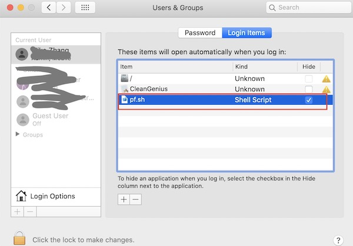

## Useful commands

+ Get pods in specific work node
```bash
kubectl get pod -o=custom-columns=NODE:.spec.nodeName,NAME:.metadata.name,KIND:.kind,NAMESPACE:.metadata.namespace  --all-namespaces
```

## Entering into node of Kubernetes of Docker for Mac 

### Option1
+ Entering
    ```bash
    screen ~/Library/Containers/com.docker.docker/Data/vms/0/tty
    ```

+ Quit
    Ctrl+a, followed by pressing k and y.

### Option2
+ Entering
    ```bash
    docker run -it --privileged --pid=host debian nsenter -t 1 -m -u -n -i sh
    ```
    > http://www.openkb.info/2021/03/docker-for-mac-could-not-find.html

+ Quit
    ```bash
    exit
    ```

## Start a pod in Kubernetes

### Start busybox-curl
```bash
kubectl run bcurl -it --image=yauritux/busybox-curl:latest  -- sh
```
> It is run as root user

### Start from a curl image
```bash
kubectl run curl -it --image=curlimages/curl:latest  -- sh
```

### Start busybox
```bash
kubectl run busybox -it --privileged=true --image=busybox  -- sh
```

### Start psql client
```bash
kubectl run psql -it --image=jbergknoff/postgresql-client  --command -- /bin/sh
```

### Start pod to run kubectl or helm
```bash
kubectl run kubectl -it --image=ubuntu:18.04 -- bash
apt-get update
apt-get install vim
apt-get install curl
cd /usr/local/bin
curl -LO https://dl.k8s.io/release/v1.21.0/bin/linux/amd64/kubectl
chmod a+x kubectl
```

### Start a pod on specific node

+ Use nodeSelector to specify exact node
```yaml
apiVersion: apps/v1
kind: Deployment
metadata:
  labels:
    app: curl
  name: curl
spec:
  replicas: 1
  selector:
    matchLabels:
      app: curl
  template:
    metadata:
      labels:
        app: curl
    spec:
      dnsPolicy: ClusterFirst
      nodeSelector:
        kubernetes.io/os: linux
        kubernetes.io/hostname: cn-shanghai.172.19.xxx.xxx
      terminationGracePeriodSeconds: 300
      containers:
        - name: curl
          image: curlimages/curl:latest
          imagePullPolicy: IfNotPresent
          args:
            - sh
            - -c
            - "sleep 36000"
```

+ Use nodeAffinity to specify nodes

```yaml
apiVersion: apps/v1
kind: Deployment
metadata:
  labels:
    app: curl
  name: curl
spec:
  replicas: 1
  selector:
    matchLabels:
      app: curl
  template:
    metadata:
      labels:
        app: curl
    spec:
      affinity:
        nodeAffinity:
          requiredDuringSchedulingIgnoredDuringExecution:
            nodeSelectorTerms:
            - matchExpressions:
              - key: type
                operator: NotIn
                values:
                - virtual-kubelet
              - key: k8s.aliyun.com
                operator: NotIn
                values:
                - "true"
              - key: usage
                operator: In
                values:
                - nginx-ingress-reverse
      dnsPolicy: ClusterFirst
      nodeSelector:
        kubernetes.io/os: linux
      terminationGracePeriodSeconds: 300
      containers:
        - name: curl
          image: curlimages/curl:latest
          imagePullPolicy: IfNotPresent
          args:
            - sh
            - -c
            - "sleep 36000"
```

> nodeSelector can also be used together with nodeAffinity.

### Tolerate a pod to a node with taints

The node has a taint "usage: nginx-ingress-reverse".  

```yaml
apiVersion: apps/v1
kind: Deployment
metadata:
  labels:
    app: curl
  name: curl
spec:
  replicas: 1
  selector:
    matchLabels:
      app: curl
  template:
    metadata:
      labels:
        app: curl
    spec:
      tolerations:
      - key: "usage"
        operator: "Equal"
        value: "nginx-ingress-reverse"
        effect: "NoSchedule"
      dnsPolicy: ClusterFirst
      nodeSelector:
        kubernetes.io/os: linux
      terminationGracePeriodSeconds: 300
      containers:
        - name: curl
          image: curlimages/curl:latest
          imagePullPolicy: IfNotPresent
          args:
            - sh
            - -c
            - "sleep 36000"
```

> nodeSelector can also be used together with toleration.

```yaml
apiVersion: apps/v1
kind: Deployment
metadata:
  labels:
    app: dig
  name: dig
spec:
  replicas: 1
  selector:
    matchLabels:
      app: dig
  template:
    metadata:
      labels:
        app: dig
    spec:
      affinity:
        nodeAffinity:
          requiredDuringSchedulingIgnoredDuringExecution:
            nodeSelectorTerms:
            - matchExpressions:
              - key: type
                operator: NotIn
                values:
                - virtual-kubelet
              - key: k8s.aliyun.com
                operator: NotIn
                values:
                - "true"
              - key: kubernetes.io/hostname
                operator: In
                values:
                - cn-shanghai.10.229.249.51
      dnsPolicy: ClusterFirst
      nodeSelector:
        kubernetes.io/os: linux
      terminationGracePeriodSeconds: 300
      containers:
        - name: dig-51
          image: azukiapp/dig
          imagePullPolicy: IfNotPresent
          args:
            - bash
            - -c
            - "sleep 36000"
```
> If the node has taints, also need to add tolerations

## Start testing NFS server

### deployment.yaml
```yaml
apiVersion: apps/v1
kind: Deployment
metadata:
  namespace: nfs
  name: nfs-server
  labels:
    app: nfs-server
spec:
  replicas: 1
  selector:
    matchLabels:
      app: nfs-server
  template:
    metadata:
      labels:
        app: nfs-server
        name: nfs-server
    spec:
      containers:
        - name: nfs-server
          image: itsthenetwork/nfs-server-alpine:12
          securityContext:
            privileged: true
          ports:
            - name: nfs
              containerPort: 2049
            - name: mountd
              containerPort: 20048
            - name: rpcbind
              containerPort: 111
          env:
            - name: SHARED_DIRECTORY
              value: /nfsshare
          volumeMounts:
          - mountPath: /nfsshare
            name: nfsshare
          imagePullPolicy: IfNotPresent
          resources:
            limits:
              cpu: 200m
              memory: 512Mi
            requests:
              cpu: 100m
              memory: 256Mi
      restartPolicy: Always
      volumes:
      - name: nfsshare
        emptyDir: {}
        # For hostPath, the client can mount but has no permission to write.
        #hostPath:
          # directory location on host
        #  path: /Users/mizha53/Documents/MikeStorage/MikeNFS
          # this field is optional
        #  type: Directory
```

### service.yaml
```yaml
apiVersion: v1
kind: Service
metadata:
  name: nfs-server
  namespace: nfs
spec:
  selector:
    app: nfs-server
  ports:
    - name: nfs
      port: 2049
    - name: mountd
      port: 20048
    - name: rpcbind
      port: 111
```
### Mount to the testing NFS server by PV
+ pv.yaml
    ```yaml
    apiVersion: v1
    kind: PersistentVolume
    metadata:
    name: nfs-client
    labels:
        app: nfs-client
    spec:
    capacity:
        storage: 5Gi
    accessModes:
        - ReadWriteMany
    nfs:
        server: "10.101.253.230"
        path: "/"
    mountOptions:
        - vers=4
    ```
+ pvc.yaml
    ```yaml
    apiVersion: v1
    kind: PersistentVolumeClaim
    metadata:
    namespace: nfs
    name: nfs-client
    labels:
        app: nfs-client
    spec:
    accessModes:
        - ReadWriteMany
    storageClassName: ""
    resources:
        requests:
        storage: 5Gi
    selector:
        matchLabels:
        app: nfs-client
    ```
+ deployment.yaml
    ```yaml
    apiVersion: apps/v1
    kind: Deployment
    metadata:
    namespace: nfs
    name: nfs-client
    labels:
        app: nfs-client
    spec:
    replicas: 1
    selector:
        matchLabels:
        app: nfs-client
    template:
        metadata:
        name: nfs-client
        labels:
            app: nfs-client
        spec:
        containers:
            - name: nfs-client
            image: busybox
            securityContext:
                privileged: true
            volumeMounts:
            - mountPath: /var/nfs
                name: nfsshare
            imagePullPolicy: IfNotPresent
            resources:
                limits:
                cpu: 200m
                memory: 512Mi
                requests:
                cpu: 100m
                memory: 256Mi
            command: ["/bin/sh"]
            args: ["-c", "while true; do date >> /var/nfs/dates.txt; sleep 5; done"]
        restartPolicy: Always
        volumes:
        - name: nfsshare
            persistentVolumeClaim:
            claimName: nfs-client
    ```

### Mount to the testing NFS server

+ Start a busybox pod
+ Run mount command
    ```bash
    mount -v -o vers=4 nfs-server.nfs.svc.cluster.local:/ /tmp/test
    ```

## Minikube

### Start a Minikube kubernetes

If had proxy, set the proxy environment and the NO_PROXY especially https://minikube.sigs.k8s.io/docs/handbook/vpn_and_proxy/:  
```bash
export https_proxy=http://192.168.0.208:7890
export http_proxy=http://192.168.0.208:7890
export all_proxy=socks5://192.168.0.208:7891
export no_proxy=localhost,127.0.0.1,192.168.0.208,.aliyuncs.com,.youku.com,k8s.mikesay.com,wp.mikesay.com,docker-registry.local,10.96.0.0/12,192.168.99.0/24,192.168.39.0/24,192.168.49.0/24,192.168.64.0/24

export HTTPS_PROXY=$https_proxy
export HTTP_PROXY=$http_proxy
export ALL_PROXY=$all_proxy
export NO_PROXY=$no_proxy
```
  
#### Use hyperkit driver:  
```bash
minikube start --cpus=4 --memory='6g' --cni='flannel' --disk-size='60g' --driver='hyperkit' --kubernetes-version='v1.19.10' --extra-config=apiserver.service-node-port-range=1-65535
```

#### Use virtualbox driver:  
```bash
minikube start --cpus=4 --memory='6g' --cni='flannel' --disk-size='60g' --driver='virtualbox' --kubernetes-version='v1.19.10' --extra-config=apiserver.service-node-port-range=1-65535 --extra-config=controller-manager.bind-address=0.0.0.0 --extra-config=scheduler.bind-address=0.0.0.0
```

### Make Minikube work in Corporate VPN

#### Port forwarding localhost:xxx -> minikube_IP:xxx
http://tdongsi.github.io/blog/2018/12/31/minikube-in-corporate-vpn/

This approach is the more convenient and more reliable in my experience. All you need to do is to set up a list of port forwarding rules for minikube’s VirtualBox:

```bash
VBoxManage controlvm minikube natpf1 k8s-apiserver,tcp,127.0.0.1,8443,,8443
VBoxManage controlvm minikube natpf1 k8s-dashboard,tcp,127.0.0.1,30000,,30000
VBoxManage controlvm minikube natpf1 jenkins,tcp,127.0.0.1,30080,,30080
VBoxManage controlvm minikube natpf1 docker,tcp,127.0.0.1,2376,,2376
```

In real setup, we could consider port forwarding from local to api server(8443), to docker(2376), to ingress controller(80, 443), and all the services will be exported by ingress:
```bash
VBoxManage controlvm minikube natpf1 k8s-apiserver,tcp,127.0.0.1,8443,,8443
VBoxManage controlvm minikube natpf1 k8s-ingress,tcp,127.0.0.1,9080,,80
VBoxManage controlvm minikube natpf1 k8s-ingress-secure,tcp,127.0.0.1,9443,,443
VBoxManage controlvm minikube natpf1 docker,tcp,127.0.0.1,2376,,2376
```

Since Mac(Unix) can't listen at ports lower than 1024 with no-root user, we have to specify local port 9080 and 9443 to map 80 and 443. However, in order to let user use local 80 and 443, we can setup port-forwarding in local Mac by refering following articles:  
https://www.zhiqiexing.com/2.html  
https://www.zhiqiexing.com/128.html  
https://www.zhiqiexing.com/127.html  

Steps:
+ Create /etc/pf.anchors/kubernetes.ingress-controller.forwarding with following content
```bash
rdr pass on lo0 inet proto tcp from any to 127.0.0.1 port 80 -> 127.0.0.1 port 9080
rdr pass on lo0 inet proto tcp from any to 127.0.0.1 port 443 -> 127.0.0.1 port 9443
```

+ Create /etc/pf-kubernetes-ingress-controller.conf with following content
```bash
load anchor "forwarding" from "/etc/pf.anchors/kubernetes.ingress-controller.forwarding"
```

+ Create a shell /Users/xxxx/.mikestart/pf.sh script which will be run during machine startup to enable port-forwarding
```bash
#!/bin/bash
sudo pfctl -ef /etc/pf-kubernetes-ingress-controller.conf
```
> Need to enable non password for sudo

+ Change the shell script to be executable
```bash
sudo chmod a+x /Users/xxxx/.mikestart/pf.sh
```

+ Register this script to be run during machine starup  

 

Then, you can set up a new Kubernetes context for working with VPN:

```bash
kubectl config set-cluster minikube-vpn --server=https://127.0.0.1:8443 --insecure-skip-tls-verify
kubectl config set-context minikube-vpn --cluster=minikube-vpn --user=minikube
```
When working on VPN, you can set kubectl to switch to the new context:

```bash
kubectl config use-context minikube-vpn
```

All Minikube URLs now must be accessed through localhost in browser. For example, the standard Kubernetes dashboard URL such as:

```bash
minikube dashboard --url
http://192.168.99.100:30000
```

must now be accessed via localhost:30000. Similar applies to other services that are deployed to minikube, such as jenkins shown above.

In addition, the eval $(minikube docker-env) standard pattern to reuse minikube’s Docker deamon would not work anymore.

```bash
minikube docker-env
export DOCKER_TLS_VERIFY="1"
export DOCKER_HOST="tcp://192.168.99.100:2376"
export DOCKER_CERT_PATH="/Users/tdongsi/.minikube/certs"
export DOCKER_API_VERSION="1.23"
```

Run this command to configure your shell:
eval $(minikube docker-env)

```bash
echo $DOCKER_HOST
tcp://192.168.99.100:2376
docker images
```

Cannot connect to the Docker daemon at tcp://192.168.99.100:2376. Is the docker daemon running?
Instead, you have to adjust DOCKER_HOST accordingly and use docker --tlsverify=false ....

```bash
export DOCKER_HOST="tcp://127.0.0.1:2376"
alias dockervpn="docker --tlsverify=false"
dockervpn images
...
```
Finally, when not working on VPN, you can set kubectl to switch back to the old context:

```bash
kubectl config use-context minikube
```


### Use minikube as docker daemon
https://itnext.io/goodbye-docker-desktop-hello-minikube-3649f2a1c469  

https://www.chevdor.com/post/2021/02/docker_to_k8s/

## Kubernetes 配置管理最佳方法
https://www.kubernetes.org.cn/3031.html

## Change Kubernetes subdomains
https://stackoverflow.com/questions/48326773/how-to-change-the-cluster-local-default-domain-on-kubernetes-1-9-deployed-with-k#:~:text=You%20can%20change%20the%20cluster,the%20clusterDomain%20during%20kubeadm%20init%20.&text=Then%20change-,kubernetes%20cluster.,.arpa%20%7B%20...%20%7D

I assume you are using CoreDNS.  

You can change the cluster base DNS by editing the kubelet config file on ALL Nodes, located here /var/lib/kubelet/config.yaml or set the clusterDomain during kubeadm init.  

Change  

```yaml
clusterDomain: cluster.local
```

to:  

```yaml
clusterDomain: my.new.domain  
```

Now you also need to change the CoreDNS configuration. CoreDNS uses a ConfigMap for this. You can get your current CoreDNS ConfigMap by running  

```yaml
kubectl get -n kube-system cm/coredns -o yaml
```

Then change  

```yaml
kubernetes cluster.local in-addr.arpa ip6.arpa {
    ...
}
to match your new domain like this:

kubernetes my.new.domain in-addr.arpa ip6.arpa {
    ...
}
```

Now apply the changes to the CoreDNS ConfigMap. If you restart kubelet and your CoreDNS pods then your cluster should use the new domain.  

If you have for example a service called grafana-service, this can now be accessed with this address: grafana-service.default.svc.my.new.domain  

Test:  
```yaml
kubectl get service
NAME              TYPE         CLUSTER-IP      EXTERNAL-IP   PORT(S)    AGE
grafana-service   ClusterIP    <Internal-IP>   <none>        3000/TCP   100m

# nslookup grafana-service.default.svc.my.new.domain
Server:    <Internal-IP>
Address 1: <Internal-IP> kube-dns.kube-system.svc.my.new.domain

Name:      grafana-service.default.svc.my.new.domain
Address 1: <Internal-IP> grafana-service.default.svc.my.new.domain
```

## Container runtime hierarchy
 

### High level Container Runtime

#### Containerd
https://containerd.io/

 

A simple containerd client:  
https://containerd.io/docs/getting-started/#full-example

#### CRI-O
https://cri-o.io/  
https://www.linkedin.com/pulse/lightweight-container-runtime-kubernetes-cri-o-daniel-oh/

CRI-O is an implementation of the Kubernetes CRI (Container Runtime Interface) to enable using OCI (Open Container Initiative) compatible runtimes.

 

### Low level container runtime - OCI compatible runtime
#### Runc  
https://github.com/opencontainers/runc

### Others

Container Security: Understanding the Hierarchy of Runtimes  
https://www.threatstack.com/blog/container-security-understanding-the-hierarchy-of-runtimes


Diving Deeper Into Runtimes: Kubernetes, CRI, and Shims  
https://www.threatstack.com/blog/diving-deeper-into-runtimes-kubernetes-cri-and-shims

## Cluster resource auto-scaling
Kubernetes CA, VPA, HPA  
https://dasydong.github.io/blog/2019/12/21/k8s-ca-code%E7%BB%BC%E5%90%88%E7%AF%87/  


## Graceful shutdown
https://github.com/mikesay/kubernetes-tests/tree/main/graceful-shutdown  