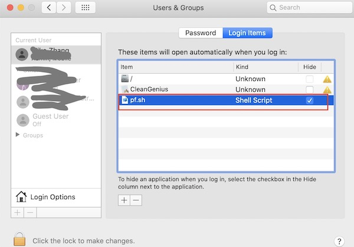

## Minikube

### Start a Minikube kubernetes in local Mac machine

```sh
# Start a minikube cluster
#
# List all supported kubernetes version: minikube config defaults kubernetes-version
# Component configuration reference:
# apiserver: https://kubernetes.io/docs/reference/command-line-tools-reference/kube-apiserver/
# controller-manager: https://kubernetes.io/docs/reference/command-line-tools-reference/kube-controller-manager/
# scheduler: https://kubernetes.io/docs/reference/command-line-tools-reference/kube-scheduler/
# yq usage: https://mikefarah.gitbook.io/yq
#
minikube start --driver='virtualbox' --kubernetes-version='v1.26.7' \
        --cpus=4 --memory='6g' --disk-size='60g' --cni='calico' \
        --extra-config=apiserver.bind-address=0.0.0.0 \
        --extra-config=apiserver.authorization-mode='Node,RBAC' \
        --extra-config=apiserver.service-node-port-range=1-65535 \
        --extra-config=controller-manager.bind-address=0.0.0.0 \
        --extra-config=scheduler.bind-address=0.0.0.0 \
        --extra-config=kubelet.cgroup-driver=systemd

# Make minikube work behind VPN
#
# Port-forward port from local host to port of minikube node(VirtualBox VM), so that can use localhost to 
# access api-server, ingress controller, and docker server run in minikube node.
#
VBoxManage controlvm minikube natpf1 k8s-apiserver,tcp,127.0.0.1,8443,,8443
VBoxManage controlvm minikube natpf1 k8s-ingress,tcp,127.0.0.1,9080,,80
VBoxManage controlvm minikube natpf1 k8s-ingress-secure,tcp,127.0.0.1,9443,,443
VBoxManage controlvm minikube natpf1 docker,tcp,127.0.0.1,2376,,2376

# Install MetalLB
#
kubectl get cm kube-proxy -o json -n kube-system | jq -r '.data."config.conf"'  | yq  '.ipvs.strictARP=true' > config.conf
kubectl create cm kube-proxy --from-file=config.conf=config.conf --dry-run=client -o yaml -n kube-system |\
kubectl patch cm kube-proxy --type merge --patch-file /dev/stdin -n kube-system

minikube addons enable metallb
kubectl wait --for=condition=Available=True deployment/controller -n metallb-system

kubectl get cm config -o json  -n metallb-system | jq -r '.data.config' | yq  '(.address-pools[] | select(.name == "default")).addresses[0] = "192.168.59.200 - 192.168.59.250"' > config
kubectl create cm config --from-file=config=config --dry-run=client -o yaml -n metallb-system |\
kubectl patch cm config --type merge --patch-file /dev/stdin -n metallb-system

kubectl rollout restart deployment/controller -n metallb-system
kubectl wait --for=condition=Available=True deployment/controller -n metallb-system

rm config.conf
rm config

# Install Nginx Ingress Controller
#
minikube addons enable ingress
kubectl wait --for=condition=Available=True deployment/ingress-nginx-controller -n ingress-nginx

# Install Kong Ingress Controller
#
minikube addons enable kong

# Install metrics-server
#
minikube addons enable metrics-server

# Install dashboard
#
minikube addons enable dashboard

kubectl apply -f - <<EOF
apiVersion: networking.k8s.io/v1
kind: Ingress
metadata:
  name: minikube-dashboard-ingress
  namespace: kubernetes-dashboard
spec:
  ingressClassName: nginx
  rules:
    - host: minikube.test
      http:
        paths:
          - path: /
            pathType: Prefix
            backend:
              service:
                name: kubernetes-dashboard
                port:
                  number: 80
EOF
```  

#### Make Minikube work behind http proxy
If minikube run behind http proxy, set the proxy environment and NO_PROXY especially:  

```bash
export https_proxy=http://192.168.0.208:7890
export http_proxy=http://192.168.0.208:7890
export all_proxy=socks5://192.168.0.208:7891
export no_proxy=localhost,127.0.0.1,192.168.0.208,.aliyuncs.com,.youku.com,k8s.mikesay.com,wp.mikesay.com,docker-registry.local,10.96.0.0/12,192.168.99.0/24,192.168.39.0/24,192.168.49.0/24,192.168.64.0/24

export HTTPS_PROXY=$https_proxy
export HTTP_PROXY=$http_proxy
export ALL_PROXY=$all_proxy
export NO_PROXY=$no_proxy
```  
> Refer to https://minikube.sigs.k8s.io/docs/handbook/vpn_and_proxy/#proxy  

#### Make Minikube work behind Corporate VPN

##### Port forwarding localhost:xxx -> minikube_IP:xxx  
> http://tdongsi.github.io/blog/2018/12/31/minikube-in-corporate-vpn/  

```bash
VBoxManage controlvm minikube natpf1 k8s-apiserver,tcp,127.0.0.1,8443,,8443
VBoxManage controlvm minikube natpf1 k8s-ingress,tcp,127.0.0.1,9080,,80
VBoxManage controlvm minikube natpf1 k8s-ingress-secure,tcp,127.0.0.1,9443,,443
VBoxManage controlvm minikube natpf1 docker,tcp,127.0.0.1,2376,,2376
```  

Then, change the API server url from "https://${Minikube IP}:8443" to "https://127.0.0.1:8443", so that the access to Minikube API server will skip VPN.  

```yaml
apiVersion: v1
clusters:
- cluster:
    certificate-authority: /Users/mizha53/.minikube/ca.crt
    extensions:
    - extension:
        last-update: Sun, 21 Apr 2024 19:20:10 CST
        provider: minikube.sigs.k8s.io
        version: v1.31.2
      name: cluster_info
    server: https://127.0.0.1:8443
  name: minikube
```

Since VirtualBox run as non-root user by default, command "VBoxManage" can't open ports lower than 1024 in Mac host, then need to choose ports like 9080 and 9443 from localhost to map ports 80 and 443 in Minikube kubernetes node. It works, but it will need to add port 9080 or 9443 explicitly when accessing services exposed by Ingress in Minikube by http(s) protocol.  

In order to use ports 80 and 443 from localhost, configure to redirect from 80 and 443 to 9080 and 9443:  
> https://www.zhiqiexing.com/2.html  

+ Create /etc/pf.anchors/kubernetes.ingress-controller.forwarding with following content  
```bash
rdr pass on lo0 inet proto tcp from any to 127.0.0.1 port 80 -> 127.0.0.1 port 9080
rdr pass on lo0 inet proto tcp from any to 127.0.0.1 port 443 -> 127.0.0.1 port 9443
```

+ Create /etc/pf-kubernetes-ingress-controller.conf with following content  
```bash
load anchor "forwarding" from "/etc/pf.anchors/kubernetes.ingress-controller.forwarding"
```  

+ Create a shell /Users/xxxx/.mikestart/pf.sh script  
```bash
#!/bin/bash
sudo pfctl -ef /etc/pf-kubernetes-ingress-controller.conf
```  
> Need to enable non password for sudo (https://www.zhiqiexing.com/128.html)  

+ Change the shell script to be executable
```bash
sudo chmod a+x /Users/xxxx/.mikestart/pf.sh
```

+ Register this script to be run during machine starup(https://www.zhiqiexing.com/127.html)  

  


##### Other possible workarounds from official document  
> https://minikube.sigs.k8s.io/docs/handbook/vpn_and_proxy/#possible-workarounds  

### Configure docker client from localhost to connect docker server in Minikube
Get docker related environments:  
```bash
minikube docker-env
```  

Change the Minikube IP in "DOCKER_HOST" to "127.0.0.1" which already enable port-forwarding to ${MinibeKube IP}:2376, and add all environments to bash profile file.  

### Deploy KeyCloak  to Minikube to act as OIDC provider configured in Minikube

+ Step0 - Create a minikube with oidc provider parameters  

```sh
minikube start --driver='virtualbox' --kubernetes-version='v1.26.7' \
        --cpus=4 --memory='6g' --disk-size='60g' --cni='calico' \
        --extra-config=apiserver.bind-address=0.0.0.0 \
        --extra-config=apiserver.authorization-mode='Node,RBAC' \
        --extra-config=apiserver.service-node-port-range=1-65535 \
        --extra-config=apiserver.oidc-issuer-url=https://keycolak.minikube:1443/realms/minikube \
        --extra-config=apiserver.oidc-client-id=minikube \
        --extra-config=apiserver.oidc-username-claim=minikube_user_name \
        --extra-config=apiserver.oidc-username-prefix=- \
        --extra-config=apiserver.oidc-ca-file=/var/lib/minikube/certs/ca.crt \
        --extra-config=controller-manager.bind-address=0.0.0.0 \
        --extra-config=scheduler.bind-address=0.0.0.0 \
        --extra-config=kubelet.cgroup-driver=systemd
```  
> Steps below will install KeyCloak according to the configured oidc information.  

+ Step1 - Generate x509 certificates signed by CA of Minikube kubernetes  

<details><summary markdown="span">code</summary>

```sh
#!/bin/bash

# 创建目录存放生成的证书
mkdir -p ssl

# 生成 x509 v3 扩展文件
cat << EOF > ssl/req.cnf
[req]
req_extensions = v3_req
distinguished_name = req_distinguished_name
[req_distinguished_name]
[ v3_req ]
basicConstraints = CA:FALSE
keyUsage = nonRepudiation, digitalSignature, keyEncipherment
subjectAltName = @alt_names # Keycloak 服务器的 IP 地址和域名
[ alt_names ]
IP.0 = 192.168.59.115
IP.1 = 127.0.0.1
DNS.0 = keycolak.minikube
DNS.1 = localhost
EOF

# 生成 Keycloak 服务器私钥
openssl genrsa -out ssl/tls.key 2048

# 生成 Keycloak 服务器证书签名请求（CSR）
openssl req -new -key ssl/tls.key -out ssl/tls.csr -subj "/CN=Keycloak" -config ssl/req.cnf

# 使用 CA 签发 Keycloak 服务器证书
openssl x509 -req -in ssl/tls.csr -CA ~/.minikube/ca.crt -CAkey ~/.minikube/ca.key -CAcreateserial -out ssl/tls.crt -days 365 -extensions v3_req -extfile ssl/req.cnf
```  
</details>
<br/>

+ Step2 - Install KeyCloak and import test realm configuration  

<details><summary markdown="span">code</summary>

```sh
#!/bin/sh

docker-compose up -d
echo "After KeyCloak started, import the configuration of realm minikube from file realm-minikube.json!"
```  
docker-compose.yaml:  
```yaml
version: '2'
services:
  postgres:
      image: postgres:16.2
      restart: always
      environment:
        POSTGRES_DB: keycloak
        POSTGRES_USER: keycloak
        POSTGRES_PASSWORD: keycloak
  keycloak:
      image: quay.io/keycloak/keycloak:24.0.3
      command: start
      restart: always
      environment:
        KC_HOSTNAME: keycolak.minikube
        KC_HOSTNAME_PORT: 1443 # The port used by the proxy when exposing the hostname. Set this option if the proxy uses a port other than the default HTTP and HTTPS ports.(https://www.keycloak.org/server/containers)
        KC_HTTPS_CERTIFICATE_FILE: /etc/x509/https/tls.crt
        KC_HTTPS_CERTIFICATE_KEY_FILE: /etc/x509/https/tls.key
        KC_DB: postgres
        KC_DB_URL: jdbc:postgresql://postgres/keycloak
        KC_DB_USERNAME: keycloak
        KC_DB_PASSWORD: keycloak
        KEYCLOAK_ADMIN: admin
        KEYCLOAK_ADMIN_PASSWORD: admin888
      volumes:
        - ./ssl:/etc/x509/https # 将服务器证书和私钥挂载到容器中
      ports:
        - 1080:8080
        - 1443:8443
      depends_on:
        - postgres
```
</details>
<br/>

<details><summary markdown="span">realm-minikube.json</summary>

```json
{
  "id": "a95f531c-7da3-4eec-a2cf-c160a7762ee4",
  "realm": "minikube",
  "notBefore": 0,
  "defaultSignatureAlgorithm": "RS256",
  "revokeRefreshToken": false,
  "refreshTokenMaxReuse": 0,
  "accessTokenLifespan": 300,
  "accessTokenLifespanForImplicitFlow": 900,
  "ssoSessionIdleTimeout": 1800,
  "ssoSessionMaxLifespan": 36000,
  "ssoSessionIdleTimeoutRememberMe": 0,
  "ssoSessionMaxLifespanRememberMe": 0,
  "offlineSessionIdleTimeout": 2592000,
  "offlineSessionMaxLifespanEnabled": false,
  "offlineSessionMaxLifespan": 5184000,
  "clientSessionIdleTimeout": 0,
  "clientSessionMaxLifespan": 0,
  "clientOfflineSessionIdleTimeout": 0,
  "clientOfflineSessionMaxLifespan": 0,
  "accessCodeLifespan": 60,
  "accessCodeLifespanUserAction": 300,
  "accessCodeLifespanLogin": 1800,
  "actionTokenGeneratedByAdminLifespan": 43200,
  "actionTokenGeneratedByUserLifespan": 300,
  "oauth2DeviceCodeLifespan": 600,
  "oauth2DevicePollingInterval": 5,
  "enabled": true,
  "sslRequired": "external",
  "registrationAllowed": false,
  "registrationEmailAsUsername": false,
  "rememberMe": false,
  "verifyEmail": false,
  "loginWithEmailAllowed": true,
  "duplicateEmailsAllowed": false,
  "resetPasswordAllowed": false,
  "editUsernameAllowed": false,
  "bruteForceProtected": false,
  "permanentLockout": false,
  "maxTemporaryLockouts": 0,
  "maxFailureWaitSeconds": 900,
  "minimumQuickLoginWaitSeconds": 60,
  "waitIncrementSeconds": 60,
  "quickLoginCheckMilliSeconds": 1000,
  "maxDeltaTimeSeconds": 43200,
  "failureFactor": 30,
  "roles": {
    "realm": [
      {
        "id": "2f75762b-0eac-4380-ae48-658a046edc02",
        "name": "offline_access",
        "description": "${role_offline-access}",
        "composite": false,
        "clientRole": false,
        "containerId": "a95f531c-7da3-4eec-a2cf-c160a7762ee4",
        "attributes": {}
      },
      {
        "id": "91074bfa-ac3a-4627-86ae-aad6849d5cd2",
        "name": "default-roles-minikube",
        "description": "${role_default-roles}",
        "composite": true,
        "composites": {
          "realm": [
            "offline_access",
            "uma_authorization"
          ],
          "client": {
            "account": [
              "view-profile",
              "manage-account"
            ]
          }
        },
        "clientRole": false,
        "containerId": "a95f531c-7da3-4eec-a2cf-c160a7762ee4",
        "attributes": {}
      },
      {
        "id": "1a01bcd0-3459-4423-8575-ba398cbbb6af",
        "name": "uma_authorization",
        "description": "${role_uma_authorization}",
        "composite": false,
        "clientRole": false,
        "containerId": "a95f531c-7da3-4eec-a2cf-c160a7762ee4",
        "attributes": {}
      }
    ],
    "client": {
      "realm-management": [
        {
          "id": "ccb4b520-7b04-4e51-a7eb-0cb47a4d0acb",
          "name": "view-identity-providers",
          "description": "${role_view-identity-providers}",
          "composite": false,
          "clientRole": true,
          "containerId": "bdfae14a-69cd-4641-a515-f6d41412a9b1",
          "attributes": {}
        },
        {
          "id": "84d58b3e-b34e-4209-93b0-afb73f2b7cf3",
          "name": "manage-authorization",
          "description": "${role_manage-authorization}",
          "composite": false,
          "clientRole": true,
          "containerId": "bdfae14a-69cd-4641-a515-f6d41412a9b1",
          "attributes": {}
        },
        {
          "id": "010eb477-0a4e-4f2f-bdbd-71d418d10a65",
          "name": "view-users",
          "description": "${role_view-users}",
          "composite": true,
          "composites": {
            "client": {
              "realm-management": [
                "query-groups",
                "query-users"
              ]
            }
          },
          "clientRole": true,
          "containerId": "bdfae14a-69cd-4641-a515-f6d41412a9b1",
          "attributes": {}
        },
        {
          "id": "a77e5503-b7b3-43e5-9e1a-6644ffdfdc4e",
          "name": "manage-realm",
          "description": "${role_manage-realm}",
          "composite": false,
          "clientRole": true,
          "containerId": "bdfae14a-69cd-4641-a515-f6d41412a9b1",
          "attributes": {}
        },
        {
          "id": "4975b026-72ed-4c72-997d-31b707bd8980",
          "name": "query-users",
          "description": "${role_query-users}",
          "composite": false,
          "clientRole": true,
          "containerId": "bdfae14a-69cd-4641-a515-f6d41412a9b1",
          "attributes": {}
        },
        {
          "id": "5101e229-52c3-40cd-991c-ebbfc389276c",
          "name": "view-clients",
          "description": "${role_view-clients}",
          "composite": true,
          "composites": {
            "client": {
              "realm-management": [
                "query-clients"
              ]
            }
          },
          "clientRole": true,
          "containerId": "bdfae14a-69cd-4641-a515-f6d41412a9b1",
          "attributes": {}
        },
        {
          "id": "73fe18da-6bed-4dd8-9874-210def9ea2bc",
          "name": "impersonation",
          "description": "${role_impersonation}",
          "composite": false,
          "clientRole": true,
          "containerId": "bdfae14a-69cd-4641-a515-f6d41412a9b1",
          "attributes": {}
        },
        {
          "id": "c2703e60-731a-4736-a57b-ecd535d0142b",
          "name": "query-clients",
          "description": "${role_query-clients}",
          "composite": false,
          "clientRole": true,
          "containerId": "bdfae14a-69cd-4641-a515-f6d41412a9b1",
          "attributes": {}
        },
        {
          "id": "92986cd4-6406-42c6-9224-9b9e6f3d2a5b",
          "name": "query-groups",
          "description": "${role_query-groups}",
          "composite": false,
          "clientRole": true,
          "containerId": "bdfae14a-69cd-4641-a515-f6d41412a9b1",
          "attributes": {}
        },
        {
          "id": "94557971-06a6-4ec0-a77f-edec7fc125e8",
          "name": "manage-clients",
          "description": "${role_manage-clients}",
          "composite": false,
          "clientRole": true,
          "containerId": "bdfae14a-69cd-4641-a515-f6d41412a9b1",
          "attributes": {}
        },
        {
          "id": "a5170752-f6d9-48e9-812b-98487887e8b8",
          "name": "create-client",
          "description": "${role_create-client}",
          "composite": false,
          "clientRole": true,
          "containerId": "bdfae14a-69cd-4641-a515-f6d41412a9b1",
          "attributes": {}
        },
        {
          "id": "52fbfe92-7393-4c31-accf-e8ebbf790534",
          "name": "query-realms",
          "description": "${role_query-realms}",
          "composite": false,
          "clientRole": true,
          "containerId": "bdfae14a-69cd-4641-a515-f6d41412a9b1",
          "attributes": {}
        },
        {
          "id": "8dd89ff2-9577-4230-bacf-cce4078c7c27",
          "name": "realm-admin",
          "description": "${role_realm-admin}",
          "composite": true,
          "composites": {
            "client": {
              "realm-management": [
                "view-identity-providers",
                "view-users",
                "manage-authorization",
                "manage-realm",
                "query-users",
                "view-clients",
                "query-clients",
                "impersonation",
                "query-groups",
                "manage-clients",
                "create-client",
                "query-realms",
                "view-authorization",
                "manage-events",
                "view-events",
                "manage-users",
                "manage-identity-providers",
                "view-realm"
              ]
            }
          },
          "clientRole": true,
          "containerId": "bdfae14a-69cd-4641-a515-f6d41412a9b1",
          "attributes": {}
        },
        {
          "id": "aa3d6242-cb1e-4752-bd1f-1242ef93cc00",
          "name": "manage-events",
          "description": "${role_manage-events}",
          "composite": false,
          "clientRole": true,
          "containerId": "bdfae14a-69cd-4641-a515-f6d41412a9b1",
          "attributes": {}
        },
        {
          "id": "1b52be4d-9cb8-4c4c-a499-3731880fbb27",
          "name": "view-authorization",
          "description": "${role_view-authorization}",
          "composite": false,
          "clientRole": true,
          "containerId": "bdfae14a-69cd-4641-a515-f6d41412a9b1",
          "attributes": {}
        },
        {
          "id": "333980f2-417c-4552-bef2-2a203ba3e2e2",
          "name": "view-events",
          "description": "${role_view-events}",
          "composite": false,
          "clientRole": true,
          "containerId": "bdfae14a-69cd-4641-a515-f6d41412a9b1",
          "attributes": {}
        },
        {
          "id": "8fda82c9-1cdf-4a22-adae-b3c28fb099f7",
          "name": "manage-identity-providers",
          "description": "${role_manage-identity-providers}",
          "composite": false,
          "clientRole": true,
          "containerId": "bdfae14a-69cd-4641-a515-f6d41412a9b1",
          "attributes": {}
        },
        {
          "id": "5eb45d6d-1a2b-4ee1-bf4a-fdfcaeb08d51",
          "name": "manage-users",
          "description": "${role_manage-users}",
          "composite": false,
          "clientRole": true,
          "containerId": "bdfae14a-69cd-4641-a515-f6d41412a9b1",
          "attributes": {}
        },
        {
          "id": "a31cfb7c-a420-40ee-9d6c-3ffa16c79c09",
          "name": "view-realm",
          "description": "${role_view-realm}",
          "composite": false,
          "clientRole": true,
          "containerId": "bdfae14a-69cd-4641-a515-f6d41412a9b1",
          "attributes": {}
        }
      ],
      "security-admin-console": [],
      "admin-cli": [],
      "minikube": [],
      "account-console": [],
      "broker": [
        {
          "id": "a90c24d0-9b65-401e-b6b5-9fb7cfc9e031",
          "name": "read-token",
          "description": "${role_read-token}",
          "composite": false,
          "clientRole": true,
          "containerId": "158be63c-e570-4c6b-9dfa-475012cda04e",
          "attributes": {}
        }
      ],
      "account": [
        {
          "id": "41b5e8fa-2712-4732-89e2-9726b13137ef",
          "name": "view-applications",
          "description": "${role_view-applications}",
          "composite": false,
          "clientRole": true,
          "containerId": "a1f2588c-cd99-46bb-9f22-0f8f855996e3",
          "attributes": {}
        },
        {
          "id": "f051fac3-99ed-44d8-8ad5-ef4a7527f09f",
          "name": "delete-account",
          "description": "${role_delete-account}",
          "composite": false,
          "clientRole": true,
          "containerId": "a1f2588c-cd99-46bb-9f22-0f8f855996e3",
          "attributes": {}
        },
        {
          "id": "33b822d5-b02a-4673-bbf5-b493cebae538",
          "name": "view-profile",
          "description": "${role_view-profile}",
          "composite": false,
          "clientRole": true,
          "containerId": "a1f2588c-cd99-46bb-9f22-0f8f855996e3",
          "attributes": {}
        },
        {
          "id": "8db12ffc-cd60-4863-b21b-5bf4fa5744f5",
          "name": "manage-account",
          "description": "${role_manage-account}",
          "composite": true,
          "composites": {
            "client": {
              "account": [
                "manage-account-links"
              ]
            }
          },
          "clientRole": true,
          "containerId": "a1f2588c-cd99-46bb-9f22-0f8f855996e3",
          "attributes": {}
        },
        {
          "id": "dc504d9b-2db4-4b6d-975b-159ced5f212a",
          "name": "manage-account-links",
          "description": "${role_manage-account-links}",
          "composite": false,
          "clientRole": true,
          "containerId": "a1f2588c-cd99-46bb-9f22-0f8f855996e3",
          "attributes": {}
        },
        {
          "id": "e40f3be1-6797-4555-8ef7-9654022b2917",
          "name": "view-consent",
          "description": "${role_view-consent}",
          "composite": false,
          "clientRole": true,
          "containerId": "a1f2588c-cd99-46bb-9f22-0f8f855996e3",
          "attributes": {}
        },
        {
          "id": "f7051daf-5e9a-484f-b86b-0882498946ca",
          "name": "view-groups",
          "description": "${role_view-groups}",
          "composite": false,
          "clientRole": true,
          "containerId": "a1f2588c-cd99-46bb-9f22-0f8f855996e3",
          "attributes": {}
        },
        {
          "id": "8727ea39-32eb-4af5-a41a-102e2f3820d8",
          "name": "manage-consent",
          "description": "${role_manage-consent}",
          "composite": true,
          "composites": {
            "client": {
              "account": [
                "view-consent"
              ]
            }
          },
          "clientRole": true,
          "containerId": "a1f2588c-cd99-46bb-9f22-0f8f855996e3",
          "attributes": {}
        }
      ]
    }
  },
  "groups": [],
  "defaultRole": {
    "id": "91074bfa-ac3a-4627-86ae-aad6849d5cd2",
    "name": "default-roles-minikube",
    "description": "${role_default-roles}",
    "composite": true,
    "clientRole": false,
    "containerId": "a95f531c-7da3-4eec-a2cf-c160a7762ee4"
  },
  "requiredCredentials": [
    "password"
  ],
  "otpPolicyType": "totp",
  "otpPolicyAlgorithm": "HmacSHA1",
  "otpPolicyInitialCounter": 0,
  "otpPolicyDigits": 6,
  "otpPolicyLookAheadWindow": 1,
  "otpPolicyPeriod": 30,
  "otpPolicyCodeReusable": false,
  "otpSupportedApplications": [
    "totpAppFreeOTPName",
    "totpAppGoogleName",
    "totpAppMicrosoftAuthenticatorName"
  ],
  "localizationTexts": {},
  "webAuthnPolicyRpEntityName": "keycloak",
  "webAuthnPolicySignatureAlgorithms": [
    "ES256"
  ],
  "webAuthnPolicyRpId": "",
  "webAuthnPolicyAttestationConveyancePreference": "not specified",
  "webAuthnPolicyAuthenticatorAttachment": "not specified",
  "webAuthnPolicyRequireResidentKey": "not specified",
  "webAuthnPolicyUserVerificationRequirement": "not specified",
  "webAuthnPolicyCreateTimeout": 0,
  "webAuthnPolicyAvoidSameAuthenticatorRegister": false,
  "webAuthnPolicyAcceptableAaguids": [],
  "webAuthnPolicyExtraOrigins": [],
  "webAuthnPolicyPasswordlessRpEntityName": "keycloak",
  "webAuthnPolicyPasswordlessSignatureAlgorithms": [
    "ES256"
  ],
  "webAuthnPolicyPasswordlessRpId": "",
  "webAuthnPolicyPasswordlessAttestationConveyancePreference": "not specified",
  "webAuthnPolicyPasswordlessAuthenticatorAttachment": "not specified",
  "webAuthnPolicyPasswordlessRequireResidentKey": "not specified",
  "webAuthnPolicyPasswordlessUserVerificationRequirement": "not specified",
  "webAuthnPolicyPasswordlessCreateTimeout": 0,
  "webAuthnPolicyPasswordlessAvoidSameAuthenticatorRegister": false,
  "webAuthnPolicyPasswordlessAcceptableAaguids": [],
  "webAuthnPolicyPasswordlessExtraOrigins": [],
  "scopeMappings": [
    {
      "clientScope": "offline_access",
      "roles": [
        "offline_access"
      ]
    }
  ],
  "clientScopeMappings": {
    "account": [
      {
        "client": "account-console",
        "roles": [
          "manage-account",
          "view-groups"
        ]
      }
    ]
  },
  "clients": [
    {
      "id": "a1f2588c-cd99-46bb-9f22-0f8f855996e3",
      "clientId": "account",
      "name": "${client_account}",
      "rootUrl": "${authBaseUrl}",
      "baseUrl": "/realms/minikube/account/",
      "surrogateAuthRequired": false,
      "enabled": true,
      "alwaysDisplayInConsole": false,
      "clientAuthenticatorType": "client-secret",
      "redirectUris": [
        "/realms/minikube/account/*"
      ],
      "webOrigins": [],
      "notBefore": 0,
      "bearerOnly": false,
      "consentRequired": false,
      "standardFlowEnabled": true,
      "implicitFlowEnabled": false,
      "directAccessGrantsEnabled": false,
      "serviceAccountsEnabled": false,
      "publicClient": true,
      "frontchannelLogout": false,
      "protocol": "openid-connect",
      "attributes": {
        "post.logout.redirect.uris": "+"
      },
      "authenticationFlowBindingOverrides": {},
      "fullScopeAllowed": false,
      "nodeReRegistrationTimeout": 0,
      "defaultClientScopes": [
        "web-origins",
        "acr",
        "roles",
        "profile",
        "email"
      ],
      "optionalClientScopes": [
        "address",
        "phone",
        "offline_access",
        "microprofile-jwt"
      ]
    },
    {
      "id": "46f59fce-e522-4a7f-933c-8017a5f599a1",
      "clientId": "account-console",
      "name": "${client_account-console}",
      "rootUrl": "${authBaseUrl}",
      "baseUrl": "/realms/minikube/account/",
      "surrogateAuthRequired": false,
      "enabled": true,
      "alwaysDisplayInConsole": false,
      "clientAuthenticatorType": "client-secret",
      "redirectUris": [
        "/realms/minikube/account/*"
      ],
      "webOrigins": [],
      "notBefore": 0,
      "bearerOnly": false,
      "consentRequired": false,
      "standardFlowEnabled": true,
      "implicitFlowEnabled": false,
      "directAccessGrantsEnabled": false,
      "serviceAccountsEnabled": false,
      "publicClient": true,
      "frontchannelLogout": false,
      "protocol": "openid-connect",
      "attributes": {
        "post.logout.redirect.uris": "+",
        "pkce.code.challenge.method": "S256"
      },
      "authenticationFlowBindingOverrides": {},
      "fullScopeAllowed": false,
      "nodeReRegistrationTimeout": 0,
      "protocolMappers": [
        {
          "id": "2a5a27b0-4a2e-4c12-8517-6a763213a5d2",
          "name": "audience resolve",
          "protocol": "openid-connect",
          "protocolMapper": "oidc-audience-resolve-mapper",
          "consentRequired": false,
          "config": {}
        }
      ],
      "defaultClientScopes": [
        "web-origins",
        "acr",
        "roles",
        "profile",
        "email"
      ],
      "optionalClientScopes": [
        "address",
        "phone",
        "offline_access",
        "microprofile-jwt"
      ]
    },
    {
      "id": "e21d4843-a3ae-4b6f-838b-6deb794b4b01",
      "clientId": "admin-cli",
      "name": "${client_admin-cli}",
      "surrogateAuthRequired": false,
      "enabled": true,
      "alwaysDisplayInConsole": false,
      "clientAuthenticatorType": "client-secret",
      "redirectUris": [],
      "webOrigins": [],
      "notBefore": 0,
      "bearerOnly": false,
      "consentRequired": false,
      "standardFlowEnabled": false,
      "implicitFlowEnabled": false,
      "directAccessGrantsEnabled": true,
      "serviceAccountsEnabled": false,
      "publicClient": true,
      "frontchannelLogout": false,
      "protocol": "openid-connect",
      "attributes": {},
      "authenticationFlowBindingOverrides": {},
      "fullScopeAllowed": false,
      "nodeReRegistrationTimeout": 0,
      "defaultClientScopes": [
        "web-origins",
        "acr",
        "roles",
        "profile",
        "email"
      ],
      "optionalClientScopes": [
        "address",
        "phone",
        "offline_access",
        "microprofile-jwt"
      ]
    },
    {
      "id": "158be63c-e570-4c6b-9dfa-475012cda04e",
      "clientId": "broker",
      "name": "${client_broker}",
      "surrogateAuthRequired": false,
      "enabled": true,
      "alwaysDisplayInConsole": false,
      "clientAuthenticatorType": "client-secret",
      "redirectUris": [],
      "webOrigins": [],
      "notBefore": 0,
      "bearerOnly": true,
      "consentRequired": false,
      "standardFlowEnabled": true,
      "implicitFlowEnabled": false,
      "directAccessGrantsEnabled": false,
      "serviceAccountsEnabled": false,
      "publicClient": false,
      "frontchannelLogout": false,
      "protocol": "openid-connect",
      "attributes": {},
      "authenticationFlowBindingOverrides": {},
      "fullScopeAllowed": false,
      "nodeReRegistrationTimeout": 0,
      "defaultClientScopes": [
        "web-origins",
        "acr",
        "roles",
        "profile",
        "email"
      ],
      "optionalClientScopes": [
        "address",
        "phone",
        "offline_access",
        "microprofile-jwt"
      ]
    },
    {
      "id": "20aa6a74-e1c9-4e68-9c5d-025df1a19252",
      "clientId": "minikube",
      "name": "",
      "description": "",
      "rootUrl": "",
      "adminUrl": "",
      "baseUrl": "",
      "surrogateAuthRequired": false,
      "enabled": true,
      "alwaysDisplayInConsole": false,
      "clientAuthenticatorType": "client-secret",
      "secret": "**********",
      "redirectUris": [
        "http://*"
      ],
      "webOrigins": [
        "http://*"
      ],
      "notBefore": 0,
      "bearerOnly": false,
      "consentRequired": false,
      "standardFlowEnabled": true,
      "implicitFlowEnabled": false,
      "directAccessGrantsEnabled": true,
      "serviceAccountsEnabled": false,
      "publicClient": false,
      "frontchannelLogout": true,
      "protocol": "openid-connect",
      "attributes": {
        "access.token.lifespan": "2592000",
        "client.secret.creation.time": "1713670213",
        "oauth2.device.authorization.grant.enabled": "false",
        "backchannel.logout.revoke.offline.tokens": "false",
        "use.refresh.tokens": "true",
        "oidc.ciba.grant.enabled": "false",
        "client.use.lightweight.access.token.enabled": "false",
        "backchannel.logout.session.required": "true",
        "client_credentials.use_refresh_token": "false",
        "acr.loa.map": "{}",
        "require.pushed.authorization.requests": "false",
        "tls.client.certificate.bound.access.tokens": "false",
        "display.on.consent.screen": "false",
        "token.response.type.bearer.lower-case": "false"
      },
      "authenticationFlowBindingOverrides": {},
      "fullScopeAllowed": true,
      "nodeReRegistrationTimeout": -1,
      "defaultClientScopes": [
        "web-origins",
        "acr",
        "roles",
        "profile",
        "minikube",
        "email"
      ],
      "optionalClientScopes": [
        "address",
        "phone",
        "offline_access",
        "microprofile-jwt"
      ]
    },
    {
      "id": "bdfae14a-69cd-4641-a515-f6d41412a9b1",
      "clientId": "realm-management",
      "name": "${client_realm-management}",
      "surrogateAuthRequired": false,
      "enabled": true,
      "alwaysDisplayInConsole": false,
      "clientAuthenticatorType": "client-secret",
      "redirectUris": [],
      "webOrigins": [],
      "notBefore": 0,
      "bearerOnly": true,
      "consentRequired": false,
      "standardFlowEnabled": true,
      "implicitFlowEnabled": false,
      "directAccessGrantsEnabled": false,
      "serviceAccountsEnabled": false,
      "publicClient": false,
      "frontchannelLogout": false,
      "protocol": "openid-connect",
      "attributes": {},
      "authenticationFlowBindingOverrides": {},
      "fullScopeAllowed": false,
      "nodeReRegistrationTimeout": 0,
      "defaultClientScopes": [
        "web-origins",
        "acr",
        "roles",
        "profile",
        "email"
      ],
      "optionalClientScopes": [
        "address",
        "phone",
        "offline_access",
        "microprofile-jwt"
      ]
    },
    {
      "id": "49d6d5fb-62d7-4ed8-b956-ea828c76f45c",
      "clientId": "security-admin-console",
      "name": "${client_security-admin-console}",
      "rootUrl": "${authAdminUrl}",
      "baseUrl": "/admin/minikube/console/",
      "surrogateAuthRequired": false,
      "enabled": true,
      "alwaysDisplayInConsole": false,
      "clientAuthenticatorType": "client-secret",
      "redirectUris": [
        "/admin/minikube/console/*"
      ],
      "webOrigins": [
        "+"
      ],
      "notBefore": 0,
      "bearerOnly": false,
      "consentRequired": false,
      "standardFlowEnabled": true,
      "implicitFlowEnabled": false,
      "directAccessGrantsEnabled": false,
      "serviceAccountsEnabled": false,
      "publicClient": true,
      "frontchannelLogout": false,
      "protocol": "openid-connect",
      "attributes": {
        "post.logout.redirect.uris": "+",
        "pkce.code.challenge.method": "S256"
      },
      "authenticationFlowBindingOverrides": {},
      "fullScopeAllowed": false,
      "nodeReRegistrationTimeout": 0,
      "protocolMappers": [
        {
          "id": "804439a6-c870-4852-b7d4-1cadc0bebed3",
          "name": "locale",
          "protocol": "openid-connect",
          "protocolMapper": "oidc-usermodel-attribute-mapper",
          "consentRequired": false,
          "config": {
            "introspection.token.claim": "true",
            "userinfo.token.claim": "true",
            "user.attribute": "locale",
            "id.token.claim": "true",
            "access.token.claim": "true",
            "claim.name": "locale",
            "jsonType.label": "String"
          }
        }
      ],
      "defaultClientScopes": [
        "web-origins",
        "acr",
        "roles",
        "profile",
        "email"
      ],
      "optionalClientScopes": [
        "address",
        "phone",
        "offline_access",
        "microprofile-jwt"
      ]
    }
  ],
  "clientScopes": [
    {
      "id": "a65cd2c7-0dbb-4a01-9665-7d15c7493473",
      "name": "minikube",
      "description": "",
      "protocol": "openid-connect",
      "attributes": {
        "include.in.token.scope": "true",
        "display.on.consent.screen": "true",
        "gui.order": "",
        "consent.screen.text": ""
      },
      "protocolMappers": [
        {
          "id": "e9fb2a73-2b7b-440e-9c87-5677a126ceec",
          "name": "name",
          "protocol": "openid-connect",
          "protocolMapper": "oidc-usermodel-attribute-mapper",
          "consentRequired": false,
          "config": {
            "aggregate.attrs": "false",
            "introspection.token.claim": "true",
            "multivalued": "false",
            "userinfo.token.claim": "true",
            "user.attribute": "username",
            "id.token.claim": "true",
            "lightweight.claim": "false",
            "access.token.claim": "true",
            "claim.name": "minikube_user_name",
            "jsonType.label": "String"
          }
        }
      ]
    },
    {
      "id": "e5d45240-8e7c-4baa-9935-9b6eb710eeb7",
      "name": "email",
      "description": "OpenID Connect built-in scope: email",
      "protocol": "openid-connect",
      "attributes": {
        "include.in.token.scope": "true",
        "display.on.consent.screen": "true",
        "consent.screen.text": "${emailScopeConsentText}"
      },
      "protocolMappers": [
        {
          "id": "b6f3ddd3-17ea-4a53-9939-8b73477eb917",
          "name": "email verified",
          "protocol": "openid-connect",
          "protocolMapper": "oidc-usermodel-property-mapper",
          "consentRequired": false,
          "config": {
            "introspection.token.claim": "true",
            "userinfo.token.claim": "true",
            "user.attribute": "emailVerified",
            "id.token.claim": "true",
            "access.token.claim": "true",
            "claim.name": "email_verified",
            "jsonType.label": "boolean"
          }
        },
        {
          "id": "c5d2522b-9780-447f-983f-7650476e2d90",
          "name": "email",
          "protocol": "openid-connect",
          "protocolMapper": "oidc-usermodel-attribute-mapper",
          "consentRequired": false,
          "config": {
            "introspection.token.claim": "true",
            "userinfo.token.claim": "true",
            "user.attribute": "email",
            "id.token.claim": "true",
            "access.token.claim": "true",
            "claim.name": "email",
            "jsonType.label": "String"
          }
        }
      ]
    },
    {
      "id": "74879a93-376a-4a98-b3d8-87119d073b10",
      "name": "microprofile-jwt",
      "description": "Microprofile - JWT built-in scope",
      "protocol": "openid-connect",
      "attributes": {
        "include.in.token.scope": "true",
        "display.on.consent.screen": "false"
      },
      "protocolMappers": [
        {
          "id": "3950dd51-21f2-40be-9cc3-71f6b49f0144",
          "name": "upn",
          "protocol": "openid-connect",
          "protocolMapper": "oidc-usermodel-attribute-mapper",
          "consentRequired": false,
          "config": {
            "introspection.token.claim": "true",
            "userinfo.token.claim": "true",
            "user.attribute": "username",
            "id.token.claim": "true",
            "access.token.claim": "true",
            "claim.name": "upn",
            "jsonType.label": "String"
          }
        },
        {
          "id": "7d7cce6b-f21d-486b-89f7-72a6e4c57137",
          "name": "groups",
          "protocol": "openid-connect",
          "protocolMapper": "oidc-usermodel-realm-role-mapper",
          "consentRequired": false,
          "config": {
            "introspection.token.claim": "true",
            "multivalued": "true",
            "user.attribute": "foo",
            "id.token.claim": "true",
            "access.token.claim": "true",
            "claim.name": "groups",
            "jsonType.label": "String"
          }
        }
      ]
    },
    {
      "id": "5479f1a0-3a97-45ac-91e6-ff8ebdae1f5c",
      "name": "roles",
      "description": "OpenID Connect scope for add user roles to the access token",
      "protocol": "openid-connect",
      "attributes": {
        "include.in.token.scope": "false",
        "display.on.consent.screen": "true",
        "consent.screen.text": "${rolesScopeConsentText}"
      },
      "protocolMappers": [
        {
          "id": "496c8b28-76f1-4d67-89eb-4fe73452762d",
          "name": "realm roles",
          "protocol": "openid-connect",
          "protocolMapper": "oidc-usermodel-realm-role-mapper",
          "consentRequired": false,
          "config": {
            "introspection.token.claim": "true",
            "multivalued": "true",
            "user.attribute": "foo",
            "access.token.claim": "true",
            "claim.name": "realm_access.roles",
            "jsonType.label": "String"
          }
        },
        {
          "id": "40e0a559-5512-4db8-b8cc-069f1caac5e1",
          "name": "client roles",
          "protocol": "openid-connect",
          "protocolMapper": "oidc-usermodel-client-role-mapper",
          "consentRequired": false,
          "config": {
            "introspection.token.claim": "true",
            "multivalued": "true",
            "user.attribute": "foo",
            "access.token.claim": "true",
            "claim.name": "resource_access.${client_id}.roles",
            "jsonType.label": "String"
          }
        },
        {
          "id": "d5ddcae3-0f7d-4986-85e2-10e9b73ee773",
          "name": "audience resolve",
          "protocol": "openid-connect",
          "protocolMapper": "oidc-audience-resolve-mapper",
          "consentRequired": false,
          "config": {
            "introspection.token.claim": "true",
            "access.token.claim": "true"
          }
        }
      ]
    },
    {
      "id": "cfbc8300-d645-4176-9beb-708a68aaa125",
      "name": "phone",
      "description": "OpenID Connect built-in scope: phone",
      "protocol": "openid-connect",
      "attributes": {
        "include.in.token.scope": "true",
        "display.on.consent.screen": "true",
        "consent.screen.text": "${phoneScopeConsentText}"
      },
      "protocolMappers": [
        {
          "id": "76336b2d-4517-4412-8aa3-9d701f1ec526",
          "name": "phone number",
          "protocol": "openid-connect",
          "protocolMapper": "oidc-usermodel-attribute-mapper",
          "consentRequired": false,
          "config": {
            "introspection.token.claim": "true",
            "userinfo.token.claim": "true",
            "user.attribute": "phoneNumber",
            "id.token.claim": "true",
            "access.token.claim": "true",
            "claim.name": "phone_number",
            "jsonType.label": "String"
          }
        },
        {
          "id": "e1c1c097-716e-4516-b939-9b747f9fc671",
          "name": "phone number verified",
          "protocol": "openid-connect",
          "protocolMapper": "oidc-usermodel-attribute-mapper",
          "consentRequired": false,
          "config": {
            "introspection.token.claim": "true",
            "userinfo.token.claim": "true",
            "user.attribute": "phoneNumberVerified",
            "id.token.claim": "true",
            "access.token.claim": "true",
            "claim.name": "phone_number_verified",
            "jsonType.label": "boolean"
          }
        }
      ]
    },
    {
      "id": "cdef2426-7533-4717-aa69-4c7e5d2fd8ae",
      "name": "offline_access",
      "description": "OpenID Connect built-in scope: offline_access",
      "protocol": "openid-connect",
      "attributes": {
        "consent.screen.text": "${offlineAccessScopeConsentText}",
        "display.on.consent.screen": "true"
      }
    },
    {
      "id": "0402e57d-a81c-4803-92ea-9ffdcf2b422a",
      "name": "address",
      "description": "OpenID Connect built-in scope: address",
      "protocol": "openid-connect",
      "attributes": {
        "include.in.token.scope": "true",
        "display.on.consent.screen": "true",
        "consent.screen.text": "${addressScopeConsentText}"
      },
      "protocolMappers": [
        {
          "id": "dee83c16-4d0e-4640-9789-0b54ed72a07d",
          "name": "address",
          "protocol": "openid-connect",
          "protocolMapper": "oidc-address-mapper",
          "consentRequired": false,
          "config": {
            "user.attribute.formatted": "formatted",
            "user.attribute.country": "country",
            "introspection.token.claim": "true",
            "user.attribute.postal_code": "postal_code",
            "userinfo.token.claim": "true",
            "user.attribute.street": "street",
            "id.token.claim": "true",
            "user.attribute.region": "region",
            "access.token.claim": "true",
            "user.attribute.locality": "locality"
          }
        }
      ]
    },
    {
      "id": "c45ec6f3-4d5b-494a-804e-b6e78229ebeb",
      "name": "role_list",
      "description": "SAML role list",
      "protocol": "saml",
      "attributes": {
        "consent.screen.text": "${samlRoleListScopeConsentText}",
        "display.on.consent.screen": "true"
      },
      "protocolMappers": [
        {
          "id": "bb5c7039-c678-4b9e-923e-56fa8198837b",
          "name": "role list",
          "protocol": "saml",
          "protocolMapper": "saml-role-list-mapper",
          "consentRequired": false,
          "config": {
            "single": "false",
            "attribute.nameformat": "Basic",
            "attribute.name": "Role"
          }
        }
      ]
    },
    {
      "id": "6a1f954d-74d2-4605-bac0-9f15ae93b5b5",
      "name": "profile",
      "description": "OpenID Connect built-in scope: profile",
      "protocol": "openid-connect",
      "attributes": {
        "include.in.token.scope": "true",
        "display.on.consent.screen": "true",
        "consent.screen.text": "${profileScopeConsentText}"
      },
      "protocolMappers": [
        {
          "id": "35f9aa3f-3d7a-4d21-ac50-1f3601e316dc",
          "name": "gender",
          "protocol": "openid-connect",
          "protocolMapper": "oidc-usermodel-attribute-mapper",
          "consentRequired": false,
          "config": {
            "introspection.token.claim": "true",
            "userinfo.token.claim": "true",
            "user.attribute": "gender",
            "id.token.claim": "true",
            "access.token.claim": "true",
            "claim.name": "gender",
            "jsonType.label": "String"
          }
        },
        {
          "id": "e992ba3a-b37d-4954-a0d8-180ac8d1d935",
          "name": "nickname",
          "protocol": "openid-connect",
          "protocolMapper": "oidc-usermodel-attribute-mapper",
          "consentRequired": false,
          "config": {
            "introspection.token.claim": "true",
            "userinfo.token.claim": "true",
            "user.attribute": "nickname",
            "id.token.claim": "true",
            "access.token.claim": "true",
            "claim.name": "nickname",
            "jsonType.label": "String"
          }
        },
        {
          "id": "98e6b961-2aea-40a0-94c4-981bd1d86947",
          "name": "picture",
          "protocol": "openid-connect",
          "protocolMapper": "oidc-usermodel-attribute-mapper",
          "consentRequired": false,
          "config": {
            "introspection.token.claim": "true",
            "userinfo.token.claim": "true",
            "user.attribute": "picture",
            "id.token.claim": "true",
            "access.token.claim": "true",
            "claim.name": "picture",
            "jsonType.label": "String"
          }
        },
        {
          "id": "d71a04a0-595f-42bf-a200-0757efc320a6",
          "name": "middle name",
          "protocol": "openid-connect",
          "protocolMapper": "oidc-usermodel-attribute-mapper",
          "consentRequired": false,
          "config": {
            "introspection.token.claim": "true",
            "userinfo.token.claim": "true",
            "user.attribute": "middleName",
            "id.token.claim": "true",
            "access.token.claim": "true",
            "claim.name": "middle_name",
            "jsonType.label": "String"
          }
        },
        {
          "id": "e723fe73-ad5c-412f-99ae-146f3b99c800",
          "name": "birthdate",
          "protocol": "openid-connect",
          "protocolMapper": "oidc-usermodel-attribute-mapper",
          "consentRequired": false,
          "config": {
            "introspection.token.claim": "true",
            "userinfo.token.claim": "true",
            "user.attribute": "birthdate",
            "id.token.claim": "true",
            "access.token.claim": "true",
            "claim.name": "birthdate",
            "jsonType.label": "String"
          }
        },
        {
          "id": "5b5b8396-93ea-4239-823c-eaf2696eea7f",
          "name": "username",
          "protocol": "openid-connect",
          "protocolMapper": "oidc-usermodel-attribute-mapper",
          "consentRequired": false,
          "config": {
            "introspection.token.claim": "true",
            "userinfo.token.claim": "true",
            "user.attribute": "username",
            "id.token.claim": "true",
            "access.token.claim": "true",
            "claim.name": "preferred_username",
            "jsonType.label": "String"
          }
        },
        {
          "id": "4cf8cbe5-563d-4338-ba91-4c7ebf50c615",
          "name": "locale",
          "protocol": "openid-connect",
          "protocolMapper": "oidc-usermodel-attribute-mapper",
          "consentRequired": false,
          "config": {
            "introspection.token.claim": "true",
            "userinfo.token.claim": "true",
            "user.attribute": "locale",
            "id.token.claim": "true",
            "access.token.claim": "true",
            "claim.name": "locale",
            "jsonType.label": "String"
          }
        },
        {
          "id": "a448fb1e-14a2-410d-906b-2eeac8ad24f0",
          "name": "website",
          "protocol": "openid-connect",
          "protocolMapper": "oidc-usermodel-attribute-mapper",
          "consentRequired": false,
          "config": {
            "introspection.token.claim": "true",
            "userinfo.token.claim": "true",
            "user.attribute": "website",
            "id.token.claim": "true",
            "access.token.claim": "true",
            "claim.name": "website",
            "jsonType.label": "String"
          }
        },
        {
          "id": "1200cf1b-b7ab-43a7-9e6e-df5619b464c6",
          "name": "given name",
          "protocol": "openid-connect",
          "protocolMapper": "oidc-usermodel-attribute-mapper",
          "consentRequired": false,
          "config": {
            "introspection.token.claim": "true",
            "userinfo.token.claim": "true",
            "user.attribute": "firstName",
            "id.token.claim": "true",
            "access.token.claim": "true",
            "claim.name": "given_name",
            "jsonType.label": "String"
          }
        },
        {
          "id": "99bd3e7e-a91d-40ee-9754-b39d39ba706a",
          "name": "updated at",
          "protocol": "openid-connect",
          "protocolMapper": "oidc-usermodel-attribute-mapper",
          "consentRequired": false,
          "config": {
            "introspection.token.claim": "true",
            "userinfo.token.claim": "true",
            "user.attribute": "updatedAt",
            "id.token.claim": "true",
            "access.token.claim": "true",
            "claim.name": "updated_at",
            "jsonType.label": "long"
          }
        },
        {
          "id": "401ee233-4c80-493d-be79-b243797c560c",
          "name": "zoneinfo",
          "protocol": "openid-connect",
          "protocolMapper": "oidc-usermodel-attribute-mapper",
          "consentRequired": false,
          "config": {
            "introspection.token.claim": "true",
            "userinfo.token.claim": "true",
            "user.attribute": "zoneinfo",
            "id.token.claim": "true",
            "access.token.claim": "true",
            "claim.name": "zoneinfo",
            "jsonType.label": "String"
          }
        },
        {
          "id": "22bd50c8-7acf-4162-a657-526d70d4771b",
          "name": "family name",
          "protocol": "openid-connect",
          "protocolMapper": "oidc-usermodel-attribute-mapper",
          "consentRequired": false,
          "config": {
            "introspection.token.claim": "true",
            "userinfo.token.claim": "true",
            "user.attribute": "lastName",
            "id.token.claim": "true",
            "access.token.claim": "true",
            "claim.name": "family_name",
            "jsonType.label": "String"
          }
        },
        {
          "id": "758459f2-7bb9-478c-ae26-957974c5b2a8",
          "name": "full name",
          "protocol": "openid-connect",
          "protocolMapper": "oidc-full-name-mapper",
          "consentRequired": false,
          "config": {
            "id.token.claim": "true",
            "introspection.token.claim": "true",
            "access.token.claim": "true",
            "userinfo.token.claim": "true"
          }
        },
        {
          "id": "98bcd6c5-a05a-4cc9-922b-3eae825a5169",
          "name": "profile",
          "protocol": "openid-connect",
          "protocolMapper": "oidc-usermodel-attribute-mapper",
          "consentRequired": false,
          "config": {
            "introspection.token.claim": "true",
            "userinfo.token.claim": "true",
            "user.attribute": "profile",
            "id.token.claim": "true",
            "access.token.claim": "true",
            "claim.name": "profile",
            "jsonType.label": "String"
          }
        }
      ]
    },
    {
      "id": "f00f10f5-35d6-41bc-aa3f-d53288731f95",
      "name": "web-origins",
      "description": "OpenID Connect scope for add allowed web origins to the access token",
      "protocol": "openid-connect",
      "attributes": {
        "include.in.token.scope": "false",
        "display.on.consent.screen": "false",
        "consent.screen.text": ""
      },
      "protocolMappers": [
        {
          "id": "baeacb82-5cef-4a8c-befd-cab26843134e",
          "name": "allowed web origins",
          "protocol": "openid-connect",
          "protocolMapper": "oidc-allowed-origins-mapper",
          "consentRequired": false,
          "config": {
            "introspection.token.claim": "true",
            "access.token.claim": "true"
          }
        }
      ]
    },
    {
      "id": "c1a42097-a515-4ed2-b2f2-b0be86507639",
      "name": "acr",
      "description": "OpenID Connect scope for add acr (authentication context class reference) to the token",
      "protocol": "openid-connect",
      "attributes": {
        "include.in.token.scope": "false",
        "display.on.consent.screen": "false"
      },
      "protocolMappers": [
        {
          "id": "b9983f85-f53c-496c-a20b-e82503806cf2",
          "name": "acr loa level",
          "protocol": "openid-connect",
          "protocolMapper": "oidc-acr-mapper",
          "consentRequired": false,
          "config": {
            "id.token.claim": "true",
            "introspection.token.claim": "true",
            "access.token.claim": "true"
          }
        }
      ]
    }
  ],
  "defaultDefaultClientScopes": [
    "role_list",
    "profile",
    "email",
    "roles",
    "web-origins",
    "acr",
    "minikube"
  ],
  "defaultOptionalClientScopes": [
    "offline_access",
    "address",
    "phone",
    "microprofile-jwt"
  ],
  "browserSecurityHeaders": {
    "contentSecurityPolicyReportOnly": "",
    "xContentTypeOptions": "nosniff",
    "referrerPolicy": "no-referrer",
    "xRobotsTag": "none",
    "xFrameOptions": "SAMEORIGIN",
    "contentSecurityPolicy": "frame-src 'self'; frame-ancestors 'self'; object-src 'none';",
    "xXSSProtection": "1; mode=block",
    "strictTransportSecurity": "max-age=31536000; includeSubDomains"
  },
  "smtpServer": {},
  "eventsEnabled": false,
  "eventsListeners": [
    "jboss-logging"
  ],
  "enabledEventTypes": [],
  "adminEventsEnabled": false,
  "adminEventsDetailsEnabled": false,
  "identityProviders": [],
  "identityProviderMappers": [],
  "components": {
    "org.keycloak.services.clientregistration.policy.ClientRegistrationPolicy": [
      {
        "id": "abc54ea3-e98a-4542-b5ff-49a7f3a2aa93",
        "name": "Trusted Hosts",
        "providerId": "trusted-hosts",
        "subType": "anonymous",
        "subComponents": {},
        "config": {
          "host-sending-registration-request-must-match": [
            "true"
          ],
          "client-uris-must-match": [
            "true"
          ]
        }
      },
      {
        "id": "fce69316-461c-4efc-968f-0aedc98eb2ae",
        "name": "Max Clients Limit",
        "providerId": "max-clients",
        "subType": "anonymous",
        "subComponents": {},
        "config": {
          "max-clients": [
            "200"
          ]
        }
      },
      {
        "id": "9f71f714-8eba-419b-879a-1c4d5d9f6e55",
        "name": "Allowed Client Scopes",
        "providerId": "allowed-client-templates",
        "subType": "anonymous",
        "subComponents": {},
        "config": {
          "allow-default-scopes": [
            "true"
          ]
        }
      },
      {
        "id": "e797ca71-a6ad-4469-b4b2-b83c05700dfe",
        "name": "Consent Required",
        "providerId": "consent-required",
        "subType": "anonymous",
        "subComponents": {},
        "config": {}
      },
      {
        "id": "2c4a9518-8e9a-4af8-af60-65d74bea3b3b",
        "name": "Allowed Protocol Mapper Types",
        "providerId": "allowed-protocol-mappers",
        "subType": "authenticated",
        "subComponents": {},
        "config": {
          "allowed-protocol-mapper-types": [
            "saml-user-property-mapper",
            "oidc-sha256-pairwise-sub-mapper",
            "oidc-full-name-mapper",
            "saml-role-list-mapper",
            "oidc-address-mapper",
            "oidc-usermodel-property-mapper",
            "saml-user-attribute-mapper",
            "oidc-usermodel-attribute-mapper"
          ]
        }
      },
      {
        "id": "2219cc8f-52b7-403f-90e0-632953bee344",
        "name": "Allowed Client Scopes",
        "providerId": "allowed-client-templates",
        "subType": "authenticated",
        "subComponents": {},
        "config": {
          "allow-default-scopes": [
            "true"
          ]
        }
      },
      {
        "id": "89843038-48ee-4a39-ba0f-1c082bbdc026",
        "name": "Full Scope Disabled",
        "providerId": "scope",
        "subType": "anonymous",
        "subComponents": {},
        "config": {}
      },
      {
        "id": "ba6c072c-fc07-4b7b-9ce5-7a6baa3cabb3",
        "name": "Allowed Protocol Mapper Types",
        "providerId": "allowed-protocol-mappers",
        "subType": "anonymous",
        "subComponents": {},
        "config": {
          "allowed-protocol-mapper-types": [
            "oidc-usermodel-property-mapper",
            "oidc-sha256-pairwise-sub-mapper",
            "oidc-usermodel-attribute-mapper",
            "saml-user-attribute-mapper",
            "oidc-full-name-mapper",
            "oidc-address-mapper",
            "saml-user-property-mapper",
            "saml-role-list-mapper"
          ]
        }
      }
    ],
    "org.keycloak.keys.KeyProvider": [
      {
        "id": "0833bd1e-7d21-44d0-83dc-847ee8790c76",
        "name": "rsa-enc-generated",
        "providerId": "rsa-enc-generated",
        "subComponents": {},
        "config": {
          "priority": [
            "100"
          ],
          "algorithm": [
            "RSA-OAEP"
          ]
        }
      },
      {
        "id": "f471ecfc-1d06-49ea-aa5d-239535d114e4",
        "name": "aes-generated",
        "providerId": "aes-generated",
        "subComponents": {},
        "config": {
          "priority": [
            "100"
          ]
        }
      },
      {
        "id": "75edd4c5-fda6-44b4-ace1-1b82d374559d",
        "name": "hmac-generated-hs512",
        "providerId": "hmac-generated",
        "subComponents": {},
        "config": {
          "priority": [
            "100"
          ],
          "algorithm": [
            "HS512"
          ]
        }
      },
      {
        "id": "6e6209c9-244f-4661-b3c4-32b210b8d9bb",
        "name": "rsa-generated",
        "providerId": "rsa-generated",
        "subComponents": {},
        "config": {
          "priority": [
            "100"
          ]
        }
      }
    ]
  },
  "internationalizationEnabled": false,
  "supportedLocales": [],
  "authenticationFlows": [
    {
      "id": "e27aaf8e-6baa-4409-bec4-94cb24124dfc",
      "alias": "Account verification options",
      "description": "Method with which to verity the existing account",
      "providerId": "basic-flow",
      "topLevel": false,
      "builtIn": true,
      "authenticationExecutions": [
        {
          "authenticator": "idp-email-verification",
          "authenticatorFlow": false,
          "requirement": "ALTERNATIVE",
          "priority": 10,
          "autheticatorFlow": false,
          "userSetupAllowed": false
        },
        {
          "authenticatorFlow": true,
          "requirement": "ALTERNATIVE",
          "priority": 20,
          "autheticatorFlow": true,
          "flowAlias": "Verify Existing Account by Re-authentication",
          "userSetupAllowed": false
        }
      ]
    },
    {
      "id": "3a934f81-112a-4f36-bd6d-27759b5e9e78",
      "alias": "Browser - Conditional OTP",
      "description": "Flow to determine if the OTP is required for the authentication",
      "providerId": "basic-flow",
      "topLevel": false,
      "builtIn": true,
      "authenticationExecutions": [
        {
          "authenticator": "conditional-user-configured",
          "authenticatorFlow": false,
          "requirement": "REQUIRED",
          "priority": 10,
          "autheticatorFlow": false,
          "userSetupAllowed": false
        },
        {
          "authenticator": "auth-otp-form",
          "authenticatorFlow": false,
          "requirement": "REQUIRED",
          "priority": 20,
          "autheticatorFlow": false,
          "userSetupAllowed": false
        }
      ]
    },
    {
      "id": "d83bcef5-365d-492e-8176-b45e23850bf1",
      "alias": "Direct Grant - Conditional OTP",
      "description": "Flow to determine if the OTP is required for the authentication",
      "providerId": "basic-flow",
      "topLevel": false,
      "builtIn": true,
      "authenticationExecutions": [
        {
          "authenticator": "conditional-user-configured",
          "authenticatorFlow": false,
          "requirement": "REQUIRED",
          "priority": 10,
          "autheticatorFlow": false,
          "userSetupAllowed": false
        },
        {
          "authenticator": "direct-grant-validate-otp",
          "authenticatorFlow": false,
          "requirement": "REQUIRED",
          "priority": 20,
          "autheticatorFlow": false,
          "userSetupAllowed": false
        }
      ]
    },
    {
      "id": "ab120867-b217-4002-8f9b-58070c468ec7",
      "alias": "First broker login - Conditional OTP",
      "description": "Flow to determine if the OTP is required for the authentication",
      "providerId": "basic-flow",
      "topLevel": false,
      "builtIn": true,
      "authenticationExecutions": [
        {
          "authenticator": "conditional-user-configured",
          "authenticatorFlow": false,
          "requirement": "REQUIRED",
          "priority": 10,
          "autheticatorFlow": false,
          "userSetupAllowed": false
        },
        {
          "authenticator": "auth-otp-form",
          "authenticatorFlow": false,
          "requirement": "REQUIRED",
          "priority": 20,
          "autheticatorFlow": false,
          "userSetupAllowed": false
        }
      ]
    },
    {
      "id": "86cd810b-39f7-446e-ae8b-d4f243629a25",
      "alias": "Handle Existing Account",
      "description": "Handle what to do if there is existing account with same email/username like authenticated identity provider",
      "providerId": "basic-flow",
      "topLevel": false,
      "builtIn": true,
      "authenticationExecutions": [
        {
          "authenticator": "idp-confirm-link",
          "authenticatorFlow": false,
          "requirement": "REQUIRED",
          "priority": 10,
          "autheticatorFlow": false,
          "userSetupAllowed": false
        },
        {
          "authenticatorFlow": true,
          "requirement": "REQUIRED",
          "priority": 20,
          "autheticatorFlow": true,
          "flowAlias": "Account verification options",
          "userSetupAllowed": false
        }
      ]
    },
    {
      "id": "5e54a37a-da4b-4fb4-8a2d-21845b2f635f",
      "alias": "Reset - Conditional OTP",
      "description": "Flow to determine if the OTP should be reset or not. Set to REQUIRED to force.",
      "providerId": "basic-flow",
      "topLevel": false,
      "builtIn": true,
      "authenticationExecutions": [
        {
          "authenticator": "conditional-user-configured",
          "authenticatorFlow": false,
          "requirement": "REQUIRED",
          "priority": 10,
          "autheticatorFlow": false,
          "userSetupAllowed": false
        },
        {
          "authenticator": "reset-otp",
          "authenticatorFlow": false,
          "requirement": "REQUIRED",
          "priority": 20,
          "autheticatorFlow": false,
          "userSetupAllowed": false
        }
      ]
    },
    {
      "id": "a63e5ba4-345e-42f7-8c42-11c8f619d87e",
      "alias": "User creation or linking",
      "description": "Flow for the existing/non-existing user alternatives",
      "providerId": "basic-flow",
      "topLevel": false,
      "builtIn": true,
      "authenticationExecutions": [
        {
          "authenticatorConfig": "create unique user config",
          "authenticator": "idp-create-user-if-unique",
          "authenticatorFlow": false,
          "requirement": "ALTERNATIVE",
          "priority": 10,
          "autheticatorFlow": false,
          "userSetupAllowed": false
        },
        {
          "authenticatorFlow": true,
          "requirement": "ALTERNATIVE",
          "priority": 20,
          "autheticatorFlow": true,
          "flowAlias": "Handle Existing Account",
          "userSetupAllowed": false
        }
      ]
    },
    {
      "id": "590bff8c-76a5-4a22-88e5-b5387bffa79f",
      "alias": "Verify Existing Account by Re-authentication",
      "description": "Reauthentication of existing account",
      "providerId": "basic-flow",
      "topLevel": false,
      "builtIn": true,
      "authenticationExecutions": [
        {
          "authenticator": "idp-username-password-form",
          "authenticatorFlow": false,
          "requirement": "REQUIRED",
          "priority": 10,
          "autheticatorFlow": false,
          "userSetupAllowed": false
        },
        {
          "authenticatorFlow": true,
          "requirement": "CONDITIONAL",
          "priority": 20,
          "autheticatorFlow": true,
          "flowAlias": "First broker login - Conditional OTP",
          "userSetupAllowed": false
        }
      ]
    },
    {
      "id": "853d9ef4-1e32-4804-9e40-c9ec27c7daf8",
      "alias": "browser",
      "description": "browser based authentication",
      "providerId": "basic-flow",
      "topLevel": true,
      "builtIn": true,
      "authenticationExecutions": [
        {
          "authenticator": "auth-cookie",
          "authenticatorFlow": false,
          "requirement": "ALTERNATIVE",
          "priority": 10,
          "autheticatorFlow": false,
          "userSetupAllowed": false
        },
        {
          "authenticator": "auth-spnego",
          "authenticatorFlow": false,
          "requirement": "DISABLED",
          "priority": 20,
          "autheticatorFlow": false,
          "userSetupAllowed": false
        },
        {
          "authenticator": "identity-provider-redirector",
          "authenticatorFlow": false,
          "requirement": "ALTERNATIVE",
          "priority": 25,
          "autheticatorFlow": false,
          "userSetupAllowed": false
        },
        {
          "authenticatorFlow": true,
          "requirement": "ALTERNATIVE",
          "priority": 30,
          "autheticatorFlow": true,
          "flowAlias": "forms",
          "userSetupAllowed": false
        }
      ]
    },
    {
      "id": "f13e75c8-fc0a-41c9-ba11-e103d85f4d9a",
      "alias": "clients",
      "description": "Base authentication for clients",
      "providerId": "client-flow",
      "topLevel": true,
      "builtIn": true,
      "authenticationExecutions": [
        {
          "authenticator": "client-secret",
          "authenticatorFlow": false,
          "requirement": "ALTERNATIVE",
          "priority": 10,
          "autheticatorFlow": false,
          "userSetupAllowed": false
        },
        {
          "authenticator": "client-jwt",
          "authenticatorFlow": false,
          "requirement": "ALTERNATIVE",
          "priority": 20,
          "autheticatorFlow": false,
          "userSetupAllowed": false
        },
        {
          "authenticator": "client-secret-jwt",
          "authenticatorFlow": false,
          "requirement": "ALTERNATIVE",
          "priority": 30,
          "autheticatorFlow": false,
          "userSetupAllowed": false
        },
        {
          "authenticator": "client-x509",
          "authenticatorFlow": false,
          "requirement": "ALTERNATIVE",
          "priority": 40,
          "autheticatorFlow": false,
          "userSetupAllowed": false
        }
      ]
    },
    {
      "id": "c489f7eb-a850-440b-bdea-86fb5a2b412a",
      "alias": "direct grant",
      "description": "OpenID Connect Resource Owner Grant",
      "providerId": "basic-flow",
      "topLevel": true,
      "builtIn": true,
      "authenticationExecutions": [
        {
          "authenticator": "direct-grant-validate-username",
          "authenticatorFlow": false,
          "requirement": "REQUIRED",
          "priority": 10,
          "autheticatorFlow": false,
          "userSetupAllowed": false
        },
        {
          "authenticator": "direct-grant-validate-password",
          "authenticatorFlow": false,
          "requirement": "REQUIRED",
          "priority": 20,
          "autheticatorFlow": false,
          "userSetupAllowed": false
        },
        {
          "authenticatorFlow": true,
          "requirement": "CONDITIONAL",
          "priority": 30,
          "autheticatorFlow": true,
          "flowAlias": "Direct Grant - Conditional OTP",
          "userSetupAllowed": false
        }
      ]
    },
    {
      "id": "0c453726-ee92-4dbd-8139-326f116b495f",
      "alias": "docker auth",
      "description": "Used by Docker clients to authenticate against the IDP",
      "providerId": "basic-flow",
      "topLevel": true,
      "builtIn": true,
      "authenticationExecutions": [
        {
          "authenticator": "docker-http-basic-authenticator",
          "authenticatorFlow": false,
          "requirement": "REQUIRED",
          "priority": 10,
          "autheticatorFlow": false,
          "userSetupAllowed": false
        }
      ]
    },
    {
      "id": "82668d0e-d27d-4645-a7c1-80385df0d679",
      "alias": "first broker login",
      "description": "Actions taken after first broker login with identity provider account, which is not yet linked to any Keycloak account",
      "providerId": "basic-flow",
      "topLevel": true,
      "builtIn": true,
      "authenticationExecutions": [
        {
          "authenticatorConfig": "review profile config",
          "authenticator": "idp-review-profile",
          "authenticatorFlow": false,
          "requirement": "REQUIRED",
          "priority": 10,
          "autheticatorFlow": false,
          "userSetupAllowed": false
        },
        {
          "authenticatorFlow": true,
          "requirement": "REQUIRED",
          "priority": 20,
          "autheticatorFlow": true,
          "flowAlias": "User creation or linking",
          "userSetupAllowed": false
        }
      ]
    },
    {
      "id": "252356df-e702-4b77-a171-eb4ed7a85f71",
      "alias": "forms",
      "description": "Username, password, otp and other auth forms.",
      "providerId": "basic-flow",
      "topLevel": false,
      "builtIn": true,
      "authenticationExecutions": [
        {
          "authenticator": "auth-username-password-form",
          "authenticatorFlow": false,
          "requirement": "REQUIRED",
          "priority": 10,
          "autheticatorFlow": false,
          "userSetupAllowed": false
        },
        {
          "authenticatorFlow": true,
          "requirement": "CONDITIONAL",
          "priority": 20,
          "autheticatorFlow": true,
          "flowAlias": "Browser - Conditional OTP",
          "userSetupAllowed": false
        }
      ]
    },
    {
      "id": "f4f44daf-9d1d-4d3c-9b59-7c357d807d8a",
      "alias": "registration",
      "description": "registration flow",
      "providerId": "basic-flow",
      "topLevel": true,
      "builtIn": true,
      "authenticationExecutions": [
        {
          "authenticator": "registration-page-form",
          "authenticatorFlow": true,
          "requirement": "REQUIRED",
          "priority": 10,
          "autheticatorFlow": true,
          "flowAlias": "registration form",
          "userSetupAllowed": false
        }
      ]
    },
    {
      "id": "d59be5b1-f692-49c2-a9c2-c2e71dc7496f",
      "alias": "registration form",
      "description": "registration form",
      "providerId": "form-flow",
      "topLevel": false,
      "builtIn": true,
      "authenticationExecutions": [
        {
          "authenticator": "registration-user-creation",
          "authenticatorFlow": false,
          "requirement": "REQUIRED",
          "priority": 20,
          "autheticatorFlow": false,
          "userSetupAllowed": false
        },
        {
          "authenticator": "registration-password-action",
          "authenticatorFlow": false,
          "requirement": "REQUIRED",
          "priority": 50,
          "autheticatorFlow": false,
          "userSetupAllowed": false
        },
        {
          "authenticator": "registration-recaptcha-action",
          "authenticatorFlow": false,
          "requirement": "DISABLED",
          "priority": 60,
          "autheticatorFlow": false,
          "userSetupAllowed": false
        },
        {
          "authenticator": "registration-terms-and-conditions",
          "authenticatorFlow": false,
          "requirement": "DISABLED",
          "priority": 70,
          "autheticatorFlow": false,
          "userSetupAllowed": false
        }
      ]
    },
    {
      "id": "5a80e51c-17ff-45f6-baa1-0e75d3d718bc",
      "alias": "reset credentials",
      "description": "Reset credentials for a user if they forgot their password or something",
      "providerId": "basic-flow",
      "topLevel": true,
      "builtIn": true,
      "authenticationExecutions": [
        {
          "authenticator": "reset-credentials-choose-user",
          "authenticatorFlow": false,
          "requirement": "REQUIRED",
          "priority": 10,
          "autheticatorFlow": false,
          "userSetupAllowed": false
        },
        {
          "authenticator": "reset-credential-email",
          "authenticatorFlow": false,
          "requirement": "REQUIRED",
          "priority": 20,
          "autheticatorFlow": false,
          "userSetupAllowed": false
        },
        {
          "authenticator": "reset-password",
          "authenticatorFlow": false,
          "requirement": "REQUIRED",
          "priority": 30,
          "autheticatorFlow": false,
          "userSetupAllowed": false
        },
        {
          "authenticatorFlow": true,
          "requirement": "CONDITIONAL",
          "priority": 40,
          "autheticatorFlow": true,
          "flowAlias": "Reset - Conditional OTP",
          "userSetupAllowed": false
        }
      ]
    },
    {
      "id": "af58181a-29a3-4ec2-ba1d-cf42c1152ab5",
      "alias": "saml ecp",
      "description": "SAML ECP Profile Authentication Flow",
      "providerId": "basic-flow",
      "topLevel": true,
      "builtIn": true,
      "authenticationExecutions": [
        {
          "authenticator": "http-basic-authenticator",
          "authenticatorFlow": false,
          "requirement": "REQUIRED",
          "priority": 10,
          "autheticatorFlow": false,
          "userSetupAllowed": false
        }
      ]
    }
  ],
  "authenticatorConfig": [
    {
      "id": "e0a4809f-0227-4502-a27d-88f79c322f3d",
      "alias": "create unique user config",
      "config": {
        "require.password.update.after.registration": "false"
      }
    },
    {
      "id": "cdee95be-25b2-4abf-a6d3-92a1ec67d6f2",
      "alias": "review profile config",
      "config": {
        "update.profile.on.first.login": "missing"
      }
    }
  ],
  "requiredActions": [
    {
      "alias": "CONFIGURE_TOTP",
      "name": "Configure OTP",
      "providerId": "CONFIGURE_TOTP",
      "enabled": true,
      "defaultAction": false,
      "priority": 10,
      "config": {}
    },
    {
      "alias": "TERMS_AND_CONDITIONS",
      "name": "Terms and Conditions",
      "providerId": "TERMS_AND_CONDITIONS",
      "enabled": false,
      "defaultAction": false,
      "priority": 20,
      "config": {}
    },
    {
      "alias": "UPDATE_PASSWORD",
      "name": "Update Password",
      "providerId": "UPDATE_PASSWORD",
      "enabled": true,
      "defaultAction": false,
      "priority": 30,
      "config": {}
    },
    {
      "alias": "UPDATE_PROFILE",
      "name": "Update Profile",
      "providerId": "UPDATE_PROFILE",
      "enabled": true,
      "defaultAction": false,
      "priority": 40,
      "config": {}
    },
    {
      "alias": "VERIFY_EMAIL",
      "name": "Verify Email",
      "providerId": "VERIFY_EMAIL",
      "enabled": true,
      "defaultAction": false,
      "priority": 50,
      "config": {}
    },
    {
      "alias": "delete_account",
      "name": "Delete Account",
      "providerId": "delete_account",
      "enabled": false,
      "defaultAction": false,
      "priority": 60,
      "config": {}
    },
    {
      "alias": "webauthn-register",
      "name": "Webauthn Register",
      "providerId": "webauthn-register",
      "enabled": true,
      "defaultAction": false,
      "priority": 70,
      "config": {}
    },
    {
      "alias": "webauthn-register-passwordless",
      "name": "Webauthn Register Passwordless",
      "providerId": "webauthn-register-passwordless",
      "enabled": true,
      "defaultAction": false,
      "priority": 80,
      "config": {}
    },
    {
      "alias": "VERIFY_PROFILE",
      "name": "Verify Profile",
      "providerId": "VERIFY_PROFILE",
      "enabled": true,
      "defaultAction": false,
      "priority": 90,
      "config": {}
    },
    {
      "alias": "delete_credential",
      "name": "Delete Credential",
      "providerId": "delete_credential",
      "enabled": true,
      "defaultAction": false,
      "priority": 100,
      "config": {}
    },
    {
      "alias": "update_user_locale",
      "name": "Update User Locale",
      "providerId": "update_user_locale",
      "enabled": true,
      "defaultAction": false,
      "priority": 1000,
      "config": {}
    }
  ],
  "browserFlow": "browser",
  "registrationFlow": "registration",
  "directGrantFlow": "direct grant",
  "resetCredentialsFlow": "reset credentials",
  "clientAuthenticationFlow": "clients",
  "dockerAuthenticationFlow": "docker auth",
  "firstBrokerLoginFlow": "first broker login",
  "attributes": {
    "cibaBackchannelTokenDeliveryMode": "poll",
    "cibaExpiresIn": "120",
    "cibaAuthRequestedUserHint": "login_hint",
    "oauth2DeviceCodeLifespan": "600",
    "oauth2DevicePollingInterval": "5",
    "parRequestUriLifespan": "60",
    "cibaInterval": "5",
    "realmReusableOtpCode": "false"
  },
  "keycloakVersion": "24.0.3",
  "userManagedAccessAllowed": false,
  "clientProfiles": {
    "profiles": []
  },
  "clientPolicies": {
    "policies": []
  }
}
```
</details>
<br/>

> [Running Keycloak in a container](https://www.keycloak.org/server/containers)  
> [KeyCloak All configuration](https://www.keycloak.org/server/all-config#category-hostname)

+ Step3 - Enable access from container(Kubernetes API Server) in Minikube Kubernetes to KeyCloak  

<details><summary markdown="span">code</summary>

```sh
kubectl apply -f - <<EOF
---
apiVersion: v1
kind: Namespace
metadata:
  name: minikube
---
apiVersion: v1
kind: Service
metadata:
  name: keycolak
  namespace: minikube
spec:
  internalTrafficPolicy: Cluster
  ipFamilies:
  - IPv4
  ipFamilyPolicy: SingleStack
  ports:
  - name: https
    port: 1443
    protocol: TCP
    targetPort: 1443
  sessionAffinity: None
  type: ClusterIP
---
addressType: IPv4
apiVersion: discovery.k8s.io/v1
kind: EndpointSlice
metadata:
  labels:
    kubernetes.io/service-name: keycolak
  name: keycolak
  namespace: minikube
endpoints:
- addresses:
  - 192.168.59.115
  conditions:
    ready: true
ports:
- name: https
  port: 1443
  protocol: TCP
EOF
```  
</details>
<br/>

> [Kubernetes Services without selectors](https://kubernetes.io/docs/concepts/services-networking/service/#services-without-selectors)  

+ Step4 - Run the test  

<details><summary markdown="span">code</summary>

```sh
#!/bin/sh
echo "Add test ClusterRole and ClusterRoleBinding to test use..."
kubectl apply -f - <<EOF 
kind: ClusterRole
apiVersion: rbac.authorization.k8s.io/v1
metadata:
  name: namespace-view
rules:
  - apiGroups: [""]
    resources: ["namespaces"] 
    verbs: ["get", "watch", "list"] # 允许读取 namespace 信息
---
kind: ClusterRoleBinding
apiVersion: rbac.authorization.k8s.io/v1
metadata:
  name: mike-crb
roleRef:
  apiGroup: rbac.authorization.k8s.io
  kind: ClusterRole
  name: namespace-view # 关联的角色
subjects:
- kind: User
  name: mike  # 用户名
  apiGroup: rbac.authorization.k8s.io
EOF


idToken=$(curl -ks -X POST https://keycolak.minikube:1443/realms/minikube/protocol/openid-connect/token \
          -d grant_type=password -d client_id=minikube \
          -d username=mike -d password=xxxx -d scope=openid \
          -d client_secret=xxxx | \
          jq -r '.id_token')


curl -k https://127.0.0.1:8443/api/v1/namespaces -H "Authorization: Bearer ${idToken}"
```  
</details>
<br/>

> Replace the vaule of username, passoword, client_secret to corrent one.  

+ Step5 - Access Kubernetes   

1. Configure user's static token in kubeconfig  

```bash
kubectl config set-credentials mike \
   --auth-provider=oidc \
   --auth-provider-arg=idp-issuer-url=https://keycolak.minikube:1443/realms/minikube \
   --auth-provider-arg=client-id=minikube \
   --auth-provider-arg=client-secret=xxxx \
   --auth-provider-arg=refresh-token=xxxx \
   --auth-provider-arg=id-token=xxxx \
  --auth-provider-arg=idp-certificate-authority=/etc/kubernetes/pki/ca.crt
```  

> Get token:  
> ```bash
> curl -ks -X POST https://keycolak.minikube:1443/realms/minikube/protocol/openid-connect/token \
>         -d grant_type=password -d client_id=minikube \
>         -d username=mike -d password=xxxx -d scope=openid \
>         -d client_secret=xxxx 
> ```  

2. Use "--token" option  
```bash
kubectl get namespace --user tom --token=<id_token>
```  

3. Use kubelogin plugin to enable oidc login dynamically  

Install kubelogin plugin:  
```bash
# Homebrew (macOS and Linux)
brew install int128/kubelogin/kubelogin

# Krew (macOS, Linux, Windows and ARM)
kubectl krew install oidc-login

# Chocolatey (Windows)
choco install kubelogin
```

Configure kubeconfig to use kubelogin plugin:  
```bash
kubectl config set-credentials minikube-mike \
    --exec-api-version=client.authentication.k8s.io/v1beta1 \
    --exec-command=kubectl \
    --exec-arg=oidc-login \
    --exec-arg=get-token \
    --exec-arg=--oidc-issuer-url=https://keycolak.minikube:1443/realms/minikube \
    --exec-arg=--oidc-client-id=minikube \
    --exec-arg=--oidc-client-secret=xxxx \
    --exec-arg=--insecure-skip-tls-verify
```

> kubelogin 的 id_token 和 refresh_token 缓存在 ~/.kube/cache/oidc-login/  
> Refer to https://www.modb.pro/db/436226  