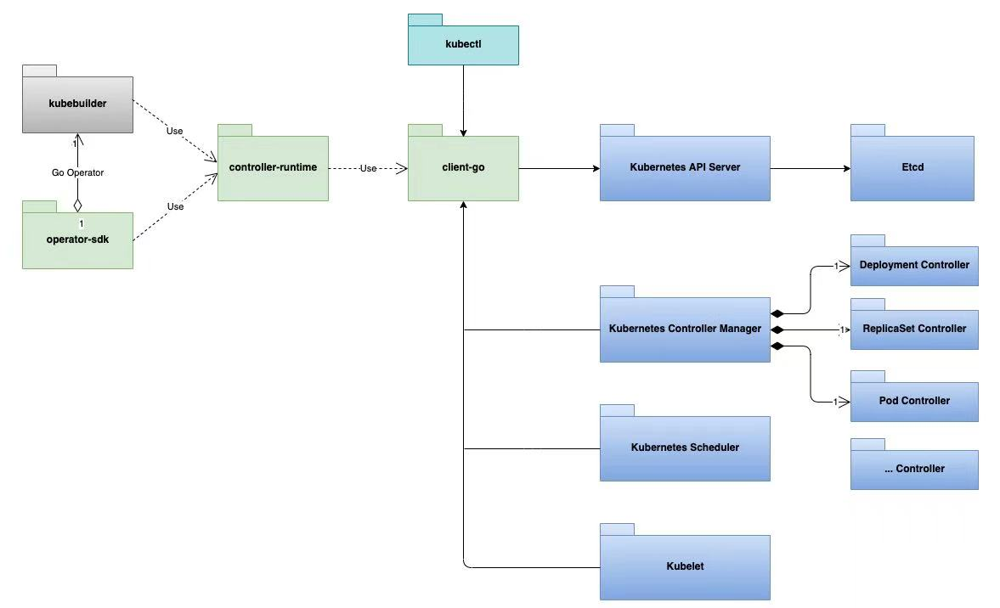
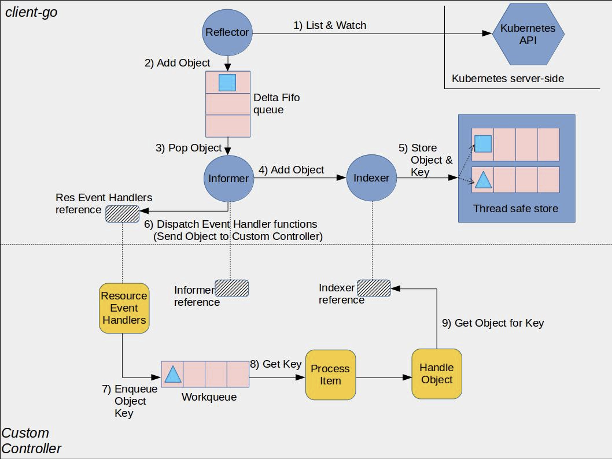

## What is Kubernetes operator

### Operator pattern

https://kubernetes.io/docs/concepts/extend-kubernetes/operator/

#### Introducing Operators
**Putting Operational Knowledge into Software**  
https://coreos.com/blog/introducing-operators.html

#### Introducing the Operator Framework
**Building Apps on Kubernetes**  
https://coreos.com/blog/introducing-operator-framework

## Development technology stack for operator
 

### client-go
https://github.com/kubernetes/client-go
https://github.com/kubernetes/sample-controller/blob/master/docs/controller-client-go.md

Go clients for talking to a kubernetes cluster. The client-go library contains various mechanisms that you can use when developing your custom controllers. These mechanisms are defined in the tools/cache folder of the library.  
 

### controller-runtime
https://github.com/kubernetes-sigs/controller-runtime

The Kubernetes controller-runtime Project is a set of go libraries for building Controllers. It is leveraged by Kubebuilder and Operator SDK. Both are a great place to start for new projects. See Kubebuilder's Quick Start to see how it can be used.

### kubebuilder
https://book.kubebuilder.io/introduction.html

### operator-sdk
https://github.com/operator-framework/operator-sdk
https://sdk.operatorframework.io/docs/

### kubebuilder vs operator-sdk
A legacy post to compare "kubebuilder" and "operator-sdk for your interest. However, the winning features of kubebuilder have already been provided by operator-sdk.

https://tiewei.github.io/posts/kubebuilder-vs-operator-sdk
