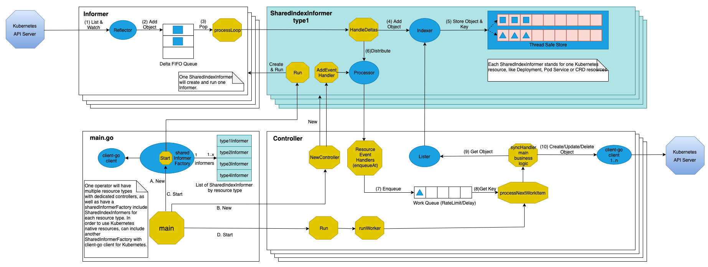
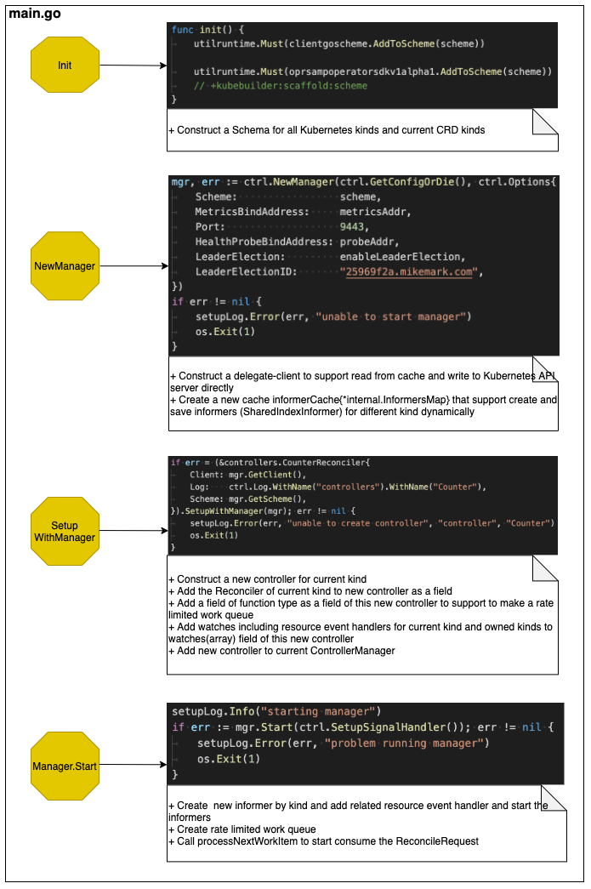

## What is Operator

### The reason you need to choose operator SDK

+ Out of box HA capability by wrapping the LeaderElection of clien-go
+ A framework which help generate all common codes

### Introducing Operators
**Putting Operational Knowledge into Software**  
https://coreos.com/blog/introducing-operators.html

### ‘Hello, World’ tutorial with Kubernetes Operators
https://developers.redhat.com/blog/2020/08/21/hello-world-tutorial-with-kubernetes-operators/

### Operator Best Practices
https://github.com/operator-framework/community-operators/blob/master/docs/best-practices.md

https://cloud.redhat.com/blog/kubernetes-operators-best-practices

### Kubernetes Operators Best Practices
https://www.openshift.com/blog/kubernetes-operators-best-practices

### Operator pattern
https://kubernetes.io/docs/concepts/extend-kubernetes/operator/

### Introducing the Operator Framework
**Building Apps on Kubernetes**  
https://coreos.com/blog/introducing-operator-framework

### Edge triggered vs Level triggered interrupts
http://venkateshabbarapu.blogspot.com/2013/03/edge-triggered-vs-level-triggered.html

## Development technology stack for operator
 

### client-go
https://github.com/kubernetes/client-go  
https://github.com/kubernetes/sample-controller/blob/master/docs/controller-client-go.md

Go clients for talking to a kubernetes cluster. The client-go library contains various mechanisms that you can use when developing your custom controllers. These mechanisms are defined in the tools/cache folder of the library.  
 

#### Operator by client-go
 

#### Sample code
<!-- tabs:start -->
#### ** main.go **
```go
/*
Copyright 2017 The Kubernetes Authors.

Licensed under the Apache License, Version 2.0 (the "License");
you may not use this file except in compliance with the License.
You may obtain a copy of the License at

    http://www.apache.org/licenses/LICENSE-2.0

Unless required by applicable law or agreed to in writing, software
distributed under the License is distributed on an "AS IS" BASIS,
WITHOUT WARRANTIES OR CONDITIONS OF ANY KIND, either express or implied.
See the License for the specific language governing permissions and
limitations under the License.
*/

package main

import (
	"flag"
	"time"

	kubeinformers "k8s.io/client-go/informers"
	"k8s.io/client-go/kubernetes"
	"k8s.io/client-go/tools/clientcmd"
	"k8s.io/klog/v2"

	// Uncomment the following line to load the gcp plugin (only required to authenticate against GKE clusters).
	// _ "k8s.io/client-go/plugin/pkg/client/auth/gcp"

	clientset "xxxx/oprsample-client-go/pkg/generated/clientset/versioned"
	informers "xxxx/mizha53/oprsample-client-go/pkg/generated/informers/externalversions"
	"xxxx/mizha53/oprsample-client-go/pkg/signals"
)

var (
	masterURL  string
	kubeconfig string
)

func main() {
	klog.InitFlags(nil)
	flag.Parse()

	// set up signals so we handle the first shutdown signal gracefully
	stopCh := signals.SetupSignalHandler()

	cfg, err := clientcmd.BuildConfigFromFlags(masterURL, kubeconfig)
	if err != nil {
		klog.Fatalf("Error building kubeconfig: %s", err.Error())
	}

	kubeClient, err := kubernetes.NewForConfig(cfg)
	if err != nil {
		klog.Fatalf("Error building kubernetes clientset: %s", err.Error())
	}

	exampleClient, err := clientset.NewForConfig(cfg)
	if err != nil {
		klog.Fatalf("Error building example clientset: %s", err.Error())
	}

	kubeInformerFactory := kubeinformers.NewSharedInformerFactory(kubeClient, time.Second*30)
	exampleInformerFactory := informers.NewSharedInformerFactory(exampleClient, time.Second*30)

	controller := NewController(kubeClient, exampleClient,
		kubeInformerFactory.Apps().V1().Deployments(),
		exampleInformerFactory.Oprsampleclientgo().V1alpha1().Foos())

	atController := NewAtController(kubeClient, exampleClient,
		kubeInformerFactory.Core().V1().Pods(),
		exampleInformerFactory.Oprsampleclientgo().V1alpha1().Ats())

	// notice that there is no need to run Start methods in a separate goroutine. (i.e. go kubeInformerFactory.Start(stopCh)
	// Start method is non-blocking and runs all registered informers in a dedicated goroutine.
	kubeInformerFactory.Start(stopCh)
	exampleInformerFactory.Start(stopCh)

	go runController(controller, 2, stopCh)
	runAtController(atController, 2, stopCh)
}

func runController(controller *Controller, thrediness int, stopCh <-chan struct{}) {
	if err := controller.Run(thrediness, stopCh); err != nil {
		klog.Fatalf("Error running controller: %s", err.Error())
	}
}

func runAtController(atController *AtController, thrediness int, stopCh <-chan struct{}) {
	if err := atController.Run(thrediness, stopCh); err != nil {
		klog.Fatalf("Error running atController: %s", err.Error())
	}
}

func init() {
	flag.StringVar(&kubeconfig, "kubeconfig", "", "Path to a kubeconfig. Only required if out-of-cluster.")
	flag.StringVar(&masterURL, "master", "", "The address of the Kubernetes API server. Overrides any value in kubeconfig. Only required if out-of-cluster.")
}
```

#### ** controller.go **
```go
/*
Copyright 2017 The Kubernetes Authors.

Licensed under the Apache License, Version 2.0 (the "License");
you may not use this file except in compliance with the License.
You may obtain a copy of the License at

    http://www.apache.org/licenses/LICENSE-2.0

Unless required by applicable law or agreed to in writing, software
distributed under the License is distributed on an "AS IS" BASIS,
WITHOUT WARRANTIES OR CONDITIONS OF ANY KIND, either express or implied.
See the License for the specific language governing permissions and
limitations under the License.
*/

package main

import (
	"context"
	"fmt"
	"time"

	appsv1 "k8s.io/api/apps/v1"
	corev1 "k8s.io/api/core/v1"
	"k8s.io/apimachinery/pkg/api/errors"
	metav1 "k8s.io/apimachinery/pkg/apis/meta/v1"
	utilruntime "k8s.io/apimachinery/pkg/util/runtime"
	"k8s.io/apimachinery/pkg/util/wait"
	appsinformers "k8s.io/client-go/informers/apps/v1"
	"k8s.io/client-go/kubernetes"
	"k8s.io/client-go/kubernetes/scheme"
	typedcorev1 "k8s.io/client-go/kubernetes/typed/core/v1"
	appslisters "k8s.io/client-go/listers/apps/v1"
	"k8s.io/client-go/tools/cache"
	"k8s.io/client-go/tools/record"
	"k8s.io/client-go/util/workqueue"
	"k8s.io/klog/v2"

	samplev1alpha1 "xxxx/oprsample-client-go/pkg/apis/oprsampleclientgo/v1alpha1"
	clientset "xxxx/oprsample-client-go/pkg/generated/clientset/versioned"
	samplescheme "xxxx/oprsample-client-go/pkg/generated/clientset/versioned/scheme"
	informers "xxxx/oprsample-client-go/pkg/generated/informers/externalversions/oprsampleclientgo/v1alpha1"
	listers "xxxx/oprsample-client-go/pkg/generated/listers/oprsampleclientgo/v1alpha1"
)

const controllerAgentName = "oprsample-client-go"

const (
	// SuccessSynced is used as part of the Event 'reason' when a Foo is synced
	SuccessSynced = "Synced"
	// ErrResourceExists is used as part of the Event 'reason' when a Foo fails
	// to sync due to a Deployment of the same name already existing.
	ErrResourceExists = "ErrResourceExists"

	// MessageResourceExists is the message used for Events when a resource
	// fails to sync due to a Deployment already existing
	MessageResourceExists = "Resource %q already exists and is not managed by Foo"
	// MessageResourceSynced is the message used for an Event fired when a Foo
	// is synced successfully
	MessageResourceSynced = "Foo synced successfully"
)

// Controller is the controller implementation for Foo resources
type Controller struct {
	// kubeclientset is a standard kubernetes clientset
	kubeclientset kubernetes.Interface
	// sampleclientset is a clientset for our own API group
	sampleclientset clientset.Interface

	deploymentsLister appslisters.DeploymentLister
	deploymentsSynced cache.InformerSynced
	foosLister        listers.FooLister
	foosSynced        cache.InformerSynced

	// workqueue is a rate limited work queue. This is used to queue work to be
	// processed instead of performing it as soon as a change happens. This
	// means we can ensure we only process a fixed amount of resources at a
	// time, and makes it easy to ensure we are never processing the same item
	// simultaneously in two different workers.
	workqueue workqueue.RateLimitingInterface
	// recorder is an event recorder for recording Event resources to the
	// Kubernetes API.
	recorder record.EventRecorder
}

// NewController returns a new sample controller
func NewController(
	kubeclientset kubernetes.Interface,
	sampleclientset clientset.Interface,
	deploymentInformer appsinformers.DeploymentInformer,
	fooInformer informers.FooInformer) *Controller {

	// Create event broadcaster
	// Add oprsample-client-go types to the default Kubernetes Scheme so Events can be
	// logged for oprsample-client-go types.
	utilruntime.Must(samplescheme.AddToScheme(scheme.Scheme))
	klog.V(4).Info("Creating event broadcaster")
	eventBroadcaster := record.NewBroadcaster()
	eventBroadcaster.StartStructuredLogging(0)
	eventBroadcaster.StartRecordingToSink(&typedcorev1.EventSinkImpl{Interface: kubeclientset.CoreV1().Events("")})
	recorder := eventBroadcaster.NewRecorder(scheme.Scheme, corev1.EventSource{Component: controllerAgentName})

	controller := &Controller{
		kubeclientset:     kubeclientset,
		sampleclientset:   sampleclientset,
		deploymentsLister: deploymentInformer.Lister(),
		deploymentsSynced: deploymentInformer.Informer().HasSynced,
		foosLister:        fooInformer.Lister(),
		foosSynced:        fooInformer.Informer().HasSynced,
		workqueue:         workqueue.NewNamedRateLimitingQueue(workqueue.DefaultControllerRateLimiter(), "Foos"),
		recorder:          recorder,
	}

	klog.Info("Setting up event handlers")
	// Set up an event handler for when Foo resources change
	fooInformer.Informer().AddEventHandler(cache.ResourceEventHandlerFuncs{
		AddFunc: controller.enqueueFoo,
		UpdateFunc: func(old, new interface{}) {
			controller.enqueueFoo(new)
		},
	})
	// Set up an event handler for when Deployment resources change. This
	// handler will lookup the owner of the given Deployment, and if it is
	// owned by a Foo resource will enqueue that Foo resource for
	// processing. This way, we don't need to implement custom logic for
	// handling Deployment resources. More info on this pattern:
	// https://github.com/kubernetes/community/blob/8cafef897a22026d42f5e5bb3f104febe7e29830/contributors/devel/controllers.md
	deploymentInformer.Informer().AddEventHandler(cache.ResourceEventHandlerFuncs{
		AddFunc: controller.handleObject,
		UpdateFunc: func(old, new interface{}) {
			newDepl := new.(*appsv1.Deployment)
			oldDepl := old.(*appsv1.Deployment)
			if newDepl.ResourceVersion == oldDepl.ResourceVersion {
				// Periodic resync will send update events for all known Deployments.
				// Two different versions of the same Deployment will always have different RVs.
				return
			}
			controller.handleObject(new)
		},
		DeleteFunc: controller.handleObject,
	})

	return controller
}

// Run will set up the event handlers for types we are interested in, as well
// as syncing informer caches and starting workers. It will block until stopCh
// is closed, at which point it will shutdown the workqueue and wait for
// workers to finish processing their current work items.
func (c *Controller) Run(threadiness int, stopCh <-chan struct{}) error {
	defer utilruntime.HandleCrash()
	defer c.workqueue.ShutDown()

	// Start the informer factories to begin populating the informer caches
	klog.Info("Starting Foo controller")

	// Wait for the caches to be synced before starting workers
	klog.Info("Waiting for informer caches to sync")
	if ok := cache.WaitForCacheSync(stopCh, c.deploymentsSynced, c.foosSynced); !ok {
		return fmt.Errorf("failed to wait for caches to sync")
	}

	klog.Info("Starting workers")
	// Launch two workers to process Foo resources
	for i := 0; i < threadiness; i++ {
		go wait.Until(c.runWorker, time.Second, stopCh)
	}

	klog.Info("Started workers")
	<-stopCh
	klog.Info("Shutting down workers")

	return nil
}

// runWorker is a long-running function that will continually call the
// processNextWorkItem function in order to read and process a message on the
// workqueue.
func (c *Controller) runWorker() {
	for c.processNextWorkItem() {
	}
}

// processNextWorkItem will read a single work item off the workqueue and
// attempt to process it, by calling the syncHandler.
func (c *Controller) processNextWorkItem() bool {
	obj, shutdown := c.workqueue.Get()

	if shutdown {
		return false
	}

	// We wrap this block in a func so we can defer c.workqueue.Done.
	err := func(obj interface{}) error {
		// We call Done here so the workqueue knows we have finished
		// processing this item. We also must remember to call Forget if we
		// do not want this work item being re-queued. For example, we do
		// not call Forget if a transient error occurs, instead the item is
		// put back on the workqueue and attempted again after a back-off
		// period.
		defer c.workqueue.Done(obj)
		var key string
		var ok bool
		// We expect strings to come off the workqueue. These are of the
		// form namespace/name. We do this as the delayed nature of the
		// workqueue means the items in the informer cache may actually be
		// more up to date that when the item was initially put onto the
		// workqueue.
		if key, ok = obj.(string); !ok {
			// As the item in the workqueue is actually invalid, we call
			// Forget here else we'd go into a loop of attempting to
			// process a work item that is invalid.
			c.workqueue.Forget(obj)
			utilruntime.HandleError(fmt.Errorf("expected string in workqueue but got %#v", obj))
			return nil
		}
		// Run the syncHandler, passing it the namespace/name string of the
		// Foo resource to be synced.
		if err := c.syncHandler(key); err != nil {
			// Put the item back on the workqueue to handle any transient errors.
			c.workqueue.AddRateLimited(key)
			return fmt.Errorf("error syncing '%s': %s, requeuing", key, err.Error())
		}
		// Finally, if no error occurs we Forget this item so it does not
		// get queued again until another change happens.
		c.workqueue.Forget(obj)
		klog.Infof("Successfully synced '%s'", key)
		return nil
	}(obj)

	if err != nil {
		utilruntime.HandleError(err)
		return true
	}

	return true
}

// syncHandler compares the actual state with the desired, and attempts to
// converge the two. It then updates the Status block of the Foo resource
// with the current status of the resource.
func (c *Controller) syncHandler(key string) error {
	// Convert the namespace/name string into a distinct namespace and name
	namespace, name, err := cache.SplitMetaNamespaceKey(key)
	if err != nil {
		utilruntime.HandleError(fmt.Errorf("invalid resource key: %s", key))
		return nil
	}

	// Get the Foo resource with this namespace/name
	foo, err := c.foosLister.Foos(namespace).Get(name)
	if err != nil {
		// The Foo resource may no longer exist, in which case we stop
		// processing.
		if errors.IsNotFound(err) {
			utilruntime.HandleError(fmt.Errorf("foo '%s' in work queue no longer exists", key))
			return nil
		}

		return err
	}

	deploymentName := foo.Spec.DeploymentName
	if deploymentName == "" {
		// We choose to absorb the error here as the worker would requeue the
		// resource otherwise. Instead, the next time the resource is updated
		// the resource will be queued again.
		utilruntime.HandleError(fmt.Errorf("%s: deployment name must be specified", key))
		return nil
	}

	// Get the deployment with the name specified in Foo.spec
	deployment, err := c.deploymentsLister.Deployments(foo.Namespace).Get(deploymentName)
	// If the resource doesn't exist, we'll create it
	if errors.IsNotFound(err) {
		deployment, err = c.kubeclientset.AppsV1().Deployments(foo.Namespace).Create(context.TODO(), newDeployment(foo), metav1.CreateOptions{})
	}

	// If an error occurs during Get/Create, we'll requeue the item so we can
	// attempt processing again later. This could have been caused by a
	// temporary network failure, or any other transient reason.
	if err != nil {
		return err
	}

	// If the Deployment is not controlled by this Foo resource, we should log
	// a warning to the event recorder and return error msg.
	if !metav1.IsControlledBy(deployment, foo) {
		msg := fmt.Sprintf(MessageResourceExists, deployment.Name)
		c.recorder.Event(foo, corev1.EventTypeWarning, ErrResourceExists, msg)
		return fmt.Errorf(msg)
	}

	// If this number of the replicas on the Foo resource is specified, and the
	// number does not equal the current desired replicas on the Deployment, we
	// should update the Deployment resource.
	if foo.Spec.Replicas != nil && *foo.Spec.Replicas != *deployment.Spec.Replicas {
		klog.V(4).Infof("Foo %s replicas: %d, deployment replicas: %d", name, *foo.Spec.Replicas, *deployment.Spec.Replicas)
		deployment, err = c.kubeclientset.AppsV1().Deployments(foo.Namespace).Update(context.TODO(), newDeployment(foo), metav1.UpdateOptions{})
	}

	// If an error occurs during Update, we'll requeue the item so we can
	// attempt processing again later. This could have been caused by a
	// temporary network failure, or any other transient reason.
	if err != nil {
		return err
	}

	// Finally, we update the status block of the Foo resource to reflect the
	// current state of the world
	err = c.updateFooStatus(foo, deployment)
	if err != nil {
		return err
	}

	c.recorder.Event(foo, corev1.EventTypeNormal, SuccessSynced, MessageResourceSynced)
	return nil
}

func (c *Controller) updateFooStatus(foo *samplev1alpha1.Foo, deployment *appsv1.Deployment) error {
	// NEVER modify objects from the store. It's a read-only, local cache.
	// You can use DeepCopy() to make a deep copy of original object and modify this copy
	// Or create a copy manually for better performance
	fooCopy := foo.DeepCopy()
	fooCopy.Status.AvailableReplicas = deployment.Status.AvailableReplicas
	// If the CustomResourceSubresources feature gate is not enabled,
	// we must use Update instead of UpdateStatus to update the Status block of the Foo resource.
	// UpdateStatus will not allow changes to the Spec of the resource,
	// which is ideal for ensuring nothing other than resource status has been updated.
	_, err := c.sampleclientset.OprsampleclientgoV1alpha1().Foos(foo.Namespace).Update(context.TODO(), fooCopy, metav1.UpdateOptions{})
	return err
}

// enqueueFoo takes a Foo resource and converts it into a namespace/name
// string which is then put onto the work queue. This method should *not* be
// passed resources of any type other than Foo.
func (c *Controller) enqueueFoo(obj interface{}) {
	var key string
	var err error
	if key, err = cache.MetaNamespaceKeyFunc(obj); err != nil {
		utilruntime.HandleError(err)
		return
	}
	c.workqueue.Add(key)
}

// handleObject will take any resource implementing metav1.Object and attempt
// to find the Foo resource that 'owns' it. It does this by looking at the
// objects metadata.ownerReferences field for an appropriate OwnerReference.
// It then enqueues that Foo resource to be processed. If the object does not
// have an appropriate OwnerReference, it will simply be skipped.
func (c *Controller) handleObject(obj interface{}) {
	var object metav1.Object
	var ok bool
	if object, ok = obj.(metav1.Object); !ok {
		tombstone, ok := obj.(cache.DeletedFinalStateUnknown)
		if !ok {
			utilruntime.HandleError(fmt.Errorf("error decoding object, invalid type"))
			return
		}
		object, ok = tombstone.Obj.(metav1.Object)
		if !ok {
			utilruntime.HandleError(fmt.Errorf("error decoding object tombstone, invalid type"))
			return
		}
		klog.V(4).Infof("Recovered deleted object '%s' from tombstone", object.GetName())
	}
	klog.V(4).Infof("Processing object: %s", object.GetName())
	if ownerRef := metav1.GetControllerOf(object); ownerRef != nil {
		// If this object is not owned by a Foo, we should not do anything more
		// with it.
		if ownerRef.Kind != "Foo" {
			return
		}

		foo, err := c.foosLister.Foos(object.GetNamespace()).Get(ownerRef.Name)
		if err != nil {
			klog.V(4).Infof("ignoring orphaned object '%s' of foo '%s'", object.GetSelfLink(), ownerRef.Name)
			return
		}

		c.enqueueFoo(foo)
		return
	}
}

// newDeployment creates a new Deployment for a Foo resource. It also sets
// the appropriate OwnerReferences on the resource so handleObject can discover
// the Foo resource that 'owns' it.
func newDeployment(foo *samplev1alpha1.Foo) *appsv1.Deployment {
	labels := map[string]string{
		"app":        "nginx",
		"controller": foo.Name,
	}
	return &appsv1.Deployment{
		ObjectMeta: metav1.ObjectMeta{
			Name:      foo.Spec.DeploymentName,
			Namespace: foo.Namespace,
			OwnerReferences: []metav1.OwnerReference{
				*metav1.NewControllerRef(foo, samplev1alpha1.SchemeGroupVersion.WithKind("Foo")),
			},
		},
		Spec: appsv1.DeploymentSpec{
			Replicas: foo.Spec.Replicas,
			Selector: &metav1.LabelSelector{
				MatchLabels: labels,
			},
			Template: corev1.PodTemplateSpec{
				ObjectMeta: metav1.ObjectMeta{
					Labels: labels,
				},
				Spec: corev1.PodSpec{
					Containers: []corev1.Container{
						{
							Name:  "nginx",
							Image: "nginx:latest",
						},
					},
				},
			},
		},
	}
}
```
#### ** at_controller.go **
```go
/*
Copyright 2017 The Kubernetes Authors.

Licensed under the Apache License, Version 2.0 (the "License");
you may not use this file except in compliance with the License.
You may obtain a copy of the License at

    http://www.apache.org/licenses/LICENSE-2.0

Unless required by applicable law or agreed to in writing, software
distributed under the License is distributed on an "AS IS" BASIS,
WITHOUT WARRANTIES OR CONDITIONS OF ANY KIND, either express or implied.
See the License for the specific language governing permissions and
limitations under the License.
*/

package main

import (
	"context"
	"fmt"
	"strings"
	"time"

	corev1 "k8s.io/api/core/v1"
	"k8s.io/apimachinery/pkg/api/errors"
	metav1 "k8s.io/apimachinery/pkg/apis/meta/v1"
	utilruntime "k8s.io/apimachinery/pkg/util/runtime"
	"k8s.io/apimachinery/pkg/util/wait"
	coreinformers "k8s.io/client-go/informers/core/v1"
	"k8s.io/client-go/kubernetes"
	"k8s.io/client-go/kubernetes/scheme"
	typedcorev1 "k8s.io/client-go/kubernetes/typed/core/v1"
	corelisters "k8s.io/client-go/listers/core/v1"
	"k8s.io/client-go/tools/cache"
	"k8s.io/client-go/tools/record"
	"k8s.io/client-go/util/workqueue"
	"k8s.io/klog/v2"

	samplev1alpha1 "xxxx/oprsample-client-go/pkg/apis/oprsampleclientgo/v1alpha1"
	clientset "xxxx/oprsample-client-go/pkg/generated/clientset/versioned"
	samplescheme "xxxx/oprsample-client-go/pkg/generated/clientset/versioned/scheme"
	informers "xxxx/oprsample-client-go/pkg/generated/informers/externalversions/oprsampleclientgo/v1alpha1"
	listers "xxxx/oprsample-client-go/pkg/generated/listers/oprsampleclientgo/v1alpha1"
)

const atControllerAgentName = "oprsample-client-go-at"

// AtController is the controller implementation for At resources
type AtController struct {
	// kubeclientset is a standard kubernetes clientset
	kubeclientset kubernetes.Interface
	// sampleclientset is a clientset for our own API group
	sampleclientset clientset.Interface

	podsLister corelisters.PodLister
	podsSynced cache.InformerSynced

	atsLister listers.AtLister
	atsSynced cache.InformerSynced

	// workqueue is a rate limited work queue. This is used to queue work to be
	// processed instead of performing it as soon as a change happens. This
	// means we can ensure we only process a fixed amount of resources at a
	// time, and makes it easy to ensure we are never processing the same item
	// simultaneously in two different workers.
	workqueue workqueue.RateLimitingInterface
	// recorder is an event recorder for recording Event resources to the
	// Kubernetes API.
	recorder record.EventRecorder
}

// NewAtController returns a new sample controller
func NewAtController(
	kubeclientset kubernetes.Interface,
	sampleclientset clientset.Interface,
	podInformer coreinformers.PodInformer,
	atInformer informers.AtInformer) *AtController {

	// Create event broadcaster
	// Add oprsample-client-go types to the default Kubernetes Scheme so Events can be
	// logged for oprsample-client-go types.
	utilruntime.Must(samplescheme.AddToScheme(scheme.Scheme))
	klog.V(4).Info("Creating event broadcaster")
	eventBroadcaster := record.NewBroadcaster()
	eventBroadcaster.StartStructuredLogging(0)
	eventBroadcaster.StartRecordingToSink(&typedcorev1.EventSinkImpl{Interface: kubeclientset.CoreV1().Events("")})
	recorder := eventBroadcaster.NewRecorder(scheme.Scheme, corev1.EventSource{Component: atControllerAgentName})

	controller := &AtController{
		kubeclientset:   kubeclientset,
		sampleclientset: sampleclientset,
		podsLister:      podInformer.Lister(),
		podsSynced:      podInformer.Informer().HasSynced,
		atsLister:       atInformer.Lister(),
		atsSynced:       atInformer.Informer().HasSynced,
		workqueue:       workqueue.NewNamedRateLimitingQueue(workqueue.DefaultControllerRateLimiter(), "Ats"),
		recorder:        recorder,
	}

	klog.Info("Setting up event handlers")
	// Set up an event handler for when Foo resources change
	atInformer.Informer().AddEventHandler(cache.ResourceEventHandlerFuncs{
		AddFunc: controller.enqueueAt,
		UpdateFunc: func(old, new interface{}) {
			controller.enqueueAt(new)
		},
	})

	return controller
}

// Run will set up the event handlers for types we are interested in, as well
// as syncing informer caches and starting workers. It will block until stopCh
// is closed, at which point it will shutdown the workqueue and wait for
// workers to finish processing their current work items.
func (c *AtController) Run(threadiness int, stopCh <-chan struct{}) error {
	defer utilruntime.HandleCrash()
	defer c.workqueue.ShutDown()

	// Start the informer factories to begin populating the informer caches
	klog.Info("Starting At controller")

	// Wait for the caches to be synced before starting workers
	klog.Info("Waiting for informer caches to sync")
	if ok := cache.WaitForCacheSync(stopCh, c.podsSynced, c.atsSynced); !ok {
		return fmt.Errorf("failed to wait for caches to sync")
	}

	klog.Info("Starting workers")
	// Launch two workers to process Foo resources
	for i := 0; i < threadiness; i++ {
		go wait.Until(c.runWorker, time.Second, stopCh)
	}

	klog.Info("Started workers")
	<-stopCh
	klog.Info("Shutting down workers")

	return nil
}

// runWorker is a long-running function that will continually call the
// processNextWorkItem function in order to read and process a message on the
// workqueue.
func (c *AtController) runWorker() {
	for c.processNextWorkItem() {
	}
}

// processNextWorkItem will read a single work item off the workqueue and
// attempt to process it, by calling the syncHandler.
func (c *AtController) processNextWorkItem() bool {
	obj, shutdown := c.workqueue.Get()

	if shutdown {
		return false
	}

	// We wrap this block in a func so we can defer c.workqueue.Done.
	err := func(obj interface{}) error {
		// We call Done here so the workqueue knows we have finished
		// processing this item. We also must remember to call Forget if we
		// do not want this work item being re-queued. For example, we do
		// not call Forget if a transient error occurs, instead the item is
		// put back on the workqueue and attempted again after a back-off
		// period.
		defer c.workqueue.Done(obj)
		var key string
		var ok bool
		// We expect strings to come off the workqueue. These are of the
		// form namespace/name. We do this as the delayed nature of the
		// workqueue means the items in the informer cache may actually be
		// more up to date that when the item was initially put onto the
		// workqueue.
		if key, ok = obj.(string); !ok {
			// As the item in the workqueue is actually invalid, we call
			// Forget here else we'd go into a loop of attempting to
			// process a work item that is invalid.
			c.workqueue.Forget(obj)
			utilruntime.HandleError(fmt.Errorf("expected string in workqueue but got %#v", obj))
			return nil
		}
		// Run the syncHandler, passing it the namespace/name string of the
		// Foo resource to be synced.
		if when, err := c.syncHandler(key); err != nil {
			// Put the item back on the workqueue to handle any transient errors.
			c.workqueue.AddRateLimited(key)
			return fmt.Errorf("error syncing '%s': %s, requeuing", key, err.Error())
		} else if when != time.Duration(0) {
			c.workqueue.AddAfter(key, when)
		} else {
			// Finally, if no error occurs we Forget this item so it does not
			// get queued again until another change happens.
			c.workqueue.Forget(obj)
			klog.Infof("Successfully synced '%s'", key)
		}
		return nil
	}(obj)

	if err != nil {
		utilruntime.HandleError(err)
		return true
	}

	return true
}

// syncHandler compares the actual state with the desired, and attempts to
// converge the two. It then updates the Status block of the Foo resource
// with the current status of the resource.
func (c *AtController) syncHandler(key string) (time.Duration, error) {
	// Convert the namespace/name string into a distinct namespace and name
	namespace, name, err := cache.SplitMetaNamespaceKey(key)
	if err != nil {
		utilruntime.HandleError(fmt.Errorf("invalid resource key: %s", key))
		return time.Duration(0), nil
	}

	// Get the At resource with this namespace/name
	at, err := c.atsLister.Ats(namespace).Get(name)
	if err != nil {
		// The Foo resource may no longer exist, in which case we stop
		// processing.
		if errors.IsNotFound(err) {
			utilruntime.HandleError(fmt.Errorf("at '%s' in work queue no longer exists", key))
			return time.Duration(0), nil
		}

		return time.Duration(0), err
	}

	phase := at.Status.Phase
	switch phase {
	case "":
		phase = samplev1alpha1.PhasePending
	case samplev1alpha1.PhasePending:
		klog.Infof("instance %s: phase=PENDDING", key)
		klog.Infof("instance %s: checking schedule %q", key, at.Spec.Schedule)
		d, err := timeUntilSchedule(at.Spec.Schedule)
		if err != nil {
			utilruntime.HandleError(fmt.Errorf("schedule parsing failed: %v", err))
			return time.Duration(0), err
		}
		klog.Infof("instance %s: schedule parsing done: diff=%v", key, d)
		if d > 0 {
			return d, nil
		}
		klog.Infof("instance %s: it's time! Ready to execute: %s", key, at.Spec.Command)
		phase = samplev1alpha1.PhaseRunning
	case samplev1alpha1.PhaseRunning:
		klog.Infof("instance %s: Phase: RUNNING", key)
		pod := newPodForCR(at)
		owner := metav1.NewControllerRef(at, samplev1alpha1.SchemeGroupVersion.WithKind("At"))
		pod.ObjectMeta.OwnerReferences = append(pod.ObjectMeta.OwnerReferences, *owner)
		found, err := c.podsLister.Pods(pod.Namespace).Get(pod.Name)
		if err != nil && errors.IsNotFound(err) {
			found, err = c.kubeclientset.CoreV1().Pods(pod.Namespace).Create(context.TODO(), pod, metav1.CreateOptions{})
			if err != nil {
				return time.Duration(0), err
			}
			klog.Infof("instance %s: pod lauched: name=%s", key, pod.Name)
		} else if err != nil {
			return time.Duration(0), err
		} else if found.Status.Phase == corev1.PodFailed ||
			found.Status.Phase == corev1.PodSucceeded {
			klog.Infof("instance %s: container terminated: reason=%q message=%q",
				key, found.Status.Reason, found.Status.Message)
			phase = samplev1alpha1.PhaseDone
		} else {
			return time.Duration(0), nil
		}
	case samplev1alpha1.PhaseDone:
		klog.Infof("instance %s: phase: Done", key)
		return time.Duration(0), nil
	default:
		klog.Infof("instance %s: NOP")
		return time.Duration(0), nil
	}

	// Finally, we update the status block of the Foo resource to reflect the
	// current state of the world
	err = c.updateAtStatus(at, phase)
	if err != nil {
		return time.Duration(0), err
	}

	c.recorder.Event(at, corev1.EventTypeNormal, SuccessSynced, MessageResourceSynced)
	return time.Duration(0), nil
}

func (c *AtController) updateAtStatus(at *samplev1alpha1.At, phase string) error {
	// NEVER modify objects from the store. It's a read-only, local cache.
	// You can use DeepCopy() to make a deep copy of original object and modify this copy
	// Or create a copy manually for better performance
	atCopy := at.DeepCopy()
	atCopy.Status.Phase = phase

	// If the CustomResourceSubresources feature gate is not enabled,
	// we must use Update instead of UpdateStatus to update the Status block of the Foo resource.
	// UpdateStatus will not allow changes to the Spec of the resource,
	// which is ideal for ensuring nothing other than resource status has been updated.
	_, err := c.sampleclientset.OprsampleclientgoV1alpha1().Ats(atCopy.Namespace).Update(context.TODO(), atCopy, metav1.UpdateOptions{})
	return err
}

// enqueueFoo takes a Foo resource and converts it into a namespace/name
// string which is then put onto the work queue. This method should *not* be
// passed resources of any type other than Foo.
func (c *AtController) enqueueAt(obj interface{}) {
	var key string
	var err error
	if key, err = cache.MetaNamespaceKeyFunc(obj); err != nil {
		utilruntime.HandleError(err)
		return
	}
	c.workqueue.Add(key)
}

func timeUntilSchedule(schedule string) (time.Duration, error) {
	now := time.Now().UTC()
	layout := "2006-01-02T15:04:05Z"
	s, err := time.Parse(layout, schedule)
	if err != nil {
		return time.Duration(0), err
	}
	return s.Sub(now), nil
}

func newPodForCR(cr *samplev1alpha1.At) *corev1.Pod {
	labels := map[string]string{
		"app": cr.Name,
	}

	return &corev1.Pod{
		ObjectMeta: metav1.ObjectMeta{
			Name:      cr.Name + "-pod",
			Namespace: cr.Namespace,
			Labels:    labels,
		},
		Spec: corev1.PodSpec{
			Containers: []corev1.Container{
				{
					Name:    "busybox",
					Image:   "busybox",
					Command: strings.Split(cr.Spec.Command, " "),
				},
			},
			RestartPolicy: corev1.RestartPolicyOnFailure,
		},
	}
}
```
#### ** oprsampleclientgo/v1alpha1/types.go **
```go
/*
Copyright 2017 The Kubernetes Authors.

Licensed under the Apache License, Version 2.0 (the "License");
you may not use this file except in compliance with the License.
You may obtain a copy of the License at

    http://www.apache.org/licenses/LICENSE-2.0

Unless required by applicable law or agreed to in writing, software
distributed under the License is distributed on an "AS IS" BASIS,
WITHOUT WARRANTIES OR CONDITIONS OF ANY KIND, either express or implied.
See the License for the specific language governing permissions and
limitations under the License.
*/

package v1alpha1

import (
	metav1 "k8s.io/apimachinery/pkg/apis/meta/v1"
)

// +genclient
// +k8s:deepcopy-gen:interfaces=k8s.io/apimachinery/pkg/runtime.Object

// Foo is a specification for a Foo resource
type Foo struct {
	metav1.TypeMeta   `json:",inline"`
	metav1.ObjectMeta `json:"metadata,omitempty"`

	Spec   FooSpec   `json:"spec"`
	Status FooStatus `json:"status"`
}

// FooSpec is the spec for a Foo resource
type FooSpec struct {
	DeploymentName string `json:"deploymentName"`
	Replicas       *int32 `json:"replicas"`
}

// FooStatus is the status for a Foo resource
type FooStatus struct {
	AvailableReplicas int32 `json:"availableReplicas"`
}

// +k8s:deepcopy-gen:interfaces=k8s.io/apimachinery/pkg/runtime.Object

// FooList is a list of Foo resources
type FooList struct {
	metav1.TypeMeta `json:",inline"`
	metav1.ListMeta `json:"metadata"`

	Items []Foo `json:"items"`
}

const (
	// PhasePending is a constant value
	PhasePending = "PENDDING"
	// PhaseRunning is a constant value
	PhaseRunning = "RUNNING"
	// PhaseDone is a constant value
	PhaseDone = "DONE"
)

// +genclient
// +k8s:deepcopy-gen:interfaces=k8s.io/apimachinery/pkg/runtime.Object

// At is a specification for a At resource
type At struct {
	metav1.TypeMeta   `json:",inline"`
	metav1.ObjectMeta `json:"metadata,omitempty"`

	Spec   AtSpec   `json:"spec"`
	Status AtStatus `json:"status"`
}

// AtSpec defines the desired state of At
type AtSpec struct {
	// Schedule is the desired time the command is supposed to be executed
	Schedule string `json:"schedule,omitempty"`
	// Command is the desired command (executed in a Bash shell) to be executed
	Command string `json:"command,omitempty"`
}

// AtStatus defines the observed state of At
type AtStatus struct {
	// Phase represents the state of the schedule:until the command is executed it is PENDDING,
	// afterwords it is DONE
	Phase string `json:"phase,omitempty"`
}

// +k8s:deepcopy-gen:interfaces=k8s.io/apimachinery/pkg/runtime.Object

// AtList is a list of At resources
type AtList struct {
	metav1.TypeMeta `json:",inline"`
	metav1.ListMeta `json:"metadata"`

	Items []At `json:"items"`
}
```
#### ** oprsampleclientgo/a1alpha1/register.go **
```go
/*
Copyright 2017 The Kubernetes Authors.

Licensed under the Apache License, Version 2.0 (the "License");
you may not use this file except in compliance with the License.
You may obtain a copy of the License at

    http://www.apache.org/licenses/LICENSE-2.0

Unless required by applicable law or agreed to in writing, software
distributed under the License is distributed on an "AS IS" BASIS,
WITHOUT WARRANTIES OR CONDITIONS OF ANY KIND, either express or implied.
See the License for the specific language governing permissions and
limitations under the License.
*/

package v1alpha1

import (
	metav1 "k8s.io/apimachinery/pkg/apis/meta/v1"
	"k8s.io/apimachinery/pkg/runtime"
	"k8s.io/apimachinery/pkg/runtime/schema"

	oprsampleclientgo "xxxx/oprsample-client-go/pkg/apis/oprsampleclientgo"
)

// SchemeGroupVersion is group version used to register these objects
var SchemeGroupVersion = schema.GroupVersion{Group: oprsampleclientgo.GroupName, Version: "v1alpha1"}

// Kind takes an unqualified kind and returns back a Group qualified GroupKind
func Kind(kind string) schema.GroupKind {
	return SchemeGroupVersion.WithKind(kind).GroupKind()
}

// Resource takes an unqualified resource and returns a Group qualified GroupResource
func Resource(resource string) schema.GroupResource {
	return SchemeGroupVersion.WithResource(resource).GroupResource()
}

var (
	// SchemeBuilder initializes a scheme builder
	SchemeBuilder = runtime.NewSchemeBuilder(addKnownTypes)
	// AddToScheme is a global function that registers this API group & version to a scheme
	AddToScheme = SchemeBuilder.AddToScheme
)

// Adds the list of known types to Scheme.
func addKnownTypes(scheme *runtime.Scheme) error {
	scheme.AddKnownTypes(SchemeGroupVersion,
		&Foo{},
		&FooList{},
		&At{},
		&AtList{},
	)
	metav1.AddToGroupVersion(scheme, SchemeGroupVersion)
	return nil
}
```
#### ** apis/oprsampleclientgo/register.go **
```go
/*
Copyright 2017 The Kubernetes Authors.

Licensed under the Apache License, Version 2.0 (the "License");
you may not use this file except in compliance with the License.
You may obtain a copy of the License at

    http://www.apache.org/licenses/LICENSE-2.0

Unless required by applicable law or agreed to in writing, software
distributed under the License is distributed on an "AS IS" BASIS,
WITHOUT WARRANTIES OR CONDITIONS OF ANY KIND, either express or implied.
See the License for the specific language governing permissions and
limitations under the License.
*/

package oprsampleclientgo

// GroupName is the group name used in this package
const (
	GroupName = "oprsampleclientgo.k8s.io"
)
```
#### ** informers/generic.go **
```go
/*
Copyright The Kubernetes Authors.

Licensed under the Apache License, Version 2.0 (the "License");
you may not use this file except in compliance with the License.
You may obtain a copy of the License at

    http://www.apache.org/licenses/LICENSE-2.0

Unless required by applicable law or agreed to in writing, software
distributed under the License is distributed on an "AS IS" BASIS,
WITHOUT WARRANTIES OR CONDITIONS OF ANY KIND, either express or implied.
See the License for the specific language governing permissions and
limitations under the License.
*/

// Code generated by informer-gen. DO NOT EDIT.

package externalversions

import (
	"fmt"

	v1alpha1 "xxxx/oprsample-client-go/pkg/apis/oprsampleclientgo/v1alpha1"
	schema "k8s.io/apimachinery/pkg/runtime/schema"
	cache "k8s.io/client-go/tools/cache"
)

// GenericInformer is type of SharedIndexInformer which will locate and delegate to other
// sharedInformers based on type
type GenericInformer interface {
	Informer() cache.SharedIndexInformer
	Lister() cache.GenericLister
}

type genericInformer struct {
	informer cache.SharedIndexInformer
	resource schema.GroupResource
}

// Informer returns the SharedIndexInformer.
func (f *genericInformer) Informer() cache.SharedIndexInformer {
	return f.informer
}

// Lister returns the GenericLister.
func (f *genericInformer) Lister() cache.GenericLister {
	return cache.NewGenericLister(f.Informer().GetIndexer(), f.resource)
}

// ForResource gives generic access to a shared informer of the matching type
// TODO extend this to unknown resources with a client pool
func (f *sharedInformerFactory) ForResource(resource schema.GroupVersionResource) (GenericInformer, error) {
	switch resource {
	// Group=oprsampleclientgo.k8s.io, Version=v1alpha1
	case v1alpha1.SchemeGroupVersion.WithResource("ats"):
		return &genericInformer{resource: resource.GroupResource(), informer: f.Oprsampleclientgo().V1alpha1().Ats().Informer()}, nil
	case v1alpha1.SchemeGroupVersion.WithResource("foos"):
		return &genericInformer{resource: resource.GroupResource(), informer: f.Oprsampleclientgo().V1alpha1().Foos().Informer()}, nil

	}

	return nil, fmt.Errorf("no informer found for %v", resource)
}
```
#### ** informers/factory.go **
```go
/*
Copyright The Kubernetes Authors.

Licensed under the Apache License, Version 2.0 (the "License");
you may not use this file except in compliance with the License.
You may obtain a copy of the License at

    http://www.apache.org/licenses/LICENSE-2.0

Unless required by applicable law or agreed to in writing, software
distributed under the License is distributed on an "AS IS" BASIS,
WITHOUT WARRANTIES OR CONDITIONS OF ANY KIND, either express or implied.
See the License for the specific language governing permissions and
limitations under the License.
*/

// Code generated by informer-gen. DO NOT EDIT.

package externalversions

import (
	reflect "reflect"
	sync "sync"
	time "time"

	versioned "xxxx/oprsample-client-go/pkg/generated/clientset/versioned"
	internalinterfaces "xxxx/oprsample-client-go/pkg/generated/informers/externalversions/internalinterfaces"
	oprsampleclientgo "xxxx/oprsample-client-go/pkg/generated/informers/externalversions/oprsampleclientgo"
	v1 "k8s.io/apimachinery/pkg/apis/meta/v1"
	runtime "k8s.io/apimachinery/pkg/runtime"
	schema "k8s.io/apimachinery/pkg/runtime/schema"
	cache "k8s.io/client-go/tools/cache"
)

// SharedInformerOption defines the functional option type for SharedInformerFactory.
type SharedInformerOption func(*sharedInformerFactory) *sharedInformerFactory

type sharedInformerFactory struct {
	client           versioned.Interface
	namespace        string
	tweakListOptions internalinterfaces.TweakListOptionsFunc
	lock             sync.Mutex
	defaultResync    time.Duration
	customResync     map[reflect.Type]time.Duration

	informers map[reflect.Type]cache.SharedIndexInformer
	// startedInformers is used for tracking which informers have been started.
	// This allows Start() to be called multiple times safely.
	startedInformers map[reflect.Type]bool
}

// WithCustomResyncConfig sets a custom resync period for the specified informer types.
func WithCustomResyncConfig(resyncConfig map[v1.Object]time.Duration) SharedInformerOption {
	return func(factory *sharedInformerFactory) *sharedInformerFactory {
		for k, v := range resyncConfig {
			factory.customResync[reflect.TypeOf(k)] = v
		}
		return factory
	}
}

// WithTweakListOptions sets a custom filter on all listers of the configured SharedInformerFactory.
func WithTweakListOptions(tweakListOptions internalinterfaces.TweakListOptionsFunc) SharedInformerOption {
	return func(factory *sharedInformerFactory) *sharedInformerFactory {
		factory.tweakListOptions = tweakListOptions
		return factory
	}
}

// WithNamespace limits the SharedInformerFactory to the specified namespace.
func WithNamespace(namespace string) SharedInformerOption {
	return func(factory *sharedInformerFactory) *sharedInformerFactory {
		factory.namespace = namespace
		return factory
	}
}

// NewSharedInformerFactory constructs a new instance of sharedInformerFactory for all namespaces.
func NewSharedInformerFactory(client versioned.Interface, defaultResync time.Duration) SharedInformerFactory {
	return NewSharedInformerFactoryWithOptions(client, defaultResync)
}

// NewFilteredSharedInformerFactory constructs a new instance of sharedInformerFactory.
// Listers obtained via this SharedInformerFactory will be subject to the same filters
// as specified here.
// Deprecated: Please use NewSharedInformerFactoryWithOptions instead
func NewFilteredSharedInformerFactory(client versioned.Interface, defaultResync time.Duration, namespace string, tweakListOptions internalinterfaces.TweakListOptionsFunc) SharedInformerFactory {
	return NewSharedInformerFactoryWithOptions(client, defaultResync, WithNamespace(namespace), WithTweakListOptions(tweakListOptions))
}

// NewSharedInformerFactoryWithOptions constructs a new instance of a SharedInformerFactory with additional options.
func NewSharedInformerFactoryWithOptions(client versioned.Interface, defaultResync time.Duration, options ...SharedInformerOption) SharedInformerFactory {
	factory := &sharedInformerFactory{
		client:           client,
		namespace:        v1.NamespaceAll,
		defaultResync:    defaultResync,
		informers:        make(map[reflect.Type]cache.SharedIndexInformer),
		startedInformers: make(map[reflect.Type]bool),
		customResync:     make(map[reflect.Type]time.Duration),
	}

	// Apply all options
	for _, opt := range options {
		factory = opt(factory)
	}

	return factory
}

// Start initializes all requested informers.
func (f *sharedInformerFactory) Start(stopCh <-chan struct{}) {
	f.lock.Lock()
	defer f.lock.Unlock()

	for informerType, informer := range f.informers {
		if !f.startedInformers[informerType] {
			go informer.Run(stopCh)
			f.startedInformers[informerType] = true
		}
	}
}

// WaitForCacheSync waits for all started informers' cache were synced.
func (f *sharedInformerFactory) WaitForCacheSync(stopCh <-chan struct{}) map[reflect.Type]bool {
	informers := func() map[reflect.Type]cache.SharedIndexInformer {
		f.lock.Lock()
		defer f.lock.Unlock()

		informers := map[reflect.Type]cache.SharedIndexInformer{}
		for informerType, informer := range f.informers {
			if f.startedInformers[informerType] {
				informers[informerType] = informer
			}
		}
		return informers
	}()

	res := map[reflect.Type]bool{}
	for informType, informer := range informers {
		res[informType] = cache.WaitForCacheSync(stopCh, informer.HasSynced)
	}
	return res
}

// InternalInformerFor returns the SharedIndexInformer for obj using an internal
// client.
func (f *sharedInformerFactory) InformerFor(obj runtime.Object, newFunc internalinterfaces.NewInformerFunc) cache.SharedIndexInformer {
	f.lock.Lock()
	defer f.lock.Unlock()

	informerType := reflect.TypeOf(obj)
	informer, exists := f.informers[informerType]
	if exists {
		return informer
	}

	resyncPeriod, exists := f.customResync[informerType]
	if !exists {
		resyncPeriod = f.defaultResync
	}

	informer = newFunc(f.client, resyncPeriod)
	f.informers[informerType] = informer

	return informer
}

// SharedInformerFactory provides shared informers for resources in all known
// API group versions.
type SharedInformerFactory interface {
	internalinterfaces.SharedInformerFactory
	ForResource(resource schema.GroupVersionResource) (GenericInformer, error)
	WaitForCacheSync(stopCh <-chan struct{}) map[reflect.Type]bool

	Oprsampleclientgo() oprsampleclientgo.Interface
}

func (f *sharedInformerFactory) Oprsampleclientgo() oprsampleclientgo.Interface {
	return oprsampleclientgo.New(f, f.namespace, f.tweakListOptions)
}
```
#### ** informers/oprsampleclientgo/interface.go **
```go
/*
Copyright The Kubernetes Authors.

Licensed under the Apache License, Version 2.0 (the "License");
you may not use this file except in compliance with the License.
You may obtain a copy of the License at

    http://www.apache.org/licenses/LICENSE-2.0

Unless required by applicable law or agreed to in writing, software
distributed under the License is distributed on an "AS IS" BASIS,
WITHOUT WARRANTIES OR CONDITIONS OF ANY KIND, either express or implied.
See the License for the specific language governing permissions and
limitations under the License.
*/

// Code generated by informer-gen. DO NOT EDIT.

package oprsampleclientgo

import (
	internalinterfaces "xxxx/oprsample-client-go/pkg/generated/informers/externalversions/internalinterfaces"
	v1alpha1 "xxxx/oprsample-client-go/pkg/generated/informers/externalversions/oprsampleclientgo/v1alpha1"
)

// Interface provides access to each of this group's versions.
type Interface interface {
	// V1alpha1 provides access to shared informers for resources in V1alpha1.
	V1alpha1() v1alpha1.Interface
}

type group struct {
	factory          internalinterfaces.SharedInformerFactory
	namespace        string
	tweakListOptions internalinterfaces.TweakListOptionsFunc
}

// New returns a new Interface.
func New(f internalinterfaces.SharedInformerFactory, namespace string, tweakListOptions internalinterfaces.TweakListOptionsFunc) Interface {
	return &group{factory: f, namespace: namespace, tweakListOptions: tweakListOptions}
}

// V1alpha1 returns a new v1alpha1.Interface.
func (g *group) V1alpha1() v1alpha1.Interface {
	return v1alpha1.New(g.factory, g.namespace, g.tweakListOptions)
}
```
#### ** informers/oprsampleclientgo/v1alpha1/interface.go **
```go
/*
Copyright The Kubernetes Authors.

Licensed under the Apache License, Version 2.0 (the "License");
you may not use this file except in compliance with the License.
You may obtain a copy of the License at

    http://www.apache.org/licenses/LICENSE-2.0

Unless required by applicable law or agreed to in writing, software
distributed under the License is distributed on an "AS IS" BASIS,
WITHOUT WARRANTIES OR CONDITIONS OF ANY KIND, either express or implied.
See the License for the specific language governing permissions and
limitations under the License.
*/

// Code generated by informer-gen. DO NOT EDIT.

package v1alpha1

import (
	internalinterfaces "xxxx/oprsample-client-go/pkg/generated/informers/externalversions/internalinterfaces"
)

// Interface provides access to all the informers in this group version.
type Interface interface {
	// Ats returns a AtInformer.
	Ats() AtInformer
	// Foos returns a FooInformer.
	Foos() FooInformer
}

type version struct {
	factory          internalinterfaces.SharedInformerFactory
	namespace        string
	tweakListOptions internalinterfaces.TweakListOptionsFunc
}

// New returns a new Interface.
func New(f internalinterfaces.SharedInformerFactory, namespace string, tweakListOptions internalinterfaces.TweakListOptionsFunc) Interface {
	return &version{factory: f, namespace: namespace, tweakListOptions: tweakListOptions}
}

// Ats returns a AtInformer.
func (v *version) Ats() AtInformer {
	return &atInformer{factory: v.factory, namespace: v.namespace, tweakListOptions: v.tweakListOptions}
}

// Foos returns a FooInformer.
func (v *version) Foos() FooInformer {
	return &fooInformer{factory: v.factory, namespace: v.namespace, tweakListOptions: v.tweakListOptions}
}
```

#### ** informers/oprsampleclientgo/v1alpha1/at.go **
```go
/*
Copyright The Kubernetes Authors.

Licensed under the Apache License, Version 2.0 (the "License");
you may not use this file except in compliance with the License.
You may obtain a copy of the License at

    http://www.apache.org/licenses/LICENSE-2.0

Unless required by applicable law or agreed to in writing, software
distributed under the License is distributed on an "AS IS" BASIS,
WITHOUT WARRANTIES OR CONDITIONS OF ANY KIND, either express or implied.
See the License for the specific language governing permissions and
limitations under the License.
*/

// Code generated by informer-gen. DO NOT EDIT.

package v1alpha1

import (
	"context"
	time "time"

	oprsampleclientgov1alpha1 "xxxx/oprsample-client-go/pkg/apis/oprsampleclientgo/v1alpha1"
	versioned "xxxx/oprsample-client-go/pkg/generated/clientset/versioned"
	internalinterfaces "xxxx/oprsample-client-go/pkg/generated/informers/externalversions/internalinterfaces"
	v1alpha1 "xxxx/oprsample-client-go/pkg/generated/listers/oprsampleclientgo/v1alpha1"
	v1 "k8s.io/apimachinery/pkg/apis/meta/v1"
	runtime "k8s.io/apimachinery/pkg/runtime"
	watch "k8s.io/apimachinery/pkg/watch"
	cache "k8s.io/client-go/tools/cache"
)

// AtInformer provides access to a shared informer and lister for
// Ats.
type AtInformer interface {
	Informer() cache.SharedIndexInformer
	Lister() v1alpha1.AtLister
}

type atInformer struct {
	factory          internalinterfaces.SharedInformerFactory
	tweakListOptions internalinterfaces.TweakListOptionsFunc
	namespace        string
}

// NewAtInformer constructs a new informer for At type.
// Always prefer using an informer factory to get a shared informer instead of getting an independent
// one. This reduces memory footprint and number of connections to the server.
func NewAtInformer(client versioned.Interface, namespace string, resyncPeriod time.Duration, indexers cache.Indexers) cache.SharedIndexInformer {
	return NewFilteredAtInformer(client, namespace, resyncPeriod, indexers, nil)
}

// NewFilteredAtInformer constructs a new informer for At type.
// Always prefer using an informer factory to get a shared informer instead of getting an independent
// one. This reduces memory footprint and number of connections to the server.
func NewFilteredAtInformer(client versioned.Interface, namespace string, resyncPeriod time.Duration, indexers cache.Indexers, tweakListOptions internalinterfaces.TweakListOptionsFunc) cache.SharedIndexInformer {
	return cache.NewSharedIndexInformer(
		&cache.ListWatch{
			ListFunc: func(options v1.ListOptions) (runtime.Object, error) {
				if tweakListOptions != nil {
					tweakListOptions(&options)
				}
				return client.OprsampleclientgoV1alpha1().Ats(namespace).List(context.TODO(), options)
			},
			WatchFunc: func(options v1.ListOptions) (watch.Interface, error) {
				if tweakListOptions != nil {
					tweakListOptions(&options)
				}
				return client.OprsampleclientgoV1alpha1().Ats(namespace).Watch(context.TODO(), options)
			},
		},
		&oprsampleclientgov1alpha1.At{},
		resyncPeriod,
		indexers,
	)
}

func (f *atInformer) defaultInformer(client versioned.Interface, resyncPeriod time.Duration) cache.SharedIndexInformer {
	return NewFilteredAtInformer(client, f.namespace, resyncPeriod, cache.Indexers{cache.NamespaceIndex: cache.MetaNamespaceIndexFunc}, f.tweakListOptions)
}

func (f *atInformer) Informer() cache.SharedIndexInformer {
	return f.factory.InformerFor(&oprsampleclientgov1alpha1.At{}, f.defaultInformer)
}

func (f *atInformer) Lister() v1alpha1.AtLister {
	return v1alpha1.NewAtLister(f.Informer().GetIndexer())
}
```
#### ** informers/oprsampleclientgo/v1alpha1/foo.go **
```go
/*
Copyright The Kubernetes Authors.

Licensed under the Apache License, Version 2.0 (the "License");
you may not use this file except in compliance with the License.
You may obtain a copy of the License at

    http://www.apache.org/licenses/LICENSE-2.0

Unless required by applicable law or agreed to in writing, software
distributed under the License is distributed on an "AS IS" BASIS,
WITHOUT WARRANTIES OR CONDITIONS OF ANY KIND, either express or implied.
See the License for the specific language governing permissions and
limitations under the License.
*/

// Code generated by informer-gen. DO NOT EDIT.

package v1alpha1

import (
	"context"
	time "time"

	oprsampleclientgov1alpha1 "xxxx/oprsample-client-go/pkg/apis/oprsampleclientgo/v1alpha1"
	versioned "xxxx/oprsample-client-go/pkg/generated/clientset/versioned"
	internalinterfaces "xxxx/oprsample-client-go/pkg/generated/informers/externalversions/internalinterfaces"
	v1alpha1 "xxxx/oprsample-client-go/pkg/generated/listers/oprsampleclientgo/v1alpha1"
	v1 "k8s.io/apimachinery/pkg/apis/meta/v1"
	runtime "k8s.io/apimachinery/pkg/runtime"
	watch "k8s.io/apimachinery/pkg/watch"
	cache "k8s.io/client-go/tools/cache"
)

// FooInformer provides access to a shared informer and lister for
// Foos.
type FooInformer interface {
	Informer() cache.SharedIndexInformer
	Lister() v1alpha1.FooLister
}

type fooInformer struct {
	factory          internalinterfaces.SharedInformerFactory
	tweakListOptions internalinterfaces.TweakListOptionsFunc
	namespace        string
}

// NewFooInformer constructs a new informer for Foo type.
// Always prefer using an informer factory to get a shared informer instead of getting an independent
// one. This reduces memory footprint and number of connections to the server.
func NewFooInformer(client versioned.Interface, namespace string, resyncPeriod time.Duration, indexers cache.Indexers) cache.SharedIndexInformer {
	return NewFilteredFooInformer(client, namespace, resyncPeriod, indexers, nil)
}

// NewFilteredFooInformer constructs a new informer for Foo type.
// Always prefer using an informer factory to get a shared informer instead of getting an independent
// one. This reduces memory footprint and number of connections to the server.
func NewFilteredFooInformer(client versioned.Interface, namespace string, resyncPeriod time.Duration, indexers cache.Indexers, tweakListOptions internalinterfaces.TweakListOptionsFunc) cache.SharedIndexInformer {
	return cache.NewSharedIndexInformer(
		&cache.ListWatch{
			ListFunc: func(options v1.ListOptions) (runtime.Object, error) {
				if tweakListOptions != nil {
					tweakListOptions(&options)
				}
				return client.OprsampleclientgoV1alpha1().Foos(namespace).List(context.TODO(), options)
			},
			WatchFunc: func(options v1.ListOptions) (watch.Interface, error) {
				if tweakListOptions != nil {
					tweakListOptions(&options)
				}
				return client.OprsampleclientgoV1alpha1().Foos(namespace).Watch(context.TODO(), options)
			},
		},
		&oprsampleclientgov1alpha1.Foo{},
		resyncPeriod,
		indexers,
	)
}

func (f *fooInformer) defaultInformer(client versioned.Interface, resyncPeriod time.Duration) cache.SharedIndexInformer {
	return NewFilteredFooInformer(client, f.namespace, resyncPeriod, cache.Indexers{cache.NamespaceIndex: cache.MetaNamespaceIndexFunc}, f.tweakListOptions)
}

func (f *fooInformer) Informer() cache.SharedIndexInformer {
	return f.factory.InformerFor(&oprsampleclientgov1alpha1.Foo{}, f.defaultInformer)
}

func (f *fooInformer) Lister() v1alpha1.FooLister {
	return v1alpha1.NewFooLister(f.Informer().GetIndexer())
}
```

<!-- tabs:end -->

### controller-runtime
https://github.com/kubernetes-sigs/controller-runtime

The Kubernetes controller-runtime Project is a set of go libraries for building Controllers. It is leveraged by Kubebuilder and Operator SDK. Both are a great place to start for new projects. See Kubebuilder's Quick Start to see how it can be used.

### Operator Framework
https://github.com/operator-framework

#### Operator SDK
https://sdk.operatorframework.io/docs/  
https://github.com/operator-framework/operator-sdk

 

##### Sample code
<!-- tabs:start -->
#### ** main.go **
```go
/*
Copyright 2021.

Licensed under the Apache License, Version 2.0 (the "License");
you may not use this file except in compliance with the License.
You may obtain a copy of the License at

    http://www.apache.org/licenses/LICENSE-2.0

Unless required by applicable law or agreed to in writing, software
distributed under the License is distributed on an "AS IS" BASIS,
WITHOUT WARRANTIES OR CONDITIONS OF ANY KIND, either express or implied.
See the License for the specific language governing permissions and
limitations under the License.
*/

package main

import (
	"flag"
	"os"

	// Import all Kubernetes client auth plugins (e.g. Azure, GCP, OIDC, etc.)
	// to ensure that exec-entrypoint and run can make use of them.
	_ "k8s.io/client-go/plugin/pkg/client/auth"

	"k8s.io/apimachinery/pkg/runtime"
	utilruntime "k8s.io/apimachinery/pkg/util/runtime"
	clientgoscheme "k8s.io/client-go/kubernetes/scheme"
	ctrl "sigs.k8s.io/controller-runtime"
	"sigs.k8s.io/controller-runtime/pkg/healthz"
	"sigs.k8s.io/controller-runtime/pkg/log/zap"

	oprsampoperatorsdkv1alpha1 "xxxx/oprsample-operator-sdk/api/v1alpha1"
	"xxxx/oprsample-operator-sdk/controllers"
	// +kubebuilder:scaffold:imports
)

var (
	scheme   = runtime.NewScheme()
	setupLog = ctrl.Log.WithName("setup")
)

func init() {
	utilruntime.Must(clientgoscheme.AddToScheme(scheme))

	utilruntime.Must(oprsampoperatorsdkv1alpha1.AddToScheme(scheme))
	// +kubebuilder:scaffold:scheme
}

func main() {
	var metricsAddr string
	var enableLeaderElection bool
	var probeAddr string
	flag.StringVar(&metricsAddr, "metrics-bind-address", ":8080", "The address the metric endpoint binds to.")
	flag.StringVar(&probeAddr, "health-probe-bind-address", ":8081", "The address the probe endpoint binds to.")
	flag.BoolVar(&enableLeaderElection, "leader-elect", false,
		"Enable leader election for controller manager. "+
			"Enabling this will ensure there is only one active controller manager.")
	opts := zap.Options{
		Development: true,
	}
	opts.BindFlags(flag.CommandLine)
	flag.Parse()

	ctrl.SetLogger(zap.New(zap.UseFlagOptions(&opts)))

	mgr, err := ctrl.NewManager(ctrl.GetConfigOrDie(), ctrl.Options{
		Scheme:                 scheme,
		MetricsBindAddress:     metricsAddr,
		Port:                   9443,
		HealthProbeBindAddress: probeAddr,
		LeaderElection:         enableLeaderElection,
		LeaderElectionID:       "25969f2a.mikemark.com",
	})
	if err != nil {
		setupLog.Error(err, "unable to start manager")
		os.Exit(1)
	}

	if err = (&controllers.CounterReconciler{
		Client: mgr.GetClient(),
		Log:    ctrl.Log.WithName("controllers").WithName("Counter"),
		Scheme: mgr.GetScheme(),
	}).SetupWithManager(mgr); err != nil {
		setupLog.Error(err, "unable to create controller", "controller", "Counter")
		os.Exit(1)
	}
	// +kubebuilder:scaffold:builder

	if err := mgr.AddHealthzCheck("health", healthz.Ping); err != nil {
		setupLog.Error(err, "unable to set up health check")
		os.Exit(1)
	}
	if err := mgr.AddReadyzCheck("check", healthz.Ping); err != nil {
		setupLog.Error(err, "unable to set up ready check")
		os.Exit(1)
	}

	setupLog.Info("starting manager")
	if err := mgr.Start(ctrl.SetupSignalHandler()); err != nil {
		setupLog.Error(err, "problem running manager")
		os.Exit(1)
	}
}
```
#### ** counter_controller.go **
```go
/*
Copyright 2021.

Licensed under the Apache License, Version 2.0 (the "License");
you may not use this file except in compliance with the License.
You may obtain a copy of the License at

    http://www.apache.org/licenses/LICENSE-2.0

Unless required by applicable law or agreed to in writing, software
distributed under the License is distributed on an "AS IS" BASIS,
WITHOUT WARRANTIES OR CONDITIONS OF ANY KIND, either express or implied.
See the License for the specific language governing permissions and
limitations under the License.
*/

package controllers

import (
	"context"

	"github.com/go-logr/logr"
	corev1 "k8s.io/api/core/v1"
	"k8s.io/apimachinery/pkg/api/errors"
	"k8s.io/apimachinery/pkg/runtime"
	ctrl "sigs.k8s.io/controller-runtime"
	"sigs.k8s.io/controller-runtime/pkg/client"

	oprsampoperatorsdkv1alpha1 "xxxx/oprsample-operator-sdk/api/v1alpha1"
)

// CounterReconciler reconciles a Counter object
type CounterReconciler struct {
	client.Client
	Log    logr.Logger
	Scheme *runtime.Scheme
}

// +kubebuilder:rbac:groups=oprsampoperatorsdk.mikemark.com,resources=counters,verbs=get;list;watch;create;update;patch;delete
// +kubebuilder:rbac:groups=oprsampoperatorsdk.mikemark.com,resources=counters/status,verbs=get;update;patch
// +kubebuilder:rbac:groups=oprsampoperatorsdk.mikemark.com,resources=counters/finalizers,verbs=update

// Reconcile is part of the main kubernetes reconciliation loop which aims to
// move the current state of the cluster closer to the desired state.
// TODO(user): Modify the Reconcile function to compare the state specified by
// the Counter object against the actual cluster state, and then
// perform operations to make the cluster state reflect the state specified by
// the user.
//
// For more details, check Reconcile and its Result here:
// - https://pkg.go.dev/sigs.k8s.io/controller-runtime@v0.7.0/pkg/reconcile
func (r *CounterReconciler) Reconcile(ctx context.Context, req ctrl.Request) (ctrl.Result, error) {
	_ = r.Log.WithValues("counter", req.NamespacedName)

	// Get pod
	r.Log.Info("Get pods")
	podList := &corev1.PodList{}
	r.List(context.TODO(), podList, &client.ListOptions{Limit: 100})
	for _, pod := range podList.Items {
		r.Log.Info("pod name: %s, namespace: %s", pod.Name, pod.Namespace)
	}

	// your logic here
	r.Log.Info("Reconciling Counter")

	counter := &oprsampoperatorsdkv1alpha1.Counter{}
	err := r.Get(context.TODO(), req.NamespacedName, counter)
	if err != nil {
		if errors.IsNotFound(err) {
			// Request object not found, could have been deleted after reconcile request.
			// Owned objects are automatically garbage collected. For additional cleanup logic use finalizers.
			// Return and don't requeue
			return ctrl.Result{}, nil
		}
		// Error reading the object - requeue the request.
		return ctrl.Result{}, err
	}

	total := counter.Status.Total
	if counter.Spec.Total > total {
		total = total + 1
		if err := r.updateStatus(counter, total); err != nil {
			r.Log.Info("instance %s, faile to update status: %s", req.NamespacedName, err.Error())
			// Error updating the status - requeue the request
			return ctrl.Result{}, nil
		}
	}

	// Return and don't requeue
	return ctrl.Result{}, nil
}

func (r *CounterReconciler) updateStatus(counter *oprsampoperatorsdkv1alpha1.Counter, total int) error {
	// No need to do deep copy, because the get/list methods always return deep copied objects
	counter.Status.Total = total
	err := r.Status().Update(context.TODO(), counter)
	return err
}

// SetupWithManager sets up the controller with the Manager.
func (r *CounterReconciler) SetupWithManager(mgr ctrl.Manager) error {
	return ctrl.NewControllerManagedBy(mgr).
		For(&oprsampoperatorsdkv1alpha1.Counter{}).
		Owns(&corev1.Pod{}).
		Complete(r)
}
```
#### ** controller-runtime/builder/controller.go **
```go
/*
Copyright 2018 The Kubernetes Authors.

Licensed under the Apache License, Version 2.0 (the "License");
you may not use this file except in compliance with the License.
You may obtain a copy of the License at

    http://www.apache.org/licenses/LICENSE-2.0

Unless required by applicable law or agreed to in writing, software
distributed under the License is distributed on an "AS IS" BASIS,
WITHOUT WARRANTIES OR CONDITIONS OF ANY KIND, either express or implied.
See the License for the specific language governing permissions and
limitations under the License.
*/

package builder

import (
	"fmt"
	"strings"

	"github.com/go-logr/logr"
	metav1 "k8s.io/apimachinery/pkg/apis/meta/v1"
	"k8s.io/apimachinery/pkg/runtime/schema"
	"k8s.io/client-go/rest"

	"sigs.k8s.io/controller-runtime/pkg/client"
	"sigs.k8s.io/controller-runtime/pkg/client/apiutil"
	"sigs.k8s.io/controller-runtime/pkg/controller"
	"sigs.k8s.io/controller-runtime/pkg/handler"
	"sigs.k8s.io/controller-runtime/pkg/manager"
	"sigs.k8s.io/controller-runtime/pkg/predicate"
	"sigs.k8s.io/controller-runtime/pkg/reconcile"
	"sigs.k8s.io/controller-runtime/pkg/source"
)

// Supporting mocking out functions for testing
var newController = controller.New
var getGvk = apiutil.GVKForObject

// project represents other forms that the we can use to
// send/receive a given resource (metadata-only, unstructured, etc)
type objectProjection int

const (
	// projectAsNormal doesn't change the object from the form given
	projectAsNormal objectProjection = iota
	// projectAsMetadata turns this into an metadata-only watch
	projectAsMetadata
)

// Builder builds a Controller.
type Builder struct {
	forInput         ForInput
	ownsInput        []OwnsInput
	watchesInput     []WatchesInput
	mgr              manager.Manager
	globalPredicates []predicate.Predicate
	config           *rest.Config
	ctrl             controller.Controller
	ctrlOptions      controller.Options
	name             string
}

// ControllerManagedBy returns a new controller builder that will be started by the provided Manager
func ControllerManagedBy(m manager.Manager) *Builder {
	return &Builder{mgr: m}
}

// ForInput represents the information set by For method.
type ForInput struct {
	object           client.Object
	predicates       []predicate.Predicate
	objectProjection objectProjection
	err              error
}

// For defines the type of Object being *reconciled*, and configures the ControllerManagedBy to respond to create / delete /
// update events by *reconciling the object*.
// This is the equivalent of calling
// Watches(&source.Kind{Type: apiType}, &handler.EnqueueRequestForObject{})
func (blder *Builder) For(object client.Object, opts ...ForOption) *Builder {
	if blder.forInput.object != nil {
		blder.forInput.err = fmt.Errorf("For(...) should only be called once, could not assign multiple objects for reconciliation")
		return blder
	}
	input := ForInput{object: object}
	for _, opt := range opts {
		opt.ApplyToFor(&input)
	}

	blder.forInput = input
	return blder
}

// OwnsInput represents the information set by Owns method.
type OwnsInput struct {
	object           client.Object
	predicates       []predicate.Predicate
	objectProjection objectProjection
}

// Owns defines types of Objects being *generated* by the ControllerManagedBy, and configures the ControllerManagedBy to respond to
// create / delete / update events by *reconciling the owner object*.  This is the equivalent of calling
// Watches(&source.Kind{Type: <ForType-forInput>}, &handler.EnqueueRequestForOwner{OwnerType: apiType, IsController: true})
func (blder *Builder) Owns(object client.Object, opts ...OwnsOption) *Builder {
	input := OwnsInput{object: object}
	for _, opt := range opts {
		opt.ApplyToOwns(&input)
	}

	blder.ownsInput = append(blder.ownsInput, input)
	return blder
}

// WatchesInput represents the information set by Watches method.
type WatchesInput struct {
	src              source.Source
	eventhandler     handler.EventHandler
	predicates       []predicate.Predicate
	objectProjection objectProjection
}

// Watches exposes the lower-level ControllerManagedBy Watches functions through the builder.  Consider using
// Owns or For instead of Watches directly.
// Specified predicates are registered only for given source.
func (blder *Builder) Watches(src source.Source, eventhandler handler.EventHandler, opts ...WatchesOption) *Builder {
	input := WatchesInput{src: src, eventhandler: eventhandler}
	for _, opt := range opts {
		opt.ApplyToWatches(&input)
	}

	blder.watchesInput = append(blder.watchesInput, input)
	return blder
}

// WithEventFilter sets the event filters, to filter which create/update/delete/generic events eventually
// trigger reconciliations.  For example, filtering on whether the resource version has changed.
// Given predicate is added for all watched objects.
// Defaults to the empty list.
func (blder *Builder) WithEventFilter(p predicate.Predicate) *Builder {
	blder.globalPredicates = append(blder.globalPredicates, p)
	return blder
}

// WithOptions overrides the controller options use in doController. Defaults to empty.
func (blder *Builder) WithOptions(options controller.Options) *Builder {
	blder.ctrlOptions = options
	return blder
}

// WithLogger overrides the controller options's logger used.
func (blder *Builder) WithLogger(log logr.Logger) *Builder {
	blder.ctrlOptions.Log = log
	return blder
}

// Named sets the name of the controller to the given name.  The name shows up
// in metrics, among other things, and thus should be a prometheus compatible name
// (underscores and alphanumeric characters only).
//
// By default, controllers are named using the lowercase version of their kind.
func (blder *Builder) Named(name string) *Builder {
	blder.name = name
	return blder
}

// Complete builds the Application ControllerManagedBy.
func (blder *Builder) Complete(r reconcile.Reconciler) error {
	_, err := blder.Build(r)
	return err
}

// Build builds the Application ControllerManagedBy and returns the Controller it created.
func (blder *Builder) Build(r reconcile.Reconciler) (controller.Controller, error) {
	if r == nil {
		return nil, fmt.Errorf("must provide a non-nil Reconciler")
	}
	if blder.mgr == nil {
		return nil, fmt.Errorf("must provide a non-nil Manager")
	}
	if blder.forInput.err != nil {
		return nil, blder.forInput.err
	}
	// Checking the reconcile type exist or not
	if blder.forInput.object == nil {
		return nil, fmt.Errorf("must provide an object for reconciliation")
	}

	// Set the Config
	blder.loadRestConfig()

	// Set the ControllerManagedBy
	if err := blder.doController(r); err != nil {
		return nil, err
	}

	// Set the Watch
	if err := blder.doWatch(); err != nil {
		return nil, err
	}

	return blder.ctrl, nil
}

func (blder *Builder) project(obj client.Object, proj objectProjection) (client.Object, error) {
	switch proj {
	case projectAsNormal:
		return obj, nil
	case projectAsMetadata:
		metaObj := &metav1.PartialObjectMetadata{}
		gvk, err := getGvk(obj, blder.mgr.GetScheme())
		if err != nil {
			return nil, fmt.Errorf("unable to determine GVK of %T for a metadata-only watch: %w", obj, err)
		}
		metaObj.SetGroupVersionKind(gvk)
		return metaObj, nil
	default:
		panic(fmt.Sprintf("unexpected projection type %v on type %T, should not be possible since this is an internal field", proj, obj))
	}
}

func (blder *Builder) doWatch() error {
	// Reconcile type
	typeForSrc, err := blder.project(blder.forInput.object, blder.forInput.objectProjection)
	if err != nil {
		return err
	}
	src := &source.Kind{Type: typeForSrc}
	hdler := &handler.EnqueueRequestForObject{}
	allPredicates := append(blder.globalPredicates, blder.forInput.predicates...)
	if err := blder.ctrl.Watch(src, hdler, allPredicates...); err != nil {
		return err
	}

	// Watches the managed types
	for _, own := range blder.ownsInput {
		typeForSrc, err := blder.project(own.object, own.objectProjection)
		if err != nil {
			return err
		}
		src := &source.Kind{Type: typeForSrc}
		hdler := &handler.EnqueueRequestForOwner{
			OwnerType:    blder.forInput.object,
			IsController: true,
		}
		allPredicates := append([]predicate.Predicate(nil), blder.globalPredicates...)
		allPredicates = append(allPredicates, own.predicates...)
		if err := blder.ctrl.Watch(src, hdler, allPredicates...); err != nil {
			return err
		}
	}

	// Do the watch requests
	for _, w := range blder.watchesInput {
		allPredicates := append([]predicate.Predicate(nil), blder.globalPredicates...)
		allPredicates = append(allPredicates, w.predicates...)

		// If the source of this watch is of type *source.Kind, project it.
		if srckind, ok := w.src.(*source.Kind); ok {
			typeForSrc, err := blder.project(srckind.Type, w.objectProjection)
			if err != nil {
				return err
			}
			srckind.Type = typeForSrc
		}

		if err := blder.ctrl.Watch(w.src, w.eventhandler, allPredicates...); err != nil {
			return err
		}
	}
	return nil
}

func (blder *Builder) loadRestConfig() {
	if blder.config == nil {
		blder.config = blder.mgr.GetConfig()
	}
}

func (blder *Builder) getControllerName(gvk schema.GroupVersionKind) string {
	if blder.name != "" {
		return blder.name
	}
	return strings.ToLower(gvk.Kind)
}

func (blder *Builder) doController(r reconcile.Reconciler) error {
	ctrlOptions := blder.ctrlOptions
	if ctrlOptions.Reconciler == nil {
		ctrlOptions.Reconciler = r
	}

	// Retrieve the GVK from the object we're reconciling
	// to prepopulate logger information, and to optionally generate a default name.
	gvk, err := getGvk(blder.forInput.object, blder.mgr.GetScheme())
	if err != nil {
		return err
	}

	// Setup the logger.
	if ctrlOptions.Log == nil {
		ctrlOptions.Log = blder.mgr.GetLogger()
	}
	ctrlOptions.Log = ctrlOptions.Log.WithValues("reconciler group", gvk.Group, "reconciler kind", gvk.Kind)

	// Build the controller and return.
	blder.ctrl, err = newController(blder.getControllerName(gvk), blder.mgr, ctrlOptions)
	return err
}
```
#### ** controller-runtime/internal/controller/controller.go **
```go
/*
Copyright 2018 The Kubernetes Authors.

Licensed under the Apache License, Version 2.0 (the "License");
you may not use this file except in compliance with the License.
You may obtain a copy of the License at

    http://www.apache.org/licenses/LICENSE-2.0

Unless required by applicable law or agreed to in writing, software
distributed under the License is distributed on an "AS IS" BASIS,
WITHOUT WARRANTIES OR CONDITIONS OF ANY KIND, either express or implied.
See the License for the specific language governing permissions and
limitations under the License.
*/

package controller

import (
	"context"
	"errors"
	"fmt"
	"sync"
	"time"

	"github.com/go-logr/logr"
	utilruntime "k8s.io/apimachinery/pkg/util/runtime"
	"k8s.io/apimachinery/pkg/util/wait"
	"k8s.io/client-go/util/workqueue"
	"sigs.k8s.io/controller-runtime/pkg/handler"
	ctrlmetrics "sigs.k8s.io/controller-runtime/pkg/internal/controller/metrics"
	logf "sigs.k8s.io/controller-runtime/pkg/log"
	"sigs.k8s.io/controller-runtime/pkg/predicate"
	"sigs.k8s.io/controller-runtime/pkg/reconcile"
	"sigs.k8s.io/controller-runtime/pkg/runtime/inject"
	"sigs.k8s.io/controller-runtime/pkg/source"
)

var _ inject.Injector = &Controller{}

// Controller implements controller.Controller
type Controller struct {
	// Name is used to uniquely identify a Controller in tracing, logging and monitoring.  Name is required.
	Name string

	// MaxConcurrentReconciles is the maximum number of concurrent Reconciles which can be run. Defaults to 1.
	MaxConcurrentReconciles int

	// Reconciler is a function that can be called at any time with the Name / Namespace of an object and
	// ensures that the state of the system matches the state specified in the object.
	// Defaults to the DefaultReconcileFunc.
	Do reconcile.Reconciler

	// MakeQueue constructs the queue for this controller once the controller is ready to start.
	// This exists because the standard Kubernetes workqueues start themselves immediately, which
	// leads to goroutine leaks if something calls controller.New repeatedly.
	MakeQueue func() workqueue.RateLimitingInterface

	// Queue is an listeningQueue that listens for events from Informers and adds object keys to
	// the Queue for processing
	Queue workqueue.RateLimitingInterface

	// SetFields is used to inject dependencies into other objects such as Sources, EventHandlers and Predicates
	SetFields func(i interface{}) error

	// mu is used to synchronize Controller setup
	mu sync.Mutex

	// JitterPeriod allows tests to reduce the JitterPeriod so they complete faster
	JitterPeriod time.Duration

	// Started is true if the Controller has been Started
	Started bool

	// ctx is the context that was passed to Start() and used when starting watches.
	//
	// According to the docs, contexts should not be stored in a struct: https://golang.org/pkg/context,
	// while we usually always strive to follow best practices, we consider this a legacy case and it should
	// undergo a major refactoring and redesign to allow for context to not be stored in a struct.
	ctx context.Context

	// startWatches maintains a list of sources, handlers, and predicates to start when the controller is started.
	startWatches []watchDescription

	// Log is used to log messages to users during reconciliation, or for example when a watch is started.
	Log logr.Logger
}

// watchDescription contains all the information necessary to start a watch.
type watchDescription struct {
	src        source.Source
	handler    handler.EventHandler
	predicates []predicate.Predicate
}

// Reconcile implements reconcile.Reconciler
func (c *Controller) Reconcile(ctx context.Context, req reconcile.Request) (reconcile.Result, error) {
	log := c.Log.WithValues("name", req.Name, "namespace", req.Namespace)
	ctx = logf.IntoContext(ctx, log)
	return c.Do.Reconcile(ctx, req)
}

// Watch implements controller.Controller
func (c *Controller) Watch(src source.Source, evthdler handler.EventHandler, prct ...predicate.Predicate) error {
	c.mu.Lock()
	defer c.mu.Unlock()

	// Inject Cache into arguments
	if err := c.SetFields(src); err != nil {
		return err
	}
	if err := c.SetFields(evthdler); err != nil {
		return err
	}
	for _, pr := range prct {
		if err := c.SetFields(pr); err != nil {
			return err
		}
	}

	// Controller hasn't started yet, store the watches locally and return.
	//
	// These watches are going to be held on the controller struct until the manager or user calls Start(...).
	if !c.Started {
		c.startWatches = append(c.startWatches, watchDescription{src: src, handler: evthdler, predicates: prct})
		return nil
	}

	c.Log.Info("Starting EventSource", "source", src)
	return src.Start(c.ctx, evthdler, c.Queue, prct...)
}

// Start implements controller.Controller
func (c *Controller) Start(ctx context.Context) error {
	// use an IIFE to get proper lock handling
	// but lock outside to get proper handling of the queue shutdown
	c.mu.Lock()
	if c.Started {
		return errors.New("controller was started more than once. This is likely to be caused by being added to a manager multiple times")
	}

	// Set the internal context.
	c.ctx = ctx

	c.Queue = c.MakeQueue()
	defer c.Queue.ShutDown() // needs to be outside the iife so that we shutdown after the stop channel is closed

	err := func() error {
		defer c.mu.Unlock()

		// TODO(pwittrock): Reconsider HandleCrash
		defer utilruntime.HandleCrash()

		// NB(directxman12): launch the sources *before* trying to wait for the
		// caches to sync so that they have a chance to register their intendeded
		// caches.
		for _, watch := range c.startWatches {
			c.Log.Info("Starting EventSource", "source", watch.src)
			if err := watch.src.Start(ctx, watch.handler, c.Queue, watch.predicates...); err != nil {
				return err
			}
		}

		// Start the SharedIndexInformer factories to begin populating the SharedIndexInformer caches
		c.Log.Info("Starting Controller")

		for _, watch := range c.startWatches {
			syncingSource, ok := watch.src.(source.SyncingSource)
			if !ok {
				continue
			}
			if err := syncingSource.WaitForSync(ctx); err != nil {
				// This code is unreachable in case of kube watches since WaitForCacheSync will never return an error
				// Leaving it here because that could happen in the future
				err := fmt.Errorf("failed to wait for %s caches to sync: %w", c.Name, err)
				c.Log.Error(err, "Could not wait for Cache to sync")
				return err
			}
		}

		// All the watches have been started, we can reset the local slice.
		//
		// We should never hold watches more than necessary, each watch source can hold a backing cache,
		// which won't be garbage collected if we hold a reference to it.
		c.startWatches = nil

		if c.JitterPeriod == 0 {
			c.JitterPeriod = 1 * time.Second
		}

		// Launch workers to process resources
		c.Log.Info("Starting workers", "worker count", c.MaxConcurrentReconciles)
		ctrlmetrics.WorkerCount.WithLabelValues(c.Name).Set(float64(c.MaxConcurrentReconciles))
		for i := 0; i < c.MaxConcurrentReconciles; i++ {
			go wait.UntilWithContext(ctx, func(ctx context.Context) {
				// Run a worker thread that just dequeues items, processes them, and marks them done.
				// It enforces that the reconcileHandler is never invoked concurrently with the same object.
				for c.processNextWorkItem(ctx) {
				}
			}, c.JitterPeriod)
		}

		c.Started = true
		return nil
	}()
	if err != nil {
		return err
	}

	<-ctx.Done()
	c.Log.Info("Stopping workers")
	return nil
}

// processNextWorkItem will read a single work item off the workqueue and
// attempt to process it, by calling the reconcileHandler.
func (c *Controller) processNextWorkItem(ctx context.Context) bool {
	obj, shutdown := c.Queue.Get()
	if shutdown {
		// Stop working
		return false
	}

	// We call Done here so the workqueue knows we have finished
	// processing this item. We also must remember to call Forget if we
	// do not want this work item being re-queued. For example, we do
	// not call Forget if a transient error occurs, instead the item is
	// put back on the workqueue and attempted again after a back-off
	// period.
	defer c.Queue.Done(obj)

	ctrlmetrics.ActiveWorkers.WithLabelValues(c.Name).Add(1)
	defer ctrlmetrics.ActiveWorkers.WithLabelValues(c.Name).Add(-1)

	c.reconcileHandler(ctx, obj)
	return true
}

func (c *Controller) reconcileHandler(ctx context.Context, obj interface{}) {
	// Update metrics after processing each item
	reconcileStartTS := time.Now()
	defer func() {
		c.updateMetrics(time.Since(reconcileStartTS))
	}()

	// Make sure that the the object is a valid request.
	req, ok := obj.(reconcile.Request)
	if !ok {
		// As the item in the workqueue is actually invalid, we call
		// Forget here else we'd go into a loop of attempting to
		// process a work item that is invalid.
		c.Queue.Forget(obj)
		c.Log.Error(nil, "Queue item was not a Request", "type", fmt.Sprintf("%T", obj), "value", obj)
		// Return true, don't take a break
		return
	}

	log := c.Log.WithValues("name", req.Name, "namespace", req.Namespace)
	ctx = logf.IntoContext(ctx, log)

	// RunInformersAndControllers the syncHandler, passing it the namespace/Name string of the
	// resource to be synced.
	if result, err := c.Do.Reconcile(ctx, req); err != nil {
		c.Queue.AddRateLimited(req)
		ctrlmetrics.ReconcileErrors.WithLabelValues(c.Name).Inc()
		ctrlmetrics.ReconcileTotal.WithLabelValues(c.Name, "error").Inc()
		log.Error(err, "Reconciler error")
		return
	} else if result.RequeueAfter > 0 {
		// The result.RequeueAfter request will be lost, if it is returned
		// along with a non-nil error. But this is intended as
		// We need to drive to stable reconcile loops before queuing due
		// to result.RequestAfter
		c.Queue.Forget(obj)
		c.Queue.AddAfter(req, result.RequeueAfter)
		ctrlmetrics.ReconcileTotal.WithLabelValues(c.Name, "requeue_after").Inc()
		return
	} else if result.Requeue {
		c.Queue.AddRateLimited(req)
		ctrlmetrics.ReconcileTotal.WithLabelValues(c.Name, "requeue").Inc()
		return
	}

	// Finally, if no error occurs we Forget this item so it does not
	// get queued again until another change happens.
	c.Queue.Forget(obj)

	ctrlmetrics.ReconcileTotal.WithLabelValues(c.Name, "success").Inc()
}

// GetLogger returns this controller's logger.
func (c *Controller) GetLogger() logr.Logger {
	return c.Log
}

// InjectFunc implement SetFields.Injector
func (c *Controller) InjectFunc(f inject.Func) error {
	c.SetFields = f
	return nil
}

// updateMetrics updates prometheus metrics within the controller
func (c *Controller) updateMetrics(reconcileTime time.Duration) {
	ctrlmetrics.ReconcileTime.WithLabelValues(c.Name).Observe(reconcileTime.Seconds())
}
```
<!-- tabs:end -->

##### Operator SDK Reaches v1.0
https://www.openshift.com/blog/operator-sdk-reaches-v1.0

**Some highlights:**  
KUBEBUILDER FOR GOLANG OPERATORS  
After several of the SDK features have been up streamed to the Kubebuilder project and the controller-runtime library, Kubebuilder has been embedded into the SDK as the scaffolding solution for Golang Operators. That means existing Kubebuilder projects can be used as is with the SDK and continue to work.
Kubebuilder and Operator SDK have long been seen as competitors in the field of Operator tooling, when in reality there was collaboration going on for some time already. Now, with the Operator Framework being incubated into CNCF, we are coming together on a single solution that creates Golang Operators (Kubebuilder) while the SDK provides a holistic experience in creating, testing, bundling and releasing Operators.

##### TOC approves Operator Framework as Incubating Project
https://www.cncf.io/blog/2020/07/09/toc-approves-operator-framework-as-incubating-project/

##### Differentiate of Operator SDK over Kubebuilder

+ Support Go, Ansible and Helm
+ Operator Lifecycle Manager
    Declarative UI controls  
    Operators can behave like managed service providers. Their user interface on the command line are APIs. For graphical consoles OLM annotates those APIs with descriptors that drive the creation of rich interfaces and forms for users to interact with the Operator in a natural, cloud-like way.

#### OLM
https://olm.operatorframework.io/docs/  
https://github.com/operator-framework/operator-lifecycle-manager

### Kubebuilder
https://book.kubebuilder.io/introduction.html

### kubebuilder vs operator-sdk
A legacy post(https://tiewei.github.io/posts/kubebuilder-vs-operator-sdk) to compare "kubebuilder" and "operator-sdk for your interest. However, the winning features of kubebuilder have already been provided by operator-sdk.  

https://github.com/operator-framework/operator-sdk/issues/1758  
There's not a huge difference between the Go projects that kubebuilder and operator-sdk scaffold. Both use controller-tools and controller-runtime and both scaffold substantially similar go package structures.
Where they differ is:
+ Operator SDK also has support for Ansible and Helm operators, which make it easy to write operators without having to learn Go and if you already have experience with Ansible or Helm
+ Operator SDK includes integrations with the Operator Lifecycle Manager (OLM), which is a key component of the Operator Framework that is important to Day 2 cluster operations, like managing a live upgrade of your operator.
+ Operator SDK includes a scorecard subcommand that helps you understand if your operator follows best practices.
+ Operator SDK includes an e2e testing framework that simplifies testing your operator against an actual cluster.
+ Kubebuilder includes an envtest package that allows operator developers to run simple tests with a standalone etcd and apiserver.
+ Kubebuilder scaffolds a Makefile to assist users in operator tasks (build, test, run, code generation, etc.); Operator SDK is currently using built-in subcommands. Each has pros and cons. The SDK team will likely be migrating to a Makefile-based approach in the future.
+ Kubebuilder uses Kustomize to build deployment manifests; Operator SDK uses static files with placeholders.
+ Kubebuilder has recently improved its support for admission and CRD conversion webhooks, which has not yet made it into SDK.
The SDK and Kubebuilder teams work closely together, and we're planning to increase our efforts to help the kubebuilder team maintain controller-tools and controller-runtime so that the entire community has access to the latest features and bug fixes.

### Operator Tips

#### Events and Logs
Mechanism to report the status of operator

#### High availability in Kubernetes - LeaderEelection
+ Build a Highly Available Kubernetes Operator Using Golang  
https://betterprogramming.pub/building-a-highly-available-kubernetes-operator-using-golang-fe4a44c395c2

+ Configuring leader election  
https://docs.openshift.com/container-platform/4.7/operators/operator_sdk/osdk-leader-election.html

+ 基于 k8s 实现 Leader 选举  
https://segmentfault.com/a/1190000039845761

+ Kubernetes 实战-Leader 选举  
https://zdyxry.github.io/2019/09/12/Kubernetes-%E5%AE%9E%E6%88%98-Leader-%E9%80%89%E4%B8%BE/

+ Leader选举的几种实现  
https://kayn.wang/leader/

#### The finalizer of operator


