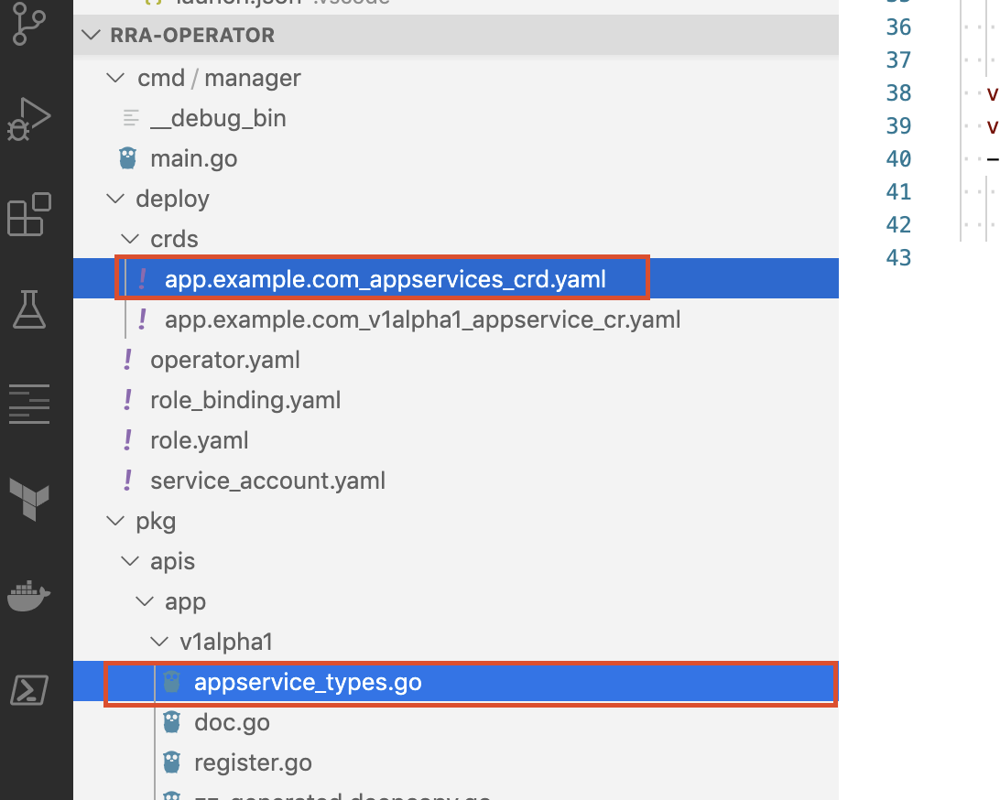
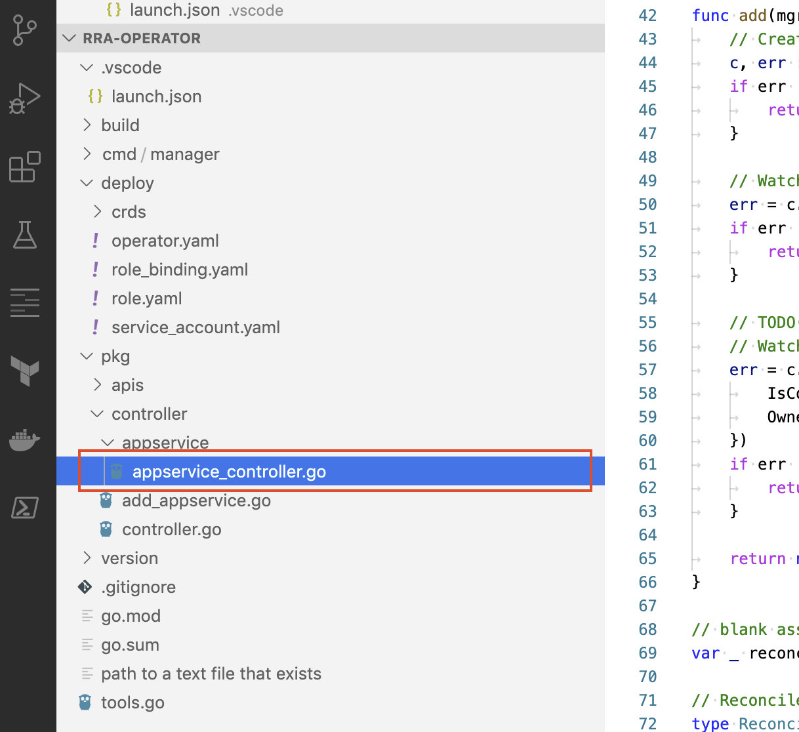
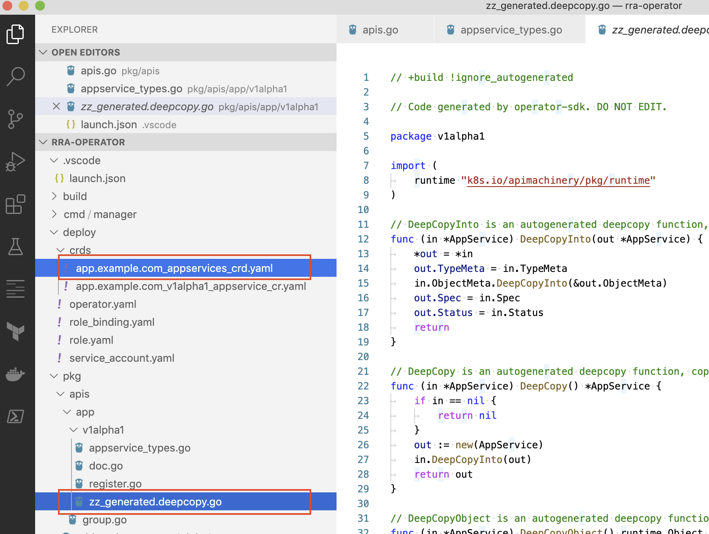
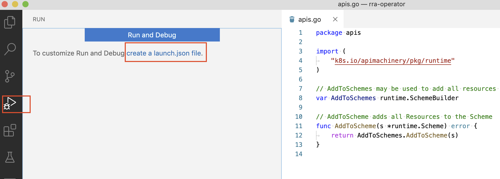
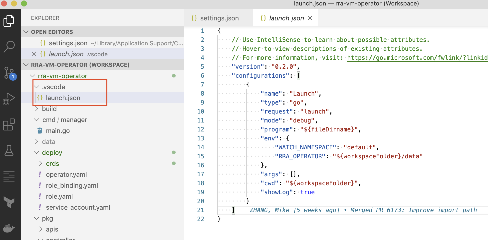
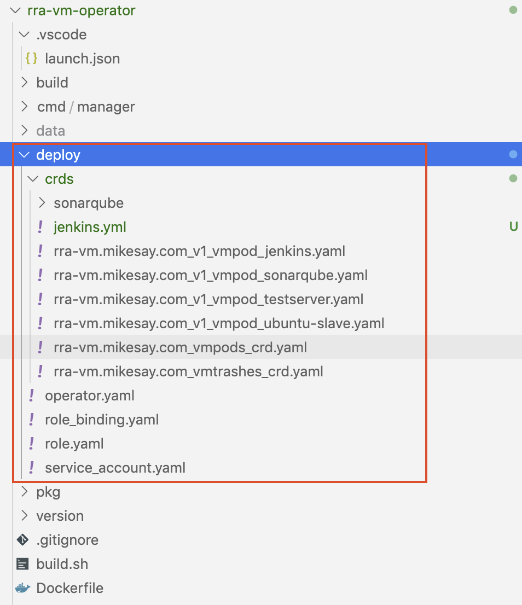

## Install operator-sdk

https://sdk.operatorframework.io/docs/install-operator-sdk/

```bash
brew install operator-sdk
```

## A quickstart project
https://sdk.operatorframework.io/docs/golang/quickstart/  

+ Create new operator project
    ```bash
    operator-sdk new rra-operator
    ```

+ Add a new CRD resource (yaml and data structures in go code)
    ```bash
    operator-sdk add api --api-version=app.example.com/v1alpha1 --kind=AppService
    ```
    

+ Add controller for the new CRD resource
    ```bash
    operator-sdk add controller --api-version=app.example.com/v1alpha1 --kind=AppService
    ```
    

+ Update CRD Yaml resource and re-generate deepcopy code
    ```bash
    operator-sdk generate crds
    operator-sdk generate k8s
    ```
    

## Setup operator debug environment

+ From Run panel, click "create a launch.json"

    

+ Edit launch.json

    

## Deploy operator

  

```bash
kubectl apply -f role.yaml
kubectl apply -f role_binding.yaml
kubectl apply service_account.yaml
kubectl apply -f operator.yaml
kubectl apply crds/xxx.yaml
```