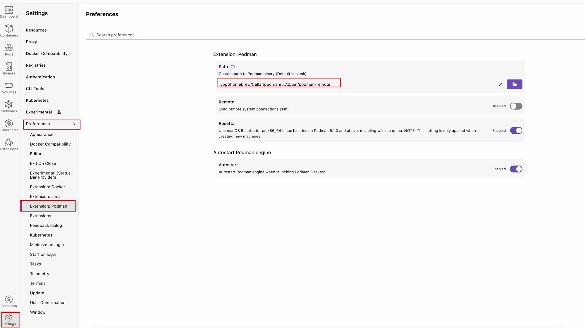
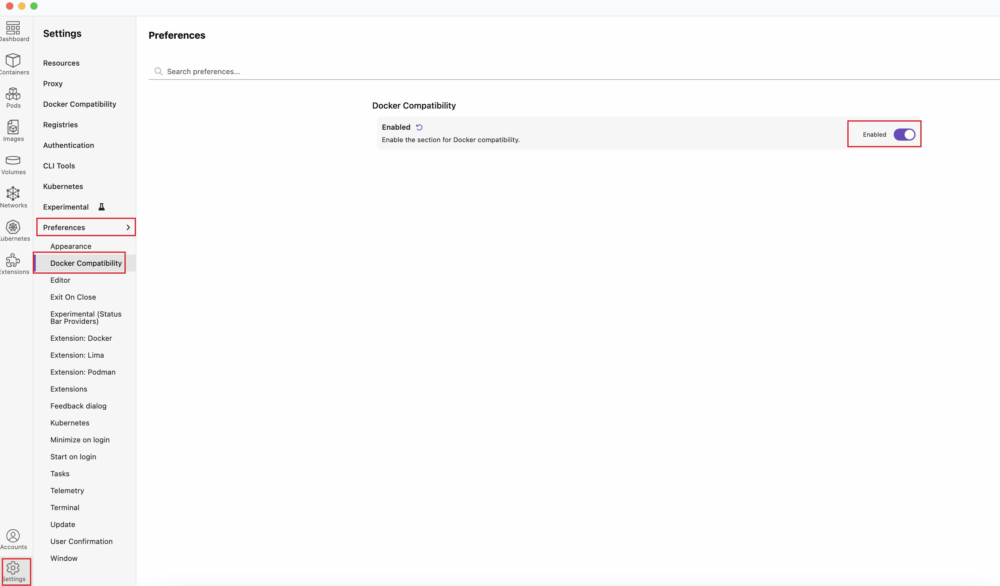
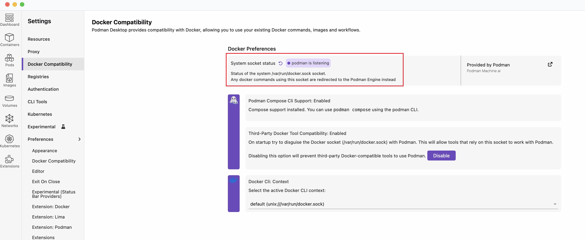

# Local Prod

## Materials
+ How to Expose Multiple Containers On the Same Port  
    https://iximiuz.com/en/posts/multiple-containers-same-port-reverse-proxy/  


## Usage
+ podman machine commands stop working, if a podman VM is created via libkrun  
    https://github.com/podman-desktop/podman-desktop/issues/9860  


## Install
+ Install podman  
    ```sh
    brew install podman
    ```  

+ Install podman-desktop
    ```sh
    brew install --cask podman-desktop
    ```
    > https://podman-desktop.io/docs/installation/macos-install#installing-podman-desktop-using-homebrew-not-recommended  

+ Configure podman in podman-desktop  
      

+ Enable docker compatibility  
      
      

+ Set "libkrun" provider  
    If on Mac OS ARM64, set below option in your shell profile:  
    ```sh
    CONTAINERS_MACHINE_PROVIDER=libkrun
    ```

    libkrun is a dynamic library that allows programs to easily acquire the ability to run processes in a partially isolated environment using KVM Virtualization on Linux and HVF on macOS/ARM64.  

    Key characteristics and functions of libkrun as a Podman provider:  
    + VM-based isolation: Libkrun utilizes KVM virtualization on Linux and the Apple Hypervisor Framework on macOS to create micro-VMs for running container workloads. This provides a stronger isolation layer compared to traditional containerization, enhancing security.  
    + Lightweight and fast: It aims for minimal code size and footprint, focusing on essential features to achieve fast startup times for these micro-VMs.
    + GPU acceleration: On macOS ARM64, libkrun enables GPU acceleration for containers, allowing AI and other GPU-intensive workloads to leverage the host's GPU resources within the containerized environment.  
    + Integration with Podman: When configured as the Podman machine provider, libkrun enables Podman to launch containers within these isolated micro-VMs, offering enhanced security and performance for specific use cases like AI workloads.  
    + Confidential computing: Libkrun can be used in conjunction with technologies like AMD SEV to enable confidential computing, protecting container workloads even from the root user on the host system.  

    > https://github.com/containers/libkrun  
    > https://github.com/containers/krunkit  

## Create a podman machine
+ Create a "libkrun" podman machine  
    ```sh
    podman machine init --memory 15360 --cpus 5 --disk-size 100  podman-libkrun
    ```  
    > On macOS ARM64, libkrun enables GPU acceleration for containers, allowing AI and other GPU-intensive workloads to leverage the host's GPU resources within the containerized environment.  


## Issues
#### Fail to start podman machine of "libkrun" provider
+ Detail  
    podman machine using "libkrun" provider can'be started afert podman being upgraded to newer version (5.6.x -> 5.7.2).  
    Run command ```podman machine start xxxx``` and get following errfor from console output:  
    '/opt/homebrew/opt/molten-vk-krunkit/lib/libMoltenVK.dylib' (no such file)  

+ Solution  
    upgrade krunkit:  
    ```sh
    brew upgrade krunkit
    ```  