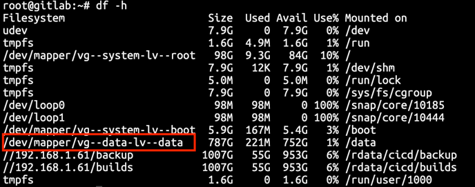

## Ubuntu - Extend LVM
> Note, following steps need root permission.
+ Start the system and you can find a new disk by console command “fdisk –l”, suppose it is /dev/sdc
+ From Linux console, run “parted” command to enter partition management console
+ Run “select /dev/sdc” to choose the newly added disk
+ Run “mktable gpt” set the type of partition table to be “GPT” which can support disk size more than 2TB
+ Run “mkpart primary ext4 0B 500G” to make the disk to be a primary partition, and the partition will be “/dev/sdc1”
+ Run “toggle 1 lvm” to make this partition to support lvm
+ Run “quit” to exit parted console
+ Run “pvcreate /dev/sdc1” to create a physical volume from newly created partion “/dev/sdc1”, and the physical volume name is also “/dev/sdc1”
+ Run “vgextend vg-data /dev/sdc1” to extend existing volume group “vg-data” with newly created physical volume “/dev/sdc1”
+ Run “lvresize -r -l 100%VG /dev/vg-data/lv-data” to extend the logical volume “/dev/vg-data/lv-data” with the newly extended space in volume group
+ Run “resize2fs /dev/mapper/vg--data-lv—data” to resize the logical filesystem of the logical volume “/dev/vg-data/lv-data”

    
