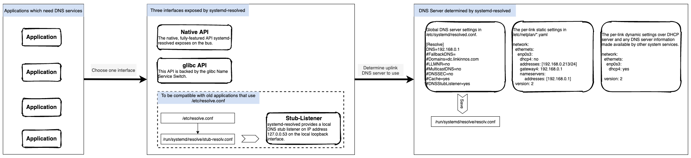

## Ubuntu - Extend LVM
> Note, following steps need root permission.
+ Start the system and you can find a new disk by console command “fdisk –l”, suppose it is /dev/sdc
+ From Linux console, run “parted” command to enter partition management console
+ Run “select /dev/sdc” to choose the newly added disk
+ Run “mktable gpt” set the type of partition table to be “GPT” which can support disk size more than 2TB
+ Run “mkpart primary ext4 0B 500G” to make the disk to be a primary partition, and the partition will be “/dev/sdc1”
+ Run “toggle 1 lvm” to make this partition to support lvm
+ Run “quit” to exit parted console
+ Run “pvcreate /dev/sdc1” to create a physical volume from newly created partion “/dev/sdc1”, and the physical volume name is also “/dev/sdc1”
+ Run “vgextend vg-data /dev/sdc1” to extend existing volume group “vg-data” with newly created physical volume “/dev/sdc1”
+ Run “lvresize -r -l 100%VG /dev/vg-data/lv-data” to extend the logical volume “/dev/vg-data/lv-data” with the newly extended space in volume group
+ Run “resize2fs /dev/mapper/vg--data-lv—data” to resize the logical filesystem of the logical volume “/dev/vg-data/lv-data”

    

## Ubuntu18 - Set static IP address
+ Update /etc/netplan/00-installer-config.yaml:
```yaml
network:
  ethernets:
    enp0s3:
      dhcp4: no
      dhcp6: no
      addresses: [192.168.0.213/24]
      gateway4: 192.168.0.1
      #nameservers:
      #    addresses: [192.168.0.1]
  version: 2
```
+ Run command "netplan apply"

> + Since no dhpc enabled, you either need to specify perlink dns server in nameservers section, or set global dns server in /etc/systemd/resolved.conf, otherwize there will be no 
> dns server name for name resolving.  
> + For dynamic IP address, do the following setting:
> ```yaml
  network:
    ethernets:
        enp0s3:
        dhcp4: no
        dhcp6: no
        addresses: [192.168.0.213/24]
        gateway4: 192.168.0.1
        #nameservers:
        #    addresses: [192.168.0.1]
    version: 2
> ```
> since dhcp enabled, it will the perlink dns server will be set automatically.i.e, run command "systemd-resolve --status", you will set the DNS servers are added to network 
> interface enp0s3.
> ```yaml
  Global
            DNSSEC NTA: 10.in-addr.arpa
                        16.172.in-addr.arpa
                        168.192.in-addr.arpa
                        17.172.in-addr.arpa
                        18.172.in-addr.arpa
                        19.172.in-addr.arpa
                        20.172.in-addr.arpa
                        21.172.in-addr.arpa
                        22.172.in-addr.arpa
                        23.172.in-addr.arpa
                        24.172.in-addr.arpa
                        25.172.in-addr.arpa
                        26.172.in-addr.arpa
                        27.172.in-addr.arpa
                        28.172.in-addr.arpa
                        29.172.in-addr.arpa
                        30.172.in-addr.arpa
                        31.172.in-addr.arpa
                        corp
                        d.f.ip6.arpa
                        home
                        internal
                        intranet
                        lan
                        local
                        private
                        test  
  Link 2 (enp0s3)  
        Current Scopes: DNS  
         LLMNR setting: yes  
  MulticastDNS setting: no  
        DNSSEC setting: no  
      DNSSEC supported: no
           DNS Servers: 192.168.1.1  
                        192.168.0.1  
> ```


## Ubuntu16 - Set static IP address
+ Update /etc/network/interfaces
    ```yaml
    # This file describes the network interfaces available on your system
    # and how to activate them. For more information, see interfaces(5).

    source /etc/network/interfaces.d/*

    # The loopback network interface
    auto lo
    iface lo inet loopback

    # The primary network interface
    auto enp0s3
    iface enp0s3 inet static
            address 192.168.0.212
            netmask 255.255.255.0
            gateway 192.168.0.1

    dns-nameservers  192.168.0.210 192.168.0.1 192.168.1.1
    dns-search dc.mikesay.com
    ```
+ Run below commands
    ```bash
    systemctl restart networking
    sudo ifdown --force eth0 && sudo ip addr flush dev eth0 && sudo ifup --force eth0
    ```

## Ubuntu18 - Set hostname
+ Run command to set the host name
    ```bash
    sudo hostnamectl set-hostname mikeubuntu
    ```
+ Edit /etc/hosts file and change the old hostname to the new one
    ```
    127.0.0.1 localhost
    127.0.0.1 mikeubuntu

    # The following lines are desirable for IPv6 capable hosts
    ::1     ip6-localhost ip6-loopback
    fe00::0 ip6-localnet
    ff00::0 ip6-mcastprefix
    ff02::1 ip6-allnodes
    ff02::2 ip6-allrouters
    ```
+ Edit /etc/cloud/cloud.cfg, and set vaule of preserve_hostname from false to true
    > If the cloud-init package is installed you also need to edit the cloud.cfg file. This package is usually installed by default in the images provided by the cloud providers such as AWS and it is used to handle the initialization of the cloud instances.

## Principle of systemd-resolved
http://manpages.ubuntu.com/manpages/bionic/man8/systemd-resolved.service.8.html



+ Related commands
    ```bash
    systemctl restart systemd-resolved
    systemd-resolve --status
    ```
+ Related configure files
    + /etc/systemd/resolved.conf

## SSH for TCP/IP tunnel
https://www.linuxprobe.com/ssh-port-forward.html

## iptables
+ iptables delete prerouting rule
https://www.cyberciti.biz/faq/linux-iptables-delete-prerouting-rule-command/

```bash
sudo iptables -t nat -v -L PREROUTING -n --line-number
iptables -t nat -D PREROUTING {rule-number-here}
```

+ redirect an incoming connection to a different IP address on a specific port using IPtables
https://my.esecuredata.com/index.php?/knowledgebase/article/49/how-to-redirect-an-incoming-connection-to-a-different-ip-address-on-a-specific-port-using-iptables/


## Linux中文件特殊权限suid、sgid、sticky  
https://blog.csdn.net/MssGuo/article/details/120754324  
