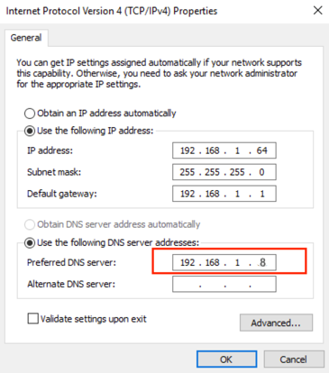
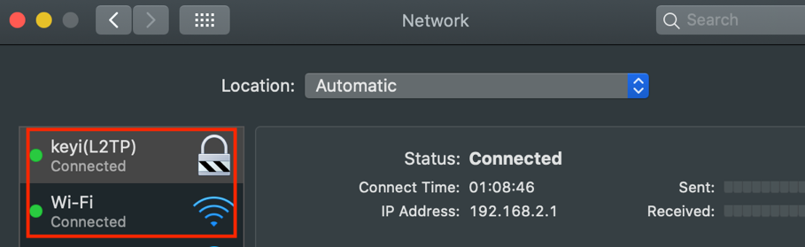
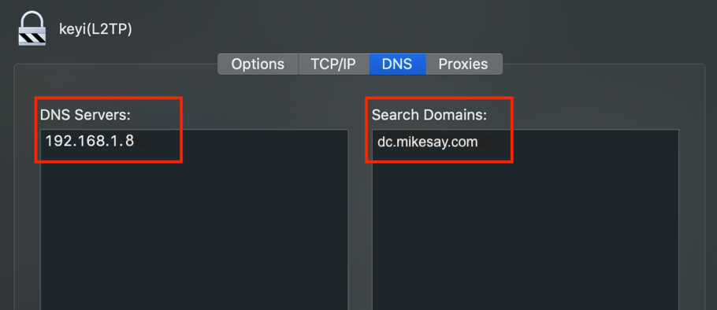

## Install Bind9

### Reference
+ How To Configure BIND as a Private Network DNS Server on Ubuntu 18.04  
    https://www.digitalocean.com/community/tutorials/how-to-configure-bind-as-a-private-network-dns-server-on-ubuntu-18-04

+ Install BIND 9 on Ubuntu and Configure It for Usage  
    https://linuxhint.com/install_bind9_ubuntu/

+ Set Up a Local DNS Resolver on Ubuntu 18.04, 16.04 with BIND9  
    https://www.linuxbabe.com/ubuntu/set-up-local-dns-resolver-ubuntu-18-04-16-04-bind9

> Following commands need to root permission.

+ Run command “apt-get install bind9 bind9utils bind9-doc”
+ Edit “/etc/default/bind9” to add “-4” to the end of the OPTIONS parameter to set bind to IPv4 mode
    ```properties
    OPTIONS="-u bind -4"
    ```  

## Configure Bind9 for forward zone and reverse zone

+ Edit /etc/bind/named.conf.options
    ```editorconfig
    options {
            directory "/var/cache/bind";

            recursion yes;                 # enables resursive queries
            listen-on { 192.168.1.8; };   # name server private IP address - listen on private network only
            allow-transfer { none; };      # disable zone transfers by default

            allow-recursion { any; };
            allow-query { any; };
            allow-query-cache { any; };

            dnssec-enable no;
            dnssec-validation no;

            forwarders {
                192.168.1.1; # The router's default DNS servee
            };

            // If there is a firewall between you and nameservers you want
            // to talk to, you may need to fix the firewall to allow multiple
            // ports to talk.  See http://www.kb.cert.org/vuls/id/800113

            // If your ISP provided one or more IP addresses for stable 
            // nameservers, you probably want to use them as forwarders.  
            // Uncomment the following block, and insert the addresses replacing 
            // the all-0's placeholder.

            // forwarders {
            //      0.0.0.0;
            // };

            //========================================================================
            // If BIND logs error messages about the root key being expired,
            // you will need to update your keys.  See https://www.isc.org/bind-keys
            //========================================================================
            //dnssec-validation auto;

            auth-nxdomain no;    # conform to RFC1035
            listen-on-v6 { any; };
    };
    ```
+ Edit “/etc/bind/named.conf.local”
    ```editorconfig
    //
    // Do any local configuration here
    //

    // Consider adding the 1918 zones here, if they are not used in your
    // organization
    //include "/etc/bind/zones.rfc1918";
    zone "dc.mikesay.com" {
        type master;
        file "/etc/bind/zones/db.dc.mikesay.com"; # zone file path
    };

    zone "1.168.192.in-addr.arpa" {
        type master;
        file "/etc/bind/zones/db.192.168.1";  # For 192.168.1.0/24 subnet
    };
    ```

+ Run command “mkdir –p /etc/bind/zones/db.dc.mikesay.com” and “mkdir –p /etc/bind/zones/db.192.168.1”

+ Edit “/etc/bind/zones/db.dc.mikesay.com”
    ```editorconfig
    ;
    ; BIND data file for local loopback interface
    ;
    $TTL    604800
    @       IN      SOA     bind9server.dc.mikesay.com. admin.dc.mikesay.com. (
                                2         ; Serial
                            604800         ; Refresh
                            86400         ; Retry
                            2419200         ; Expire
                            604800 )       ; Negative Cache TTL
    ;name servers - NS records
        IN      NS      bind9server.dc.mikesay.com.

    ; name servers - A records
    bind9server.dc.mikesay.com.          IN      A       192.168.1.8

    ; 192.168.1.0/24 - A records
    server1.dc.mikesay.com.        IN      A      192.168.1.9
    server2.dc.mikesay.com.       IN      A      192.168.1.10
    server3.dc.mikesay.com.        IN      A      192.168.1.11
    ```

+ Edit “/etc/bind/zones/db.192.168.1”
    ```editorconfig
    ;
    ; BIND reverse data file for local loopback interface
    ;
    $TTL    604800
    @       IN      SOA     bind9server.dc.mikesay.com. admin.dc.mikesay.com. (
                                1         ; Serial
                            604800         ; Refresh
                            86400         ; Retry
                            2419200         ; Expire
                            604800 )       ; Negative Cache TTL
    ;name servers - NS records
        IN      NS       bind9server.dc.mikesay.com.

    ; PTR Records
    8 IN      PTR     bind9server.dc.linkinnos.com. ; 192.168.1.8
    9 IN      PTR     server1.dc.linkinnos.com.  ; 192.168.1.9
    10 IN      PTR     server2.dc.linkinnos.com. ; 192.168.1.10
    11 IN      PTR     server3.dc.linkinnos.com.  ; 192.168.1.11
    ```

+ Run command “named-checkconf” under “/etc/bind” to check configuration

+ Run command “named-checkzone dc.mikesay.com. db.dc.mikesay.com” and “named-checkzone 1.168.192.in-addr.arpa  db.192.168.1” under “/etc/bind/zones” to check zone configuration

+ Run command “ufw allow bind9” to allow bind9 in ufw if UFW was enabled

+ Run command “systemctl restart bind9” to restart Bind9 service

+ Configure logs and log rotation for Bind9
    + Add file “/etc/bind/named.conf.log”
    ```editorconfig
    logging {
        channel bind_log {
            file "/var/log/bind/bind.log" versions 3 size 5m;
            severity info;
            print-category yes;
            print-severity yes;
            print-time yes;
        };
        category default { bind_log; };
        category update { bind_log; };
        category update-security { bind_log; };
        category security { bind_log; };
        category queries { bind_log; };
        category lame-servers { null; };
    };
    ```
    + Add file “/etc/logrotate.d/bind”
    ```editorconfig
    /var/log/bind/bind.log {
    daily
    missingok
    rotate 7
    compress
    delaycompress
    notifempty
    create 644 bind bind
    postrotate
        /usr/sbin/invoke-rc.d bind9 reload > /dev/null
    endscript
    }
    ```
    > If it was Ubuntu18, enable read/write permission to “/var/log/bind” in apparmor. Add following lines to “/etc/apparmor.d/user.sbin.named”
    > ```sh
    > /var/log/bind/** rw,
    > /var/log/bind/ rw,
    > ```
    > Run command “systemctl restart apparmor” to restart apparmor	

+ Run command “systemctl restart bind9” to enable the log

## Configure Bind9 as the default DNS server on Ubuntu18

+ Edit “/etc/systemd/resolved.conf” 
    ```editorconfig
    [Resolve]
    DNS=192.168.1.8
    #FallbackDNS=
    Domains=dc.mikesay.com
    #LLMNR=no
    #MulticastDNS=no
    #DNSSEC=no
    #Cache=yes
    #DNSStubListener=yes
    ```
+ Run command “systemctl restart systemd-resolved” and “netplan try” to enable Bind9 as the default DNS server

## Configure Bind9 as the default DNS server on Windows server (Windows server 2019)


## Configure Bind9 as the default DNS server on MacOS
  


> If you connected by VPN, try to make the VPN connection in the first order.
