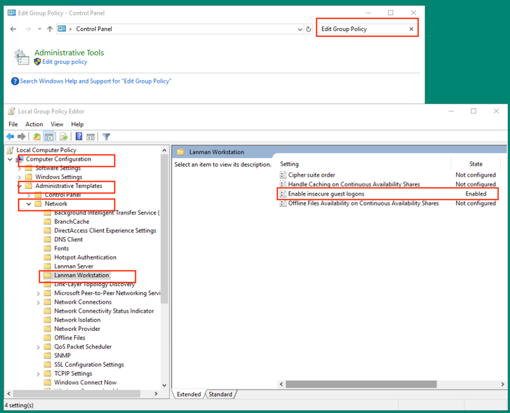
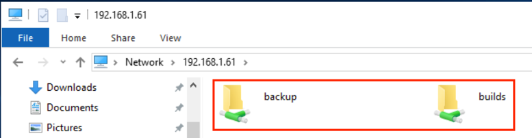

## Introduction
Samba is a free and open-source SMB/CIFS protocol implementation for Unix and Linux that allows for file and print sharing between Unix/Linux, Windows, and MacOS machine in local area network.  

Samba is usually installed and run on Linux. It comprises several programs that serve different but related purposes, the most import two of which are:
+ smbd: provides SMB/CIFS service (file sharing and printing), can also act as a Windows domain controller.
+ nmbd: This daemon provides NetBIOS name service, listens on name-server requests. It also allows the Samba server to be found by other computers on the network.

## Install Samba server

Below commands need root permission.  
+ Run command “apt install samba samba-common-bin” to install Samba server  
+ Run command “systemctl start smbd nmbd” to start these two services
+ Run command “ufw allow samba” to allow samba UFW firewall if UFW was enabled

## Create private share
+ Run command “add user samba” to create a Linux user “samba”. You will be prompted to set a Unix password
+ Run command “smbpasswd -a samba” to set a separate samba password for the new user
+ Run command “groupadd samba” to create a samba group
+ Run command “gpasswd –a samba samba” to add user “samba” to group “samba”
+ Run command “mkdir –p /data/cicd/backup/” to create the private share folder 
+ Run command “setfacl –R –m “g:samba:rwx” /data/cicd/backup/” to enable read, write, execution to this private share folder for group “samba”
+ Run command “vim /etc/samba/smb.conf” to edit Samba configuration
+ In the “[global]” section, make sure below key and value exist. The value of workgroup is the same as the workgroup settings of Windows computers
    ```properties
    workgroup = WORKGROUP
    map to guest = bad user
    security = user
    ```
+ At the end, add below section
    ```properties
    [backup]
    comment = needs username and password to access
    path = /data/cicd/backup/
    browseable = yes
    guest ok = no
    writable = yes
    valid users = @samba
    create mask = 0755
    ```
+ Run command “systemctl restart smbd nmbd” to restart Samba server

## Create public share
+ Run command “mkdir –p /data/cicd/builds/” to create the public share folder 
+ Run command “setfacl -R -m "u:nobody:rwx"/data/cicd/builds/” to enable read, write, execution to this public share folder for nobody account
+ Run command “vim /etc/samba/smb.conf” to edit Samba configuration
+ At the end, add below section
    ```properties
    [builds]
    comment = public share, don't need to enter username and password
    path = /data/cicd/builds/
    browseable = yes
    guest ok = yes
    guest only = yes
    read only = no
    writable = yes
    create mask = 0755
    ```
+ Run command “systemctl restart smbd nmbd” to restart Samba server

## Connect from Ubuntu client (Ubuntu18)
+ Run command “apt-get install cifs-utils” to install CIFS client
+ Create “samba-credential.conf” under /etc/ folder with following content
    ```properties
    username=samba
    password=xxxx
    domain=WORKGROUP
    ```
    > password is the samba password, domain is the workgroup set above.
+ Add following auto-mount option in /etc/fstab
    ```sh
    //192.168.1.61/backup /data/cicd/backup cifs x-systemd.automount,_netdev,credentials=/etc/samba-credential.conf,uid=1000,gid=1000,x-gvfs-show 1 0
    //192.168.1.61/builds /data/cicd/builds cifs x-systemd.automount,_netdev,guest,uid=1000,gid=1000,x-gvfs-show 1 0
    ```
    > uid and gid the frequent used non-root account, so that this account can write to the shared folders
+ Run command “mount –a” or restart system to get shared folders mounted

## Connect from Windows client (Windows server 2019)
+ Enable insecure guest logons    


+ From Windows explorer, input “\\192.168.1.61”, you will see the two shared folders “backup” and “builds”. To enter private folder “backup”, you need to provide the samba user and password.    
