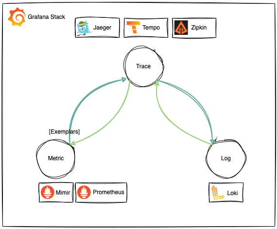
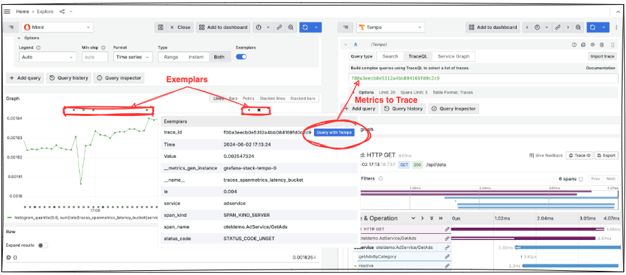
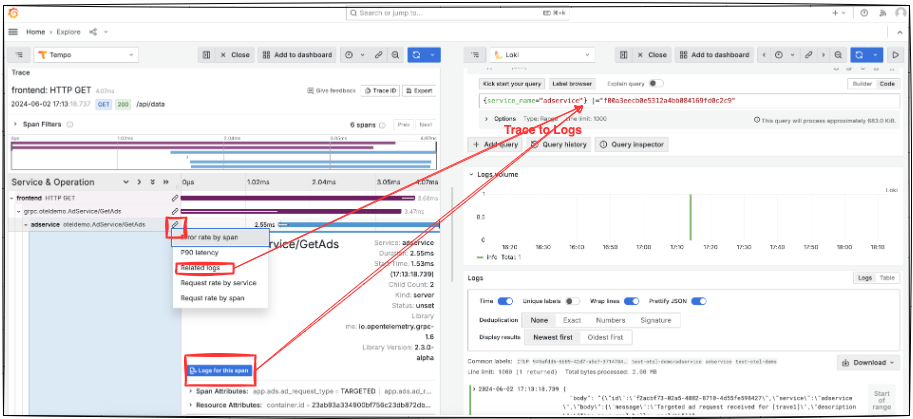
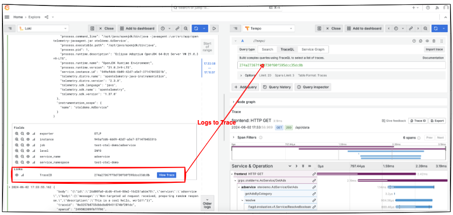
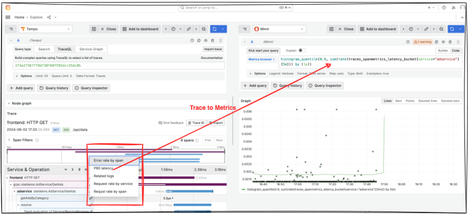

## Grafana Stack

### Telemetry data correlation
Grafana supports linking telemetry data among Metrics, Trace and Logs datasurces from virtualization layer.  
  

#### Metrics to Trace  
It was configured in prometheus type datasource like Mimir by using field "exemplarTraceIdDestinations" to pick up the trace datasource like Tempo.  

```yaml
# https://grafana.com/docs/grafana/latest/datasources/prometheus/configure-prometheus-data-source/
- name: Mimir
    type: prometheus
    access: proxy
    uid: mimir
    orgID: 1
    url: http://{{ .Release.Name }}-mimir-monolithic:8080/prometheus
    jsonData:
    prometheusType: Mimir
    timeout: 60
    exemplarTraceIdDestinations: # Metric -> Trace (Exemplar)
        - datasourceUid: tempo
        name: trace_id # This name is the file name in Exemplar data model: https://blog.lunatech.com/posts/2022-01-21-linking-metrics-and-traces-with-exemplars
```  
The "trace_id" is the field name in exemplar data, its value will be used in trace(Tempo) search. For span metrics generated from Metrics-generator of Tempo, the trace id field name can be configured in the filed "trace_id_label_name" of helm chart's value for Tempo installation:  
```yaml
global_overrides:
    defaults:
    metrics_generator:
        processors:
        - 'service-graphs'
        - 'span-metrics'
        trace_id_label_name: trace_id
```  

Metrics-generator exemplar can be enabled in helm chart's value for Tempo installation:  
```yaml
  config: |
      overrides:
        {{- toYaml .Values.tempo.global_overrides | nindent 6 }}
        {{- if .Values.tempo.metricsGenerator.enabled }}
      metrics_generator:
            storage:
              path: "/tmp/tempo"
              remote_write:
                - send_exemplars: true
                  url: {{ .Values.tempo.metricsGenerator.remoteWriteUrl }}
        {{- end }}
```

For the trace id file name is "trace_id" by default in span metrics generated from span metrics collector in OpenTelemetry collector, and it doesn't support customizing the name currently. Span Metrics collector and exemplar in OpenTelemetry Collector can be configured in OpenTelemetry's config file in the helm chart value of OpenTelemetry installation:  
```yaml
  connectors:
    spanmetrics:
      histogram:
        explicit:
          buckets: [100us, 1ms, 2ms, 6ms, 10ms, 100ms, 250ms]
      dimensions:
        - name: http.method
          default: GET
        - name: http.status_code
      exemplars: 
        enabled: true
      dimensions_cache_size: 1000
      aggregation_temporality: "AGGREGATION_TEMPORALITY_CUMULATIVE"
      namespace: otelcol_sm

    pipelines:
      metrics:
        receivers:
          - spanmetrics
      traces:
        exporters:
          - spanmetrics
``` 

Usage of Metrics to Trace in Grafana Explore view:  
  

#### Trace to Logs  
It was configured in trace datasource like Tempo by using field "tracesToLogsV2" to pick up the log datasource Loki.  
```yaml
# https://grafana.com/docs/grafana/latest/datasources/tempo/configure-tempo-data-source/
# https://grafana.com/docs/grafana/latest/datasources/tempo/configure-tempo-data-source/#provision-the-data-source
- name: Tempo
    type: tempo
    uid: tempo
    url: http://grafana-stack-tempo:3100
    access: proxy
    basicAuth: false
    jsonData:
    tracesToLogsV2: # Trace -> Log
        # https://grafana.com/docs/grafana/latest/datasources/tempo/configure-tempo-data-source/#trace-to-logs
        # Field with an internal link pointing to a logs data source in Grafana.
        # datasourceUid value must match the uid value of the logs data source.
        datasourceUid: 'loki'
        spanStartTimeShift: '-1h'
        spanEndTimeShift: '1h'
        filterByTraceID: true
        filterBySpanID: false
        customQuery: false
        tags: [{ key: 'service.name', value: 'service_name'}] # Mapping of tag "span.resource.service.name" in Tempo to label "service_name" of log entry in Loki
```  
The "tags" will pick attributes from span attributes or its resource attributes to pass to Loki search as labels' name. In order to map the label name in log entry, some attributes' name may need to be changed, so use "key" and "value" pair to do such coverting. If the name doesn't need to be changed, just use "key" to pick the attribute name.  
Filed "filterByTraceID", or "filterBySpanID" will pass trace id or span id to Loki search as log line filter.  
"spanStartTimeShift" and "spanEndTimeShift" will shift the time of curernt trace to a time range to pass to Loki search to mitigate the potential issue that the log and trace may not been stored at the same time exactly.  

Usage of Trace to Logs in Grafana Explore View:  
  

#### Logs to Trace  
It was configured in loki datasource by using [Derived Field](https://grafana.com/docs/grafana/latest/datasources/loki/#configure-derived-fields) feature. It will use regex string to match and extract the trace id information from log, and create a derived field in the log entry.  
```yaml
# https://grafana.com/docs/grafana/latest/datasources/loki/configure-loki-data-source/
# https://grafana.com/docs/grafana/latest/datasources/loki/#provisioning-examples
- name: Loki
    type: loki
    access: proxy
    uid: loki
    url: http://{{ .Release.Name }}-loki:3100
    jsonData:
    timeout: 60
    maxLines: 1000
    derivedFields:
        - datasourceUid: tempo # Log -> Trace
        # Note, always use "Line contains regex match" in Grafana's Explore View for Loki Datasource to verify this regex string works, 
        # and never use the "Debug log message" in Loki datasource configuration. (Nearly 2 days were wasted to debug this "derivedFields" configuration!!!!)
        matcherRegex: '.*"traceid":\s*"(\w+)",.*' 
        name: TraceID
        # url will be interpreted as query for the datasource
        url: '$${__value.raw}'
        # optional for URL Label to set a custom display label for the link.
        urlDisplayLabel: 'View Trace'
```  
The "name" in "derivedFields" defines the filed name of extracted derived field for trace id,  and "url" is the extracted trace id value which will be passed to Tempo trace search.  

Usage of Logs to Trace in Grafana Explore View:  
  

#### Trace to Metrics  
It was configured in trace datasource like Tempo by using field "tracesToMetrics" to pick up the prometheus type datasource like Mimir.  

```yaml
# https://grafana.com/docs/grafana/latest/datasources/tempo/configure-tempo-data-source/
# https://grafana.com/docs/grafana/latest/datasources/tempo/configure-tempo-data-source/#provision-the-data-source
- name: Tempo
    type: tempo
    uid: tempo
    url: http://grafana-stack-tempo:3100
    access: proxy
    basicAuth: false
    jsonData:
    tracesToMetrics: # Trace -> Metric
        # https://grafana.com/docs/grafana/latest/datasources/tempo/configure-tempo-data-source/#trace-to-metrics
        # https://grafana.com/blog/2022/08/18/new-in-grafana-9.1-trace-to-metrics-allows-users-to-navigate-from-a-trace-span-to-a-selected-data-source/
        datasourceUid: 'mimir'
        spanStartTimeShift: '-1h'
        spanEndTimeShift: '1h'
        tags: [{ key: 'service.name', value: 'service' }] # Mapping of tag "span.resource.service.name" in Tempo to label "service_name" of metric in Mimir
        queries:
        - name: 'Request rate by service'
            query: 'sum(rate(traces_spanmetrics_calls_total{$$__tags}[5m])) by (service)'
        - name: 'Requst rate by span'
            query: 'sum(rate(traces_spanmetrics_calls_total{$$__tags}[5m])) by (span_name)'
        - name: 'Error rate by span'
            query: 'sum(rate(traces_spanmetrics_calls_total{$$__tags, status_code="STATUS_CODE_ERROR"}[5m])) by (span_name)'
        - name: 'P90 latency'
            query: 'histogram_quantile(0.9, sum(rate(traces_spanmetrics_latency_bucket{$$__tags}[5m])) by (le))'
```  

The "tags" will pick attributes from span attributes or its resource attributes to pass to Mimir search as labels' name. In order to map the label name in Metrics' label, some attributes' name may need to be changed, so use "key" and "value" pair to do such coverting. If the name doesn't need to be changed, just use "key" to pick the attribute name.  
"queries" can be used to define multiple meaningful metrics-queries in advance, so that to can be clicked from current trace to launch it in Mimir search.  

Usage of Trace to Metrics in Grafana Explore View:  
  

<details><summary markdown="span">Complete configuration as code of grafana datasources</summary>

```yaml
grafanaDatasources:
  datasources.yaml:
    apiVersion: 1
    datasources:
    # https://grafana.com/docs/grafana/latest/datasources/prometheus/configure-prometheus-data-source/
    - name: Mimir
      type: prometheus
      access: proxy
      uid: mimir
      orgID: 1
      url: http://{{ .Release.Name }}-mimir-monolithic:8080/prometheus
      jsonData:
        prometheusType: Mimir
        timeout: 60
        exemplarTraceIdDestinations: # Metric -> Trace (Exemplar)
          - datasourceUid: tempo
            name: trace_id # This name is the file name in Exemplar data model: https://blog.lunatech.com/posts/2022-01-21-linking-metrics-and-traces-with-exemplars
    # https://grafana.com/docs/grafana/latest/datasources/loki/configure-loki-data-source/
    # https://grafana.com/docs/grafana/latest/datasources/loki/#provisioning-examples
    - name: Loki
      type: loki
      access: proxy
      uid: loki
      url: http://{{ .Release.Name }}-loki:3100
      jsonData:
        timeout: 60
        maxLines: 1000
        derivedFields:
          - datasourceUid: tempo # Log -> Trace
            # Note, always use "Line contains regex match" in Grafana's Explore View for Loki Datasource to verify this regex string works, 
            # and never use the "Debug log message" in Loki datasource configuration. (Nearly 2 days were wasted to debug this "derivedFields" configuration!!!!)
            matcherRegex: '.*"traceid":\s*"(\w+)",.*' 
            name: TraceID
            # url will be interpreted as query for the datasource
            url: '$${__value.raw}'
            # optional for URL Label to set a custom display label for the link.
            urlDisplayLabel: 'View Trace'
    # https://grafana.com/docs/grafana/latest/datasources/tempo/configure-tempo-data-source/
    # https://grafana.com/docs/grafana/latest/datasources/tempo/configure-tempo-data-source/#provision-the-data-source
    - name: Tempo
      type: tempo
      uid: tempo
      url: http://grafana-stack-tempo:3100
      access: proxy
      basicAuth: false
      jsonData:
        tracesToLogsV2: # Trace -> Log
          # https://grafana.com/docs/grafana/latest/datasources/tempo/configure-tempo-data-source/#trace-to-logs
          # Field with an internal link pointing to a logs data source in Grafana.
          # datasourceUid value must match the uid value of the logs data source.
          datasourceUid: 'loki'
          spanStartTimeShift: '-1h'
          spanEndTimeShift: '1h'
          filterByTraceID: true
          filterBySpanID: false
          customQuery: false
          tags: [{ key: 'service.name', value: 'service_name'}] # Mapping of tag "span.resource.service.name" in Tempo to label "service_name" of log entry in Loki
        tracesToMetrics: # Trace -> Metric
          # https://grafana.com/docs/grafana/latest/datasources/tempo/configure-tempo-data-source/#trace-to-metrics
          # https://grafana.com/blog/2022/08/18/new-in-grafana-9.1-trace-to-metrics-allows-users-to-navigate-from-a-trace-span-to-a-selected-data-source/
          datasourceUid: 'mimir'
          spanStartTimeShift: '-1h'
          spanEndTimeShift: '1h'
          tags: [{ key: 'service.name', value: 'service' }] # Mapping of tag "span.resource.service.name" in Tempo to label "service_name" of metric in Mimir
          queries:
            - name: 'Request rate by service'
              query: 'sum(rate(traces_spanmetrics_calls_total{$$__tags}[5m])) by (service)'
            - name: 'Requst rate by span'
              query: 'sum(rate(traces_spanmetrics_calls_total{$$__tags}[5m])) by (span_name)'
            - name: 'Error rate by span'
              query: 'sum(rate(traces_spanmetrics_calls_total{$$__tags, status_code="STATUS_CODE_ERROR"}[5m])) by (span_name)'
            - name: 'P90 latency'
              query: 'histogram_quantile(0.9, sum(rate(traces_spanmetrics_latency_bucket{$$__tags}[5m])) by (le))'
        tracesToProfiles:
          # https://grafana.com/docs/grafana/latest/datasources/tempo/configure-tempo-data-source/#trace-to-profiles
          datasourceUid: 'pyroscopee'
          tags: ['job', 'instance', 'pod', 'namespace']
          profileTypeId: 'process_cpu:cpu:nanoseconds:cpu:nanoseconds'
          customQuery: true
          query: 'method="${__span.tags.method}"'
        serviceMap:
          datasourceUid: 'mimir'
        nodeGraph:
          enabled: true
        search:
          hide: false
        lokiSearch:
          datasourceUid: 'loki'
        traceQuery:
          timeShiftEnabled: false
          spanStartTimeShift: '-1h'
          spanEndTimeShift: '1h'
        spanBar:
          type: 'Tag'
          tag: 'http.path'
```
</details>
<br/>

> Above configuration is from the configuration of Grafana helm chart's value file, which relies on the sidecar feature in Grafana installation. Sidecars that collect the configmaps with  
> specified label and stores the included files into the respective folders to support datasource/dashboard provision as code automatically by leveraging grafana's technology [Provision  
> Grafana](https://grafana.com/docs/grafana/latest/administration/provisioning/).  


### Grafana Helm Chart
https://github.com/grafana/helm-charts  
https://github.com/grafana/helm-charts/tree/main/charts/grafana

### Grafana Operator
https://operatorhub.io/operator/grafana-operator  
https://github.com/grafana-operator/grafana-operator

## Reference
### Grafana
https://grafana.com/docs/grafana/latest/  
https://github.com/grafana/grafana  
https://github.com/aliyun/aliyun-cms-grafana  

### Mimir
+ Mimir architecture  
    https://grafana.com/docs/mimir/latest/references/architecture/  

+ Mimir configuration in section "mimir-distributed.mimir"  
    https://grafana.com/docs/mimir/latest/configure/configuration-parameters/  

+ Mimir HTTP API used to set ingress  
    https://grafana.com/docs/mimir/latest/references/http-api/  

### Loki
+ Loki architecture  
    https://grafana.com/docs/loki/latest/get-started/architecture/  

+ Loki configuration in section "loki.loki"  
    https://grafana.com/docs/loki/latest/configure/  

+ Loki HTTP API used to set ingress  
    https://grafana.com/docs/loki/latest/reference/loki-http-api/  

### Grafana
+ Provision Grafana
    https://grafana.com/docs/grafana/latest/administration/provisioning/  

+ Load Grafana dashboard from labelled ConfigMaps  
    https://github.com/prometheus-operator/kube-prometheus/issues/922  

