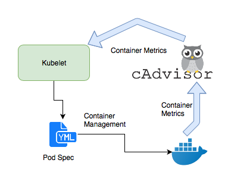

## Monitoring in generic
### Monitoring theory(What/Why)
+ Making the USE method of monitoring useful  
https://www.infoworld.com/article/3638772/making-the-use-method-of-monitoring-useful.html  

+ The RED method: A new strategy for monitoring microservices  
https://www.infoworld.com/article/3638693/the-red-method-a-new-strategy-for-monitoring-microservices.html

+ Monitoring Distributed Systems(The Four Golden Signals)  
https://sre.google/sre-book/monitoring-distributed-systems/


## Kubernetes Monitoring
  
### Official materials
+ General  
https://github.com/kubernetes/metrics

+ Implementation  
https://github.com/kubernetes/metrics/blob/master/IMPLEMENTATIONS.md  

+ Prometheus Adapter  
https://github.com/kubernetes-sigs/prometheus-adapter  

+ Base library used by Adapter:  
https://github.com/kubernetes-sigs/custom-metrics-apiserver  

### Other materials
+ Kubernetes Metrics  
https://help.sumologic.com/Metrics/Kubernetes_Metrics

+ Introduction to Kubernetes Monitoring Architecture  
https://medium.com/kubernetes-tutorials/introduction-to-kubernetes-monitoring-architecture-98a265e0917d  

Kubelet CAdvisor:  
  

Core monitoring pipeline:  
  

+ Logging and Monitoring Kubernetes
https://www.sumologic.com/blog/kubernetes-logs/  

+ Monitoring Kubernetes: The K8s Anatomy (Crash Course, Part 1)
https://www.sumologic.com/blog/monitoring-kubernetes-anatomy/  

+ Monitoring Kubernetes: What to Monitor (Crash Course, Part 2)
https://www.sumologic.com/blog/kubernetes-monitoring/  

+ Service discovery for ECS
https://github.com/seanly/prometheus-ecs-sd  

+ Effectively Managing Kubernetes Resources with Cost Monitoring
https://medium.com/kubecost/effectively-managing-kubernetes-with-cost-monitoring-96b54464e419  


## Prometheus Stack
### Prometheus
https://prometheus.io/docs/introduction/overview/
https://github.com/prometheus  
https://p8s.io/docs/  

#### Limit of Promethues Operator
+ Do not support HA. Promethues Operator was developed earlier than operator-sdk, so it didn't enjoy the out-of-box HA ability of operator-sdk. It needs to use the LeaderElection mechanism of client-go explicitly, which has already been integrated by operator-sdk.  

#### Prometheus的四种指标类型
+ Prometheus的四种指标类型，我终于搞懂了
  https://mp.weixin.qq.com/s/OqkGioTuDJdep5doCJb5ww  

#### Info Metric
+ Why info-style metrics have a value of 1  
  https://www.robustperception.io/why-info-style-metrics-have-a-value-of-1/  

+ How to use PromQL joins for more effective queries of Prometheus metrics at scale  
  https://grafana.com/blog/2021/08/04/how-to-use-promql-joins-for-more-effective-queries-of-prometheus-metrics-at-scale/  

+ Textfile exporter  
  https://grafana.com/blog/2021/08/04/how-to-use-promql-joins-for-more-effective-queries-of-prometheus-metrics-at-scale/#textfile-exporter  

+ Textfile Collector  
  https://github.com/prometheus/node_exporter#textfile-collector  

#### Exemplars(From Metric to Trace)
+ Introduction to exemplars  
  Exemplars are a concept from OpenMetrics(https://github.com/OpenObservability/OpenMetrics/blob/main/specification/OpenMetrics.md#exemplars), implemented by Prometheus.  

  https://grafana.com/docs/grafana/latest/fundamentals/exemplars/  

+ Span Metrics generated from Trace to support exemplars  
  Span metrics lower the entry barrier for using exemplars. An exemplar is a specific trace representative of measurement taken in a given time interval. 
  
  + Supported by Metrics-generator component of Tempo from grafana  
    Since traces and metrics co-exist in the metrics-generator(https://grafana.com/docs/tempo/latest/metrics-generator/span_metrics/), exemplars can be automatically added, providing additional value to these metrics.  

  + Supported by Span Metrics Connector of open telemetry  
    https://github.com/open-telemetry/opentelemetry-collector-contrib/blob/main/connector/spanmetricsconnector/README.md  

+ Demo  
  Linking metrics and traces with exemplars(https://blog.lunatech.com/posts/2022-01-21-linking-metrics-and-traces-with-exemplars). This demo add exemplars during exporting prometheus metrics directly from application code.  

  + Download source code  
    ```bash
    git clone https://github.com/lunatech-labs/lunatech-traces-metrics-exemplars.git
    ```

  + Build docker image of sample applicaton in root folder  
    ```bash
    sbt docker
    ```

  + Start all the applications in folder "docker"  
    ```bash
    docker-compose up -d
    ```

  + Open the local grafana
    ```bash
    http://localhost:3000/d/HqWCSkb7k/lunatech-candy?orgId=1&from=now-15m&to=now
    ```
#### Concepts and Usage
+ PromQL rate() and irate()  
  https://mp.weixin.qq.com/s/lsZzq0QH7qvVACLC4c_YYg  
  https://mp.weixin.qq.com/s/nnXo5SyQ-v-rfYHwvPp9_Q  

+ What's the difference between scrape_interval and evaluation_interval?  

    + scrape_interval  
    The time between each Prometheus scrape (i.e when Prometheus is pulling data from exporters etc.).
    
    + evaluation_interval  
    The time between each evaluation of Prometheus' alerting rules.  

+ How do I get a pod's (milli)core CPU usage with Prometheus in Kubernetes  
  https://stackoverflow.com/questions/48872042/how-do-i-get-a-pods-millicore-cpu-usage-with-prometheus-in-kubernetes  
  We're using the container_cpu_usage_seconds_total metric to calculate Pod CPU usage. This metrics contains the total amount of CPU seconds consumed by container by core (this is important, as a Pod may consist of multiple containers, each of which can be scheduled across multiple cores; however, the metric has a pod_name annotation that we can use for aggregation). Of special interest is the change rate of that metric (which can be calculated with PromQL's rate() function). If it increases by 1 within one second, the Pod consumes 1 CPU core (or 1000 milli-cores) in that second.  

  The following PromQL query returns per-pod number of used CPU cores starting from Kubernetes v1.16 and newer versions:  
  ```bash
  sum(rate(container_cpu_usage_seconds_total{container!=""}[5m])) by (pod)
  ```

### Prometheus Helm Chart
https://artifacthub.io/packages/helm/prometheus-community/prometheus  
https://github.com/prometheus-community/helm-charts/tree/main/charts/prometheus  

### Prometheus Operator
https://prometheus-operator.dev/  
https://github.com/prometheus-operator/prometheus-operator  

### Prometheus Monitoring Community
https://prometheus.io/community/
https://github.com/prometheus-community

### Prometheus operator development   
+ Exporter 开发  
https://knowing-draw-62b.notion.site/Exporter-59777285f25847fd81eb05a5196f81d4  

+ Package promauto  
https://github.com/prometheus/client_golang/blob/main/prometheus/promauto/auto.go  

  Package promauto provides alternative constructors for the fundamental Prometheus metric types and their …Vec and …Func variants. The difference to their counterparts in the prometheus package is that the promauto constructors register the Collectors with a registry before returning them. There are two sets of constructors. The constructors in the first set are top-level functions, while the constructors in the other set are methods of the Factory type. The top-level functions return Collectors registered with the global registry (prometheus.DefaultRegisterer), while the methods return Collectors registered with the registry the Factory was constructed with. All constructors panic if the registration fails.

### AlertManager
https://prometheus.io/docs/introduction/overview/
https://github.com/prometheus  

### Concept and Usage
+ What’s the difference between group_interval, group_wait, and repeat_interval?

    https://www.robustperception.io/whats-the-difference-between-group_interval-group_wait-and-repeat_interval

    + group_wait  
    How long to wait to buffer alerts of the same group before sending a notification initially.

    + group_interval  
    How long to wait before sending an alert that has been added to a group for which there has already been a notification.

    
    + repeat_interval  
    How long to wait before re-sending a given alert that has already been sent in a notification.

+ Silence alert in the config file of AlertManager  
https://stackoverflow.com/questions/54806336/how-to-silence-prometheus-alertmanager-using-config-files

```bash
route:
  # Other settings...
  group_wait: 0s
  group_interval: 1m
  repeat_interval: 1h

  # Default receiver.
  receiver: "null"

  routes:
  # continue defaults to false, so the first match will end routing.
  - match:
      # This was previously named DeadMansSwitch
      alertname: Watchdog
    receiver: "null"
  - match:
      alertname: CPUThrottlingHigh
    receiver: "null"
  - receiver: "regular_alert_receiver"

receivers:
  - name: "null"
  - name: regular_alert_receiver
    <snip>
```

### AlertManager Helm Chart
https://artifacthub.io/packages/helm/prometheus-community/alertmanager  
https://github.com/prometheus-community/helm-charts/tree/main/charts/alertmanager  


### kube-prometheus
https://github.com/prometheus-operator/kube-prometheus  

This repository collects Kubernetes manifests, Grafana dashboards, and Prometheus rules combined with documentation and scripts to provide easy to operate end-to-end Kubernetes cluster monitoring with Prometheus using the Prometheus Operator.  

## Grafana Stack
### Doc and Code
https://grafana.com/docs/grafana/latest/  
https://github.com/grafana/grafana  
https://github.com/aliyun/aliyun-cms-grafana  

### Grafana Helm Chart
https://github.com/grafana/helm-charts  
https://github.com/grafana/helm-charts/tree/main/charts/grafana

### Grafana Operator
https://operatorhub.io/operator/grafana-operator  
https://github.com/grafana-operator/grafana-operator

## Monitoring as Code
https://thenewstack.io/monitoring-as-code-what-it-is-and-why-you-need-it/  
https://www.atlassian.com/incident-management/kpis/common-metrics  