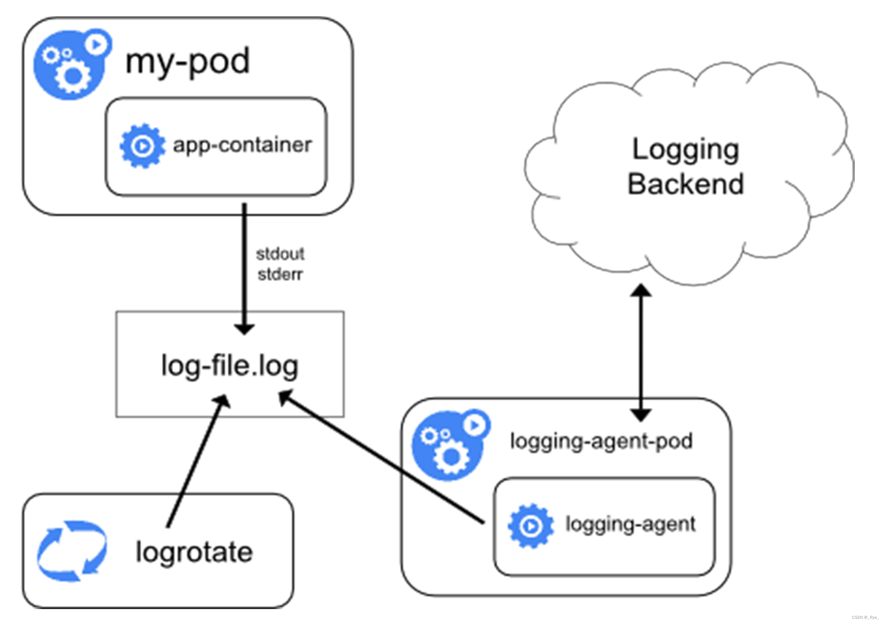
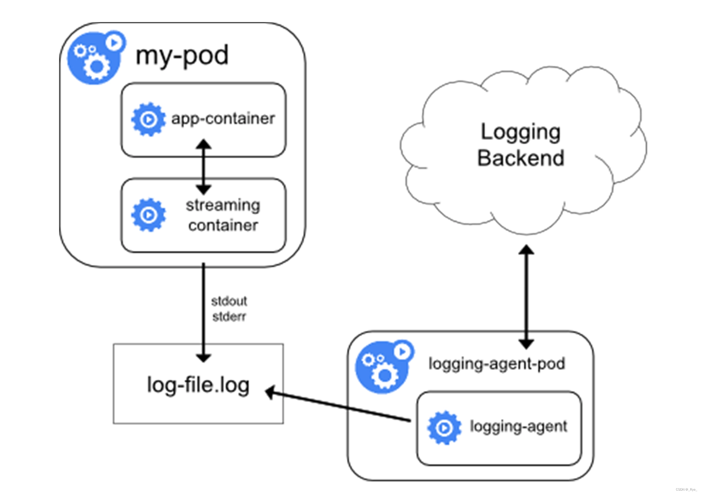
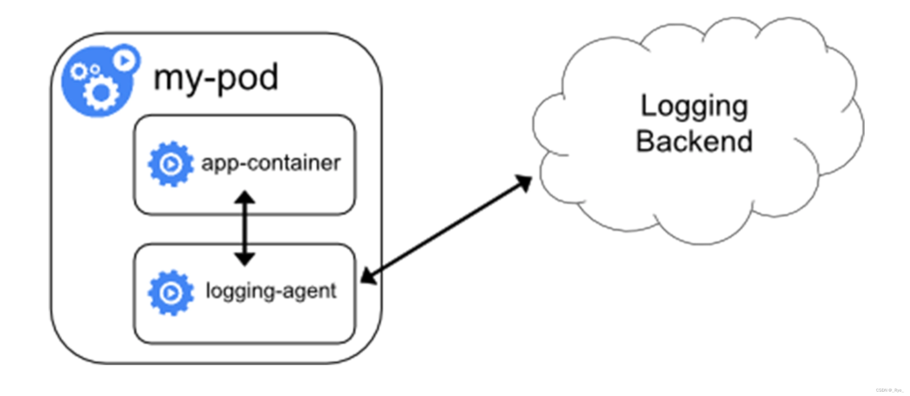

## Monitoring Kubernetes

### What to monitor for Kubernetes?

+ 12 Critical Kubernetes Health Conditions You Need to Monitor and Why  
https://www.circonus.com/2020/12/12-critical-kubernetes-health-conditions-you-need-to-monitor-and-why/#:~:text=Disk%20pressure%20is%20a%20condition,set%20in%20your%20Kubernetes%20configuration.


### Collect Kubernetes metrics
#### For Alibaba Cloud ACK
+ Configuration from ARMS prometheus which can work with OpenTelemetry Collector's prometheus receiver  
<details><summary markdown="span">prom.yaml</summary>
```yaml
        global:
          scrape_interval: 30s
          scrape_timeout: 30s
          evaluation_interval: 30s
        scrape_configs:
          - job_name: opentelemetry-collector
            scrape_interval: 10s
            static_configs:
              - targets:
                  - ${env:MY_POD_IP}:8888
          - job_name: "kubernetes-apiservers"
            honor_labels: true
            honor_timestamps: true
            params:
              hosting:
              - "true"
            scrape_interval: 30s
            scrape_timeout: 30s
            metrics_path: /metrics
            scheme: https
            tls_config:
              ca_file: /var/run/secrets/kubernetes.io/serviceaccount/ca.crt
              insecure_skip_verify: true
            bearer_token_file: /var/run/secrets/kubernetes.io/serviceaccount/token
            relabel_configs:
              - source_labels:
                  [
                    __meta_kubernetes_namespace,
                    __meta_kubernetes_service_name,
                    __meta_kubernetes_endpoint_port_name,
                  ]
                action: keep
                regex: default;kubernetes;https
              - source_labels: [__meta_kubernetes_namespace]
                regex: (.*)
                target_label: namespace
                replacement: $${1}
                action: replace
              - source_labels: [__meta_kubernetes_endpoint_address_target_kind, __meta_kubernetes_endpoint_address_target_name]
                regex: Node;(.*)
                target_label: node
                replacement: $${1}
                action: replace
              - source_labels: [__meta_kubernetes_endpoint_address_target_kind, __meta_kubernetes_endpoint_address_target_name]
                regex: Pod;(.*)
                target_label: pod
                replacement: $${1}
                action: replace
              - source_labels: [__meta_kubernetes_service_name]
                regex: (.*)
                target_label: service
                replacement: $$1
                action: replace
              - source_labels: [__meta_kubernetes_service_name]
                regex: (.*)
                target_label: job
                replacement: $${1}
                action: replace
              - source_labels: [__meta_kubernetes_service_label_component]
                regex: (.+)
                target_label: job
                replacement: $${1}
                action: replace
            kubernetes_sd_configs:
            - role: endpoints
              follow_redirects: true
              namespaces:
                names:
                - default
          - job_name: _arms/kubelet/metric
            honor_labels: true
            honor_timestamps: true
            scrape_interval: 30s
            scrape_timeout: 30s
            metrics_path: /metrics
            scheme: https
            tls_config:
              ca_file: /var/run/secrets/kubernetes.io/serviceaccount/ca.crt
              insecure_skip_verify: true
            bearer_token_file: /var/run/secrets/kubernetes.io/serviceaccount/token
            follow_redirects: true
            relabel_configs:
            - source_labels: [__meta_kubernetes_service_label_k8s_app]
              regex: kubelet
              action: keep
            - source_labels: [__meta_kubernetes_service_label_app_kubernetes_io_name]
              regex: kubelet
              action: drop
            - source_labels: [__meta_kubernetes_endpoint_port_name]
              regex: https-metrics
              action: keep
            - source_labels: [__meta_kubernetes_namespace]
              regex: (.*)
              target_label: namespace
              replacement: $${1}
              action: replace
            - source_labels: [__meta_kubernetes_endpoint_address_target_kind, __meta_kubernetes_endpoint_address_target_name]
              regex: Node;(.*)
              target_label: node
              replacement: $${1}
              action: replace
            - source_labels: [__meta_kubernetes_endpoint_address_target_kind, __meta_kubernetes_endpoint_address_target_name]
              regex: Pod;(.*)
              target_label: pod
              replacement: $${1}
              action: replace
            - source_labels: [__meta_kubernetes_service_name]
              regex: (.*)
              target_label: service
              replacement: $${1}
              action: replace
            - source_labels: [__meta_kubernetes_endpoint_address_target_name, __meta_kubernetes_endpoints_label_alibabacloud_com_is_edge_worker]
              regex: (.*);true
              target_label: __address__
              replacement: $${1}:10250
              action: replace
            - target_label: endpoint
              regex: (.*)
              replacement: http-metrics
              action: replace
            kubernetes_sd_configs:
            - role: endpoints
              follow_redirects: true
              namespaces:
                names:
                - kube-system
          - job_name: _arms/kubelet/cadvisor
            honor_labels: true
            honor_timestamps: true
            scrape_interval: 15s
            scrape_timeout: 15s
            metrics_path: /metrics/cadvisor
            scheme: https
            tls_config:
              ca_file: /var/run/secrets/kubernetes.io/serviceaccount/ca.crt
              insecure_skip_verify: true
            bearer_token_file: /var/run/secrets/kubernetes.io/serviceaccount/token
            follow_redirects: true
            relabel_configs:
            - source_labels: [__meta_kubernetes_service_label_k8s_app]
              regex: kubelet
              action: keep
            - source_labels: [__meta_kubernetes_endpoint_port_name]
              regex: https-metrics
              action: keep
            - source_labels: [__meta_kubernetes_namespace]
              regex: (.*)
              target_label: namespace
              replacement: $${1}
              action: replace
            - source_labels: [__meta_kubernetes_endpoint_address_target_kind, __meta_kubernetes_endpoint_address_target_name]
              regex: Node;(.*)
              target_label: node
              replacement: $${1}
              action: replace
            - source_labels: [__meta_kubernetes_endpoint_address_target_kind, __meta_kubernetes_endpoint_address_target_name]
              regex: Pod;(.*)
              target_label: pod
              replacement: $${1}
              action: replace
            - source_labels: [__meta_kubernetes_endpoint_address_target_name, __meta_kubernetes_endpoints_label_alibabacloud_com_is_edge_worker]
              regex: (.*);true
              target_label: __address__
              replacement: $${1}:10250
              action: replace
            kubernetes_sd_configs:
            - role: endpoints
              follow_redirects: true
              namespaces:
                names:
                - kube-system
          - job_name: k8s-csi-node-pv
            honor_timestamps: true
            scrape_interval: 30s
            scrape_timeout: 30s
            metrics_path: /metrics
            scheme: http
            follow_redirects: true
            relabel_configs:
            - source_labels: [__meta_kubernetes_pod_label_app]
              regex: csi-plugin
              action: keep
            - source_labels: [__meta_kubernetes_pod_node_name]
              regex: (.*)
              target_label: node
              replacement: $${1}
              action: replace
            - source_labels: [__meta_kubernetes_pod_node_name, __meta_kubernetes_pod_container_port_number,
                __meta_kubernetes_endpoints_label_alibabacloud_com_is_edge_worker]
              regex: (.*);(.*);true
              target_label: __address__
              replacement: $${1}:$${2}
              action: replace
            - source_labels: [__address__]
              regex: ([^:]+).*
              target_label: __address__
              replacement: $${1}:11260
              action: replace
            kubernetes_sd_configs:
            - role: pod
              follow_redirects: true
              namespaces:
                names:
                - kube-system
          - job_name: k8s-csi-cluster-pv
            honor_timestamps: true
            scrape_interval: 30s
            scrape_timeout: 30s
            metrics_path: /metrics
            scheme: http
            follow_redirects: true
            relabel_configs:
            - source_labels: [__meta_kubernetes_service_name]
              regex: storage-monitor-service
              action: keep
            - source_labels: [__address__]
              regex: ([^:]+):.*
              target_label: __address__
              replacement: $${1}:11280
              action: replace
            kubernetes_sd_configs:
            - role: service
              follow_redirects: true
              namespaces:
                names:
                - kube-system
          - job_name: arms-ack-coredns
            honor_timestamps: true
            scrape_interval: 30s
            scrape_timeout: 30s
            metrics_path: /metrics
            scheme: http
            follow_redirects: true
            relabel_configs:
            - source_labels: [__meta_kubernetes_pod_annotation_prometheus_io_scrape]
              regex: "true"
              action: keep
            - source_labels: [__meta_kubernetes_pod_annotation_prometheus_io_port]
              regex: "9153"
              action: keep
            - source_labels: [__meta_kubernetes_pod_annotation_prometheus_io_path]
              regex: (.+)
              target_label: __metrics_path__
              replacement: $${1}
              action: replace
            - source_labels: [__address__, __meta_kubernetes_pod_annotation_prometheus_io_port]
              regex: ([^:]+)(?::\d+)?;(\d+)
              target_label: __address__
              replacement: $${1}:$${2}
              action: replace
            - action: labelmap
              regex: __meta_kubernetes_pod_label_(.+)
            - source_labels: [__meta_kubernetes_namespace]
              regex: (.*)
              target_label: kubernetes_namespace
              replacement: $${1}
              action: replace
            - source_labels: [__meta_kubernetes_pod_name]
              regex: (.*)
              target_label: kubernetes_pod_name
              replacement: $${1}
              action: replace
            kubernetes_sd_configs:
            - role: pod
              follow_redirects: true
              namespaces:
                names:
                - kube-system
          - job_name: arms-ack-ingress
            honor_timestamps: true
            scrape_interval: 30s
            scrape_timeout: 30s
            metrics_path: /metrics
            scheme: http
            follow_redirects: true
            relabel_configs:
            - source_labels: [__meta_kubernetes_pod_annotation_prometheus_io_scrape]
              regex: "true"
              action: keep
            - source_labels: [__meta_kubernetes_pod_annotation_prometheus_io_port]
              regex: "10254"
              action: keep
            - source_labels: [__meta_kubernetes_pod_annotation_prometheus_io_scheme]
              regex: (https?)
              target_label: __scheme__
              replacement: $${1}
              action: replace
            - source_labels: [__meta_kubernetes_pod_annotation_prometheus_io_path]
              regex: (.+)
              target_label: __metrics_path__
              replacement: $${1}
              action: replace
            - regex: __meta_kubernetes_pod_label_(.+)
              action: labelmap
            - source_labels: [__address__, __meta_kubernetes_pod_annotation_prometheus_io_port]
              regex: ([^:]+)(?::\d+)?;(\d+)
              target_label: __address__
              replacement: $${1}:$${2}
              action: replace
            kubernetes_sd_configs:
            - role: pod
              follow_redirects: true
          - job_name: _kube-state-metrics
            honor_timestamps: true
            scrape_interval: 30s
            scrape_timeout: 30s
            metrics_path: /metrics
            scheme: http
            follow_redirects: true
            relabel_configs:
            - source_labels: [__meta_kubernetes_service_label_type]
              regex: virtual-kubelet
              action: drop
            - source_labels: [__meta_kubernetes_service_label_k8s_app]
              regex: kubelet
              action: drop
            - source_labels: [__meta_kubernetes_service_label_k8s_app]
              regex: kube-state-metrics
              replacement: $${1}
              action: keep
            - source_labels: [__meta_kubernetes_pod_container_port_number]
              regex: "8080"
              action: keep
            - source_labels: [__address__, __meta_kubernetes_pod_container_port_number]
              regex: ([^:]+)(?::\d+)?;(\d+)
              target_label: __address__
              replacement: $${1}:$${2}
              action: replace
            kubernetes_sd_configs:
            - role: endpoints
              follow_redirects: true
              namespaces:
                names:
                - kube-system
                - arms-prom
          - job_name: _arms-prom/node-exporter/0
            honor_timestamps: true
            scrape_interval: 30s
            scrape_timeout: 30s
            metrics_path: /metrics
            scheme: https
            tls_config:
              insecure_skip_verify: true
            bearer_token_file: /var/run/secrets/kubernetes.io/serviceaccount/token
            follow_redirects: true
            relabel_configs:
            - source_labels: [__meta_kubernetes_service_label_k8s_app]
              regex: node-exporter
              action: keep
            - source_labels: [__meta_kubernetes_endpoint_port_name]
              regex: https
              action: keep
            - source_labels: [__meta_kubernetes_namespace]
              regex: (.*)
              target_label: namespace
              replacement: $${1}
              action: replace
            - source_labels: [__meta_kubernetes_endpoint_address_target_kind, __meta_kubernetes_endpoint_address_target_name]
              regex: Node;(.*)
              target_label: node
              replacement: $${1}
              action: replace
            - source_labels: [__meta_kubernetes_endpoint_address_target_kind, __meta_kubernetes_endpoint_address_target_name]
              regex: Pod;(.*)
              target_label: pod
              replacement: $${1}
              action: replace
            - source_labels: [__meta_kubernetes_service_name]
              regex: (.*)
              target_label: service
              replacement: $${1}
              action: replace
            - source_labels: [__meta_kubernetes_service_name]
              regex: (.*)
              target_label: job
              replacement: $${1}
              action: replace
            - source_labels: [__meta_kubernetes_service_label_k8s_app]
              regex: (.+)
              target_label: job
              replacement: $${1}
              action: replace
            - source_labels: [__meta_kubernetes_pod_node_name, __meta_kubernetes_pod_container_port_number,
                __meta_kubernetes_endpoints_label_alibabacloud_com_is_edge_worker]
              regex: (.*);(.*);true
              target_label: __address__
              replacement: $${1}:$${2}
              action: replace
            - regex: (.*)
              target_label: endpoint
              replacement: https
              action: replace
            kubernetes_sd_configs:
            - role: endpoints
              follow_redirects: true
              namespaces:
                names:
                - arms-prom
          - job_name: gpu-exporter
            honor_timestamps: true
            scrape_interval: 30s
            scrape_timeout: 30s
            metrics_path: /metrics
            scheme: http
            follow_redirects: true
            relabel_configs:
            - regex: (.*)
              target_label: _arms_instanceid
              replacement: "392"
              action: replace
            - regex: (.*)
              target_label: _arms_instancetype
              replacement: "1"
              action: replace
            - source_labels: [__meta_kubernetes_service_label_k8s_app]
              regex: ack-prometheus-gpu-exporter
              action: keep
            - source_labels: [__meta_kubernetes_endpoint_port_name]
              regex: http-metrics
              action: keep
            - source_labels: [__meta_kubernetes_namespace]
              regex: (.*)
              target_label: namespace
              replacement: $${1}
              action: replace
            - source_labels: [__meta_kubernetes_endpoint_address_target_kind, __meta_kubernetes_endpoint_address_target_name]
              regex: Node;(.*)
              target_label: node
              replacement: $${1}
              action: replace
            - source_labels: [__meta_kubernetes_endpoint_address_target_kind, __meta_kubernetes_endpoint_address_target_name]
              regex: Pod;(.*)
              target_label: pod
              replacement: $${1}
              action: replace
            - source_labels: [__meta_kubernetes_service_name]
              regex: (.*)
              target_label: service
              replacement: $${1}
              action: replace
            - source_labels: [__meta_kubernetes_pod_node_name, __meta_kubernetes_pod_container_port_number,
                __meta_kubernetes_endpoints_label_alibabacloud_com_is_edge_worker]
              regex: (.*);(.*);true
              target_label: __address__
              replacement: $${1}:$${2}
              action: replace
            kubernetes_sd_configs:
            - role: endpoints
              follow_redirects: true
              namespaces:
                names:
                - arms-prom
          - job_name: kubernetes-pods
            honor_timestamps: true
            scrape_interval: 30s
            scrape_timeout: 30s
            metrics_path: /metrics
            scheme: http
            follow_redirects: true
            relabel_configs:
            - source_labels: [__meta_kubernetes_pod_annotation_prometheus_io_scrape]
              regex: "true"
              action: keep
            - source_labels: [__meta_kubernetes_pod_phase]
              regex: Running
              action: keep
            - source_labels: [__meta_kubernetes_pod_annotation_arms_prometheus_core_job]
              regex: "true"
              action: drop
            - source_labels: [__meta_kubernetes_pod_annotation_prometheus_io_port]
              regex: "10254"
              action: drop
            - source_labels: [__meta_kubernetes_pod_annotation_prometheus_io_port]
              regex: "9153"
              action: drop
            - source_labels: [__meta_kubernetes_pod_annotation_prometheus_io_path]
              regex: (.+)
              target_label: __metrics_path__
              replacement: $${1}
              action: replace
            - source_labels: [__meta_kubernetes_pod_label_targetId]
              regex: (.+)
              target_label: arms_instance_id
              replacement: $${1}
              action: replace
            - source_labels: [__meta_kubernetes_pod_label_uid]
              regex: (.+)
              target_label: arms_instance_name
              replacement: $${1}
              action: replace
            - source_labels: [__address__, __meta_kubernetes_pod_annotation_prometheus_io_port]
              regex: ([^:]+)(?::\d+)?;(\d+)
              target_label: __address__
              replacement: $${1}:$${2}
              action: replace
            - regex: __meta_kubernetes_pod_label_(.+)
              action: labelmap
            - source_labels: [__meta_kubernetes_namespace]
              regex: (.*)
              target_label: namespace
              replacement: $${1}
              action: replace
            - source_labels: [__meta_kubernetes_pod_name]
              regex: (.*)
              target_label: pod
              replacement: $${1}
              action: replace
            kubernetes_sd_configs:
            - role: pod
              follow_redirects: true
              namespaces:
                names:
                - arms-prom
          - job_name: _arms/kube-event
```
</details>
<br/>

> If arms prometheus was used, all configurtations are default.  

+  Configuration to work for general Kubernetes  
<details><summary markdown="span">prom.yaml</summary>
```yaml
---
apiVersion: rbac.authorization.k8s.io/v1
kind: ClusterRole
metadata:
  name: arms-prometheus-ack-arms-prometheus-role
rules:
- apiGroups:
  - ""
  resources:
  - configmaps
  verbs:
  - get
  - list
  - watch
  - create
  - delete
- apiGroups:
  - ""
  resources:
  - pods
  - namespaces
  - services
  verbs:
  - create
  - delete
  - get
  - list
  - watch
- apiGroups:
  - apps
  resources:
  - daemonsets
  - deployments
  verbs:
  - create
  - delete
  - get
  - list
  - watch
- nonResourceURLs:
  - /metrics
  verbs:
  - get
---
apiVersion: rbac.authorization.k8s.io/v1
kind: ClusterRole
metadata:
  name: arms-pilot-prom-k8s
rules:
- apiGroups:
  - monitoring.coreos.com
  resources:
  - alertmanagers
  - prometheuses
  - prometheuses/finalizers
  - alertmanagers/finalizers
  - servicemonitors
  - prometheusrules
  - podmonitors
  verbs:
  - '*'
- apiGroups:
  - apiextensions.k8s.io
  resources:
  - customresourcedefinitions
  verbs:
  - '*'
- apiGroups:
  - ""
  resources:
  - nodes/metrics
  verbs:
  - get
- nonResourceURLs:
  - /metrics
  verbs:
  - get
- apiGroups:
  - ""
  resources:
  - nodes/proxy
  verbs:
  - '*'
---
prometheus:
  config:
    scrape_configs:
      - job_name: opentelemetry-collector
        scrape_interval: 10s
        static_configs:
          - targets:
              - ${env:MY_POD_IP}:8888
      - job_name: "kubernetes-apiservers"
        honor_labels: true
        honor_timestamps: true
        params:
          hosting:
          - "true"
        scrape_interval: 30s
        scrape_timeout: 30s
        metrics_path: /metrics
        scheme: https
        tls_config:
          ca_file: /var/run/secrets/kubernetes.io/serviceaccount/ca.crt
          insecure_skip_verify: true
        bearer_token_file: /var/run/secrets/kubernetes.io/serviceaccount/token
        relabel_configs:
          - source_labels:
              [
                __meta_kubernetes_namespace,
                __meta_kubernetes_service_name,
                __meta_kubernetes_endpoint_port_name,
              ]
            action: keep
            regex: default;kubernetes;https
          - source_labels: [__meta_kubernetes_namespace]
            regex: (.*)
            target_label: namespace
            replacement: $${1}
            action: replace
          - source_labels: [__meta_kubernetes_endpoint_address_target_kind, __meta_kubernetes_endpoint_address_target_name]
            regex: Node;(.*)
            target_label: node
            replacement: $${1}
            action: replace
          - source_labels: [__meta_kubernetes_endpoint_address_target_kind, __meta_kubernetes_endpoint_address_target_name]
            regex: Pod;(.*)
            target_label: pod
            replacement: $${1}
            action: replace
          - source_labels: [__meta_kubernetes_service_name]
            regex: (.*)
            target_label: service
            replacement: $$1
            action: replace
          - source_labels: [__meta_kubernetes_service_name]
            regex: (.*)
            target_label: job
            replacement: $${1}
            action: replace
          - source_labels: [__meta_kubernetes_service_label_component]
            regex: (.+)
            target_label: job
            replacement: $${1}
            action: replace
        kubernetes_sd_configs:
        - role: endpoints
          follow_redirects: true
          namespaces:
            names:
            - default
      - job_name: "kubernetes-kubelet"
        honor_labels: true
        scheme: https
        tls_config:
          ca_file: /var/run/secrets/kubernetes.io/serviceaccount/ca.crt
        bearer_token_file: /var/run/secrets/kubernetes.io/serviceaccount/token
        kubernetes_sd_configs:
        - role: node
        relabel_configs:
        - action: labelmap
          regex: __meta_kubernetes_node_label_(.+)
        - target_label: __address__
          replacement: kubernetes.default.svc:443
        - source_labels: [__meta_kubernetes_node_name]
          regex: (.+)
          target_label: __metrics_path__
          replacement: /api/v1/nodes/$${1}/proxy/metrics
      - job_name: 'kubernetes-cadvisor'
        scheme: https
        tls_config:
          ca_file: /var/run/secrets/kubernetes.io/serviceaccount/ca.crt
        bearer_token_file: /var/run/secrets/kubernetes.io/serviceaccount/token
        kubernetes_sd_configs:
        - role: node
        relabel_configs:
        - action: labelmap
          regex: __meta_kubernetes_node_label_(.+)
        - target_label: __address__
          replacement: kubernetes.default.svc:443
        - source_labels: [__meta_kubernetes_node_name]
          regex: (.+)
          target_label: __metrics_path__
          replacement: /api/v1/nodes/$${1}/proxy/metrics/cadvisor
      - job_name: node-exporter
        kubernetes_sd_configs:
          - role: endpoints
        relabel_configs:
          - source_labels: [__meta_kubernetes_endpoints_name]
            regex: 'node-exporter'
            action: keep
      - job_name: kube-state-metrics
        kubernetes_sd_configs:
          - role: pod
        relabel_configs:
          - source_labels: [__meta_kubernetes_pod_container_name]
            regex: kube-state-metrics
            action: keep
          - source_labels: [__meta_kubernetes_pod_container_port_number]
            regex: "8080"
            action: keep
```
</details>
<br/>

> Reference:  
>   https://medium.com/hostspaceng/monitoring-kubernetes-metrics-collecting-them-using-open-telemetry-52bb3d35b148  
>   https://docs.victoriametrics.com/scrape_config_examples/  

### Collect container logs in Kubernetes
#### Container logs are output to stdout/stderr
This is the suggested way for containers to ouput the log. Deploy daemonset log agent, collect container logs from the log file in host file system:  



#### Collect log files inside container
##### Use daemonset log collectting agent
Below two methods are from https://github.com/kubernetes/kubernetes/issues/12567. The idea behind is to mount the log file to host filesystem by HostPath or EmptyDir, however both of them have disadvantages, and are not suggested:  

+ HostPath Volume  
    Mount the logdir(/log) by HostPath Volume, like:  
    ```bash
    /var/log/pods/<pod_name> => /log
    ```  
    Use /var/log/pods/<pod_name> to persist the logs, it's configured manually, so fluentd can distinguish the logs file also. But all the pod's instances will use the same HostPath(/var/log/pods/<pod_name>), this can cause conflict.  

+ EmptyDir Volume  
    Mount the logdir(/log) by EmptyDIr Volume, like:  
    ```bash
    /var/lib/kubelet/pods/<pod_id>/volumes/kubernetes.io~empty-dir/log-storage => /log
    ```  
    fluentd can tail the logfiles in /var/lib/kubelet/pods/<pod_id>/volumes/kubernetes.io~empty-dir/log-storage, but the path only include pod_id, pod_id changes when pod migrates, so I don't think it's ok to be the tag.  

Below two methods are to redirect the content of log file in container to container's stdout/stderr, so to use the method "Container logs are output to stdout/stderr":  
+ Use a "streaming container" as sidecar containers to redirect log files to the stdout of each sidecar container  
    

    ```yaml
    ---
    apiVersion: v1
    kind: Namespace
    metadata:
    name: test-log-collecting
    ---
    apiVersion: v1
    kind: Pod
    metadata:
    name: demo1
    namespace: test-log-collecting
    spec:
    containers:
        - name: demo1
        image: busybox
        imagePullPolicy: "Always"
        resources:
            limits:
            cpu: '100m'
            memory: '256Mi'
            requests:
            cpu: '50m'
            memory: '128Mi'
        args:
            - /bin/sh
            - -c
            - >
            i = 0;
            while true;
            do
                echo "$i: $(date)" >> /var/log/1.log;
                echo "$(date) INFO $i" >> /var/log/2.log;
                i=$((i+1));
                sleep 1;
            done
        volumeMounts:
            - name: varlog
            mountPath: /var/log
        - name: count-log-1
        image: busybox
        imagePullPolicy: "Always"
        resources:
            limits:
            cpu: '100m'
            memory: '256Mi'
            requests:
            cpu: '50m'
            memory: '128Mi'
        args:
            - /bin/sh
            - -c
            - tail -n+1 -f /var/log/1.log
        volumeMounts:
            - name: varlog
            mountPath: /var/log
        - name: count-log-2
        image: busybox
        imagePullPolicy: "Always"
        resources:
            limits:
            cpu: '100m'
            memory: '256Mi'
            requests:
            cpu: '50m'
            memory: '128Mi'
        args:
            - /bin/sh
            - -c
            - tail -n+1 -f /var/log/2.log
        volumeMounts:
            - name: varlog
            mountPath: /var/log
    volumes:
        - name: varlog
        emptyDir: {}
    restartPolicy: OnFailure
    ```
    > The sidecar container name can be set to the name of each log file, so that the final collected log can know which log file the log came from.  

+ symbol link log files to container's stdout, stderr like Nginx
    ```yaml
    ---
    apiVersion: v1
    kind: Namespace
    metadata:
    name: test-log-collecting
    ---
    apiVersion: v1
    kind: Pod
    metadata:
    name: demo
    namespace: test-log-collecting
    spec:
    containers:
        - name: demo
        image: busybox
        imagePullPolicy: "Always"
        resources:
            limits:
            cpu: '200m'
            memory: '512Mi'
            requests:
            cpu: '100m'
            memory: '256Mi'
        args:
            - /bin/sh
            - -c
            - >
            mkdir -p /var/log;
            echo "hello 1.log" > /var/log/1.log;
            echo "hello 2.log" > /var/log/2.log;
            ln -sf /dev/stdout /var/log/1.log;
            ln -sf /dev/stdout /var/log/2.log;
            i = 0;
            while true;
            do
                echo "$i: $(date)" >> /var/log/1.log;
                echo "$(date) INFO $i" >> /var/log/2.log;
                i=$((i+1));
                sleep 1;
            done
    restartPolicy: OnFailure
    ```  
    >  This needs to update the dockerfile to add one step to do the symbol link. However, if there were multiple log files, from the final collected log, it can't tell which log file it came from.

##### Use sidecar log collecting agent
Inject log collecting agent as sidecar into pod, and mount and share the log folder using EmptyDir  
  
