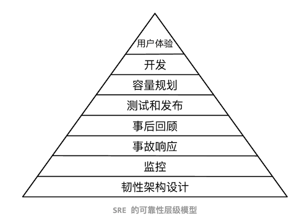

# SRE
## Reliability vs Resiliency vs Statbility vs Availability
+ Reliability(可靠性)  
    狭义可靠性, 即系统无故障运行的能力。广义可靠性更多地是指可靠性工程（reliability engineering）所提及的目标，即除了提高可靠性外，还包括提高从故障中恢复运行能力，即维修性（maintainability）。从故障中恢复运行的能力，对于硬件产品通常被称为“维修性”（maintainability），但在软件系统下通常称为“韧性”（resiliency）。  

+ Resiliency(韧性)  
    狭义韧性，指的是自动或快速从故障中恢复运行的能力；广义韧性，除了从故障中恢复运行的能力外，还包括故障容忍能力。故障容忍（fault tolerance，简称“容错”），是使系统在其某些组件中出现一个或多个故障时能够继续提供服务的能力，从客户的角度来看，该服务仍能完全正常运行，或可能降级运行。  

    > 可靠性和韧性的侧重点不同。可靠性工程的目标是尽可能减少系统中的故障，保证系统无故障运行。而韧性工程，接受故障总会发生的现实，关注的是如何降低故障带来的损失以及如何从故障中恢复。分布式系统，100% 的可靠性是不存在的，必须拥抱故障，提升系统的韧性，可靠性和韧性必须同时关注。不过在将“可靠性”和“韧性”的含义扩展后，很多时候这两个术语背后的内涵是等价的。  

+ Stability(稳定性)  
    中国信通院的指南《分布式系统稳定性建设指南》，是对“系统稳定性”的权威阐述。对稳定性建设的阐述，是从故障的视角看的，稳定性建设的目标是故障的“降发生”和“降影响”。这两个目标也与上文的稳定性定义的“保持”和“恢复”相对应。这两个目标也与国家标准 GB/T 11457-2006《信息技术 软件工程术语》对术语“稳定性”的定义的“保持”和“恢复”相对应。稳定性的含义与广义韧性的含义与相似。  

+ Availability(可用性)  
    可用性（availability）是衡量可靠性和韧性的综合性指标，可以表示为总可用时间除以总可用时间与总不可用时间之和，也可以通过平均无故障时间（MTTF，Mean Time To Failure）和平均故障恢复时间（MTTR，Mean Time To Repair）计算。可用性的计算公式如下：  
      

    高可用性（high availability）的系统，通常将可用性目标设定为 N 个 9，常见的可用性目标和不可用分钟数，如下表所示：

    |可用性 |年不可用分钟数 |月不可用分钟数 |
    |- |- |- |
    |99.5% (2.5 个 9) |2635 |219 |
    |99.9% (3 个 9) |526 |43.83 |
    |99.95% (3.5 个 9) |263 |21.92 |
    |99.99% (4 个 9) |52.60 |4.38 |
    |99.995% (4.5 个 9) |26.30 |2.19 |

    想要提高系统的可用性，需要做的是延长无故障时间（MTTF）和缩短故障恢复时间（MTTR）。  

## 可靠性和韧性设计  
### SRE的可靠性层级模型
  

### 提高系统可靠性的方法
+ 故障避免（fault avoidonce，简称“避错”）  
    在系统的设计和实现过程中使用一些开发方法来减少故障发生，并在系统部署使用之前进行验证和确认来发现和去除程序中的故障。避错技术包括通过优秀的软件设计方法、编译器检查、技术评审、代码评审、测试等。  

+ 故障容忍（fault tolerance，简称“容错”）  
    容错是使系统在其某些组件中出现一个或多个故障时能够继续提供服务的能力，尽管该服务可能处于降级级别。容错技术主要是采用冗余（redundancy）方法来消除故障的影响，冗余的含义是指当系统无故障时取消冗余资源不会影响系统正常运行。   

    系统的资源包括硬件资源、软件资源、信息资源、时间资源，所以冗余区分 4 种方式：  

    + 硬件冗余（hardware redundancy）：通过配置额外的硬件组件实现冗余。  
    + 软件冗余（software redundancy）：通过配置额外的软件版本实现冗余，例如 N 版本编程（NVP）。  
    + 信息冗余（information redundancy）：通过对信息中外加一部分信息码或将信息存放在多个内存单元或将信息进行备份等实现冗余，例如循环冗余校验码、数据复制、数据库备份等。  
    + 时间冗余（time redundancy）：多次执行相同的操作（重试）实现冗余，例如多次执行程序或传输数据的多个副本。  
    
    硬件冗余和软件冗余被合称为结构冗余（structural redundancy）。相对与时间冗余，硬件冗余、软件冗余、信息冗余被合称为空间冗余（space redundancy）。硬件冗余比较常见，而软件冗余相对少见。  

+ 应对各种故障的具体典型的可靠性和韧性策略  
    + 硬件和网络故障：  
        避错：通过提高硬件的质量实现避错  
        容错：通过冗余实现容错，具体的措施包括硬件冗余、数据复制（replication）、数据库备份（backup）、重试（retry）等  
        快恢：自动主备、主从或多活流量切换  

    + 软件 bug：  
        避错：技术评审、代码评审、测试等实现避错  
        快恢：通过重启处理导致崩溃（crash）、夯死（hang）的软件故障，通过回滚代码快速修复 bug  

    + 人为错误：包括配置错误和运维操作错误  
        避错：更好的人；消除人为因素，即自动化；预先检测等  
        快恢：通过回滚配置或操作修复错误  

    + 服务过载：典型的是在大促期间可能出现服务过载  
        避错：通过提前的容量规划（capacity planning）、压测（stress testing）实现避错  
        容错：通过弹性扩容（elastic scaling）实现负载均衡，通过限流（rate limiting）、优雅降级（graceful degradation）来降低负载  

    + 依赖服务：主要策略是故障隔离，将故障的影响限制在较小的范围内，避免发生连锁故障（cascading failure）  
        避错：通过服务功能拆分、服务依赖资源隔离、服务强弱依赖治理等实现故障隔离  
        容错：通过熔断（circuit breaker）实现故障隔离，通过快速失败（fail fast）的方式，避免请求大量阻塞，从而保护调用方  

## Scalability vs Elasticity
TBD

## Reference
+ 大型网站的稳定性、可靠性和韧性  
    https://nullwy.me/2023/12/website-scalability-reliability-resilience/  

+ 对比Availability可用性、Reliability可靠性、Stability稳定性  
    https://blog.51cto.com/u_15588078/6531361  

+ Cloud Elasticity vs Cloud Scalability  
    https://k21academy.com/amazon-web-services/aws-solutions-architect/elasticity-vs-scalability/  

