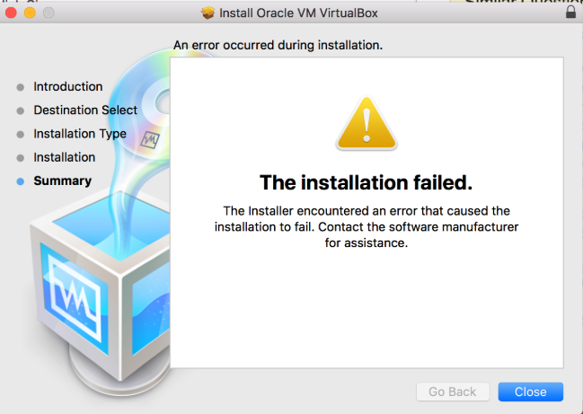

## Failed to install VirtualBox on Mac


### Solution
> https://forums.virtualbox.org/viewtopic.php?f=8&t=93133

+ Restart Mac in recovery mode (cmd + R)
+ Open a terminal and run:  
    ```bash
    spctl kext-consent add VB5E2TV963
    ```
    > VB5E2TV963 is the code for oracle.
+ Restart the Mac

## Failed to create Host-only network adapter
VBoxNetAdpCtl: Error while adding new interface: failed to open /dev/vboxnetctl: No such file or directory  

### Solution
Run below commands:  

```bash
sudo kextload -b org.virtualbox.kext.VBoxDrv;
sudo kextload -b org.virtualbox.kext.VBoxNetFlt;
sudo kextload -b org.virtualbox.kext.VBoxNetAdp;
sudo kextload -b org.virtualbox.kext.VBoxUSB;
```